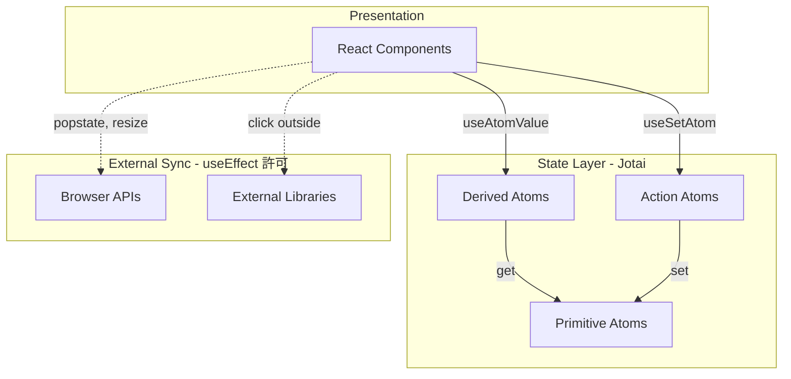
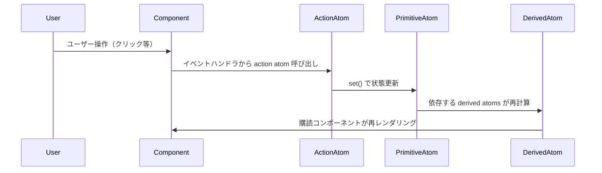
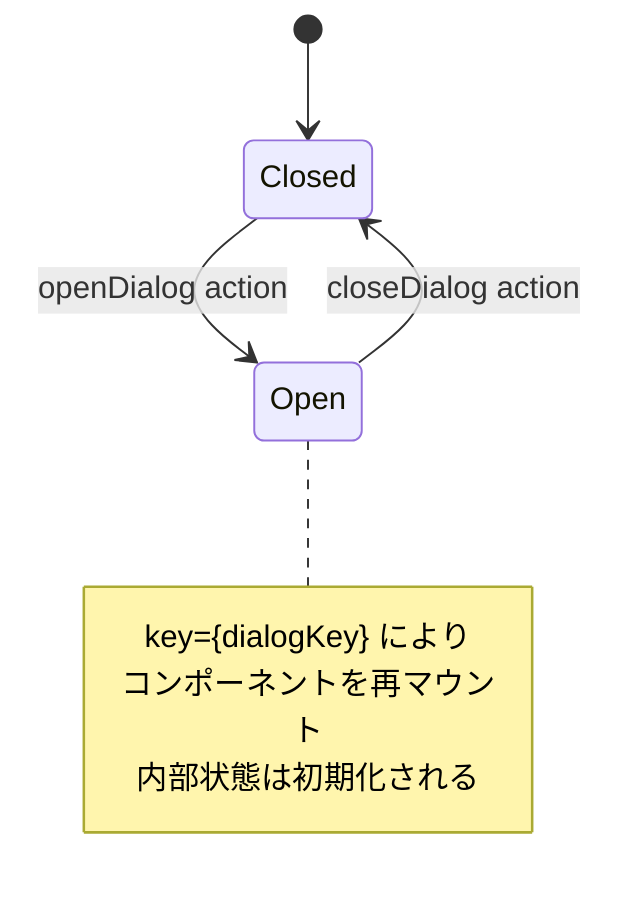
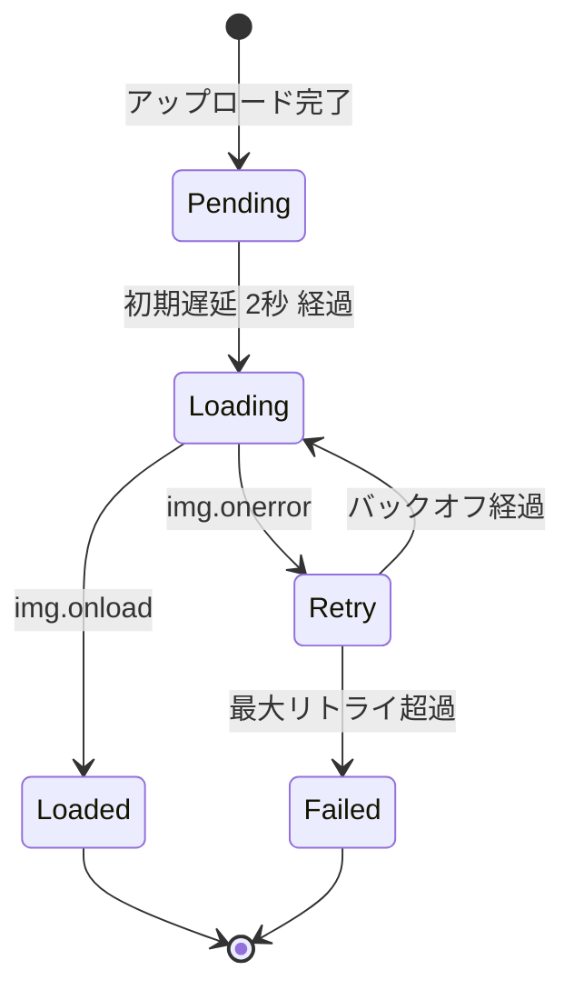
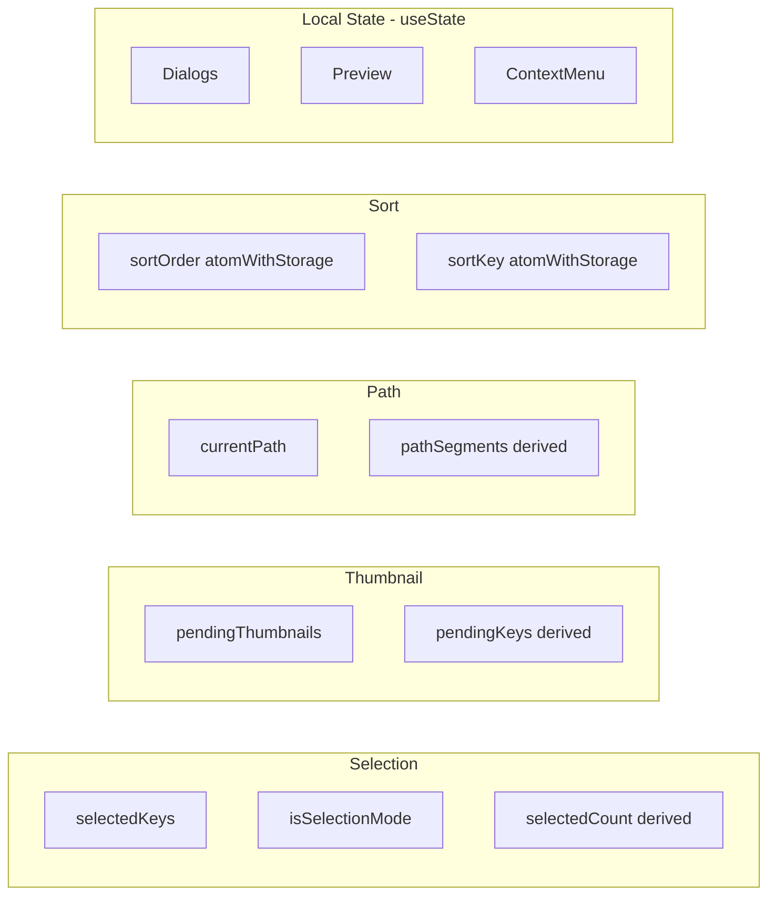

# Design Document

## Overview

**Purpose**: クライアント状態を Jotai ベースのデータドリブン・アーキテクチャに移行し、状態の可視化・デバッグ容易性・テスト容易性を実現する。

**Users**: 開発者がデバッグ・保守・テストを行う際に、状態変更の流れを明確に追跡できるようになる。

**Impact**: 既存の hooks ベースの状態管理を Jotai atoms に移行し、useEffect の不適切な使用を排除する。

### Goals

- 状態管理を Jotai atoms で一元化し、DevTools で可視化可能にする
- React 公式ドキュメント「You Might Not Need an Effect」の原則に従い、禁止用途の useEffect を排除する
- 既存機能の後方互換性を維持しながら段階的に移行する
- 派生データは derived atoms で計算し、Single Source of Truth を実現する

### Non-Goals

- ファイル一覧状態（現在のアイテム、ローディング状態、エラー）の管理（要件 2.1 — Phase 2 TanStack Query で対応）
- サーバー状態（S3 データ）のキャッシュ管理（Phase 2 で対応）
- サムネイル状態管理（複雑なため Phase 3 で個別対応: ただし設計は残している）
- パフォーマンス最適化（本 Phase では機能維持を優先）
- 単一コンポーネントに閉じる UI 状態の atom 化（useState のまま維持）

---

## Architecture

### Existing Architecture Analysis

現在のアーキテクチャには以下の問題がある：

| 問題カテゴリ    | 現状                                     | 影響               |
| --------------- | ---------------------------------------- | ------------------ |
| 状態分散        | 11 個の hooks が独立した useState を保持 | 状態追跡困難       |
| useEffect 乱用  | 18 箇所（うち禁止用途 3 箇所）           | 複数再レンダリング |
| Effect チェーン | useEffect → setState → 別 useEffect      | デバッグ困難       |
| 派生状態の重複  | 計算可能な値を状態として保持             | 同期処理の複雑化   |

### Design Principles

| 原則                                   | 説明                                                                         | 適用例                                   |
| -------------------------------------- | ---------------------------------------------------------------------------- | ---------------------------------------- |
| データドリブン                         | イベントハンドラで状態を更新し、UI はその状態から派生                        | 選択操作 → atom 更新 → UI 再レンダリング |
| 共有状態のみ atom 化                   | 複数コンポーネントで参照される状態のみ Jotai に移行                          | Selection, Path, Thumbnail, Sort         |
| 単一コンポーネント内状態は useState    | コンポーネントに閉じる状態は useState のまま維持                             | ダイアログ表示、プレビューインデックス   |
| useEffect 禁止用途の排除               | 派生データ計算、初期化、状態同期に useEffect を使わない                      | derived atoms、`key` 属性                |
| 派生データは derived atoms             | 計算可能な値は状態として保持せず、レンダリング時に計算                       | selectedCountAtom、isAllSelectedAtom     |
| アップロード追跡はサムネイル状態で代替 | 曖昧な「アップロード状態」を廃止し、具体的な「サムネイル読み込み状態」で管理 | pendingThumbnailsAtom                    |
| 永続化が必要な設定は atomWithStorage   | ユーザー設定をブラウザに保存し、セッション間で維持                           | sortOrderAtom、sortKeyAtom               |

### State Classification

| 状態カテゴリ                          | 管理方式       | 理由                                                                             |
| ------------------------------------- | -------------- | -------------------------------------------------------------------------------- |
| 選択状態（Selection）                 | **Jotai Atom** | 複数コンポーネント（Header, FileList）で共有                                     |
| サムネイル追跡（Thumbnail）           | **Jotai Atom** | サムネイル問題のデバッグに必須、アップロード追跡を統合（本フェーズではやらない） |
| パス状態（Path）                      | **Jotai Atom** | URL 同期あり、複数コンポーネントで参照                                           |
| ダイアログ状態（showCreateFolder 等） | useState       | MediaBrowser 内に閉じる                                                          |
| プレビュー状態（currentPreviewIndex） | useState       | MediaBrowser 内に閉じる                                                          |
| コンテキストメニュー状態              | useState       | MediaBrowser 内に閉じる                                                          |
| ソート設定（Sort）                    | **Jotai Atom** | atomWithStorage で localStorage 永続化                                           |

### Architecture Pattern & Boundary Map

**Selected Pattern**: Jotai Atomic State Management + データドリブン・アーキテクチャ

**Architecture Diagram**:

**Architecture Integration**:

- **Selected pattern**: Jotai Atomic Model — ボトムアップで必要な状態のみ購読
- **Domain boundaries**: 機能ドメイン別に atom 群を分割（Selection, Path, Sort）※ Thumbnail は別 spec で対応
- **Existing patterns preserved**: ファサード hooks で既存インターフェースを維持
- **New components rationale**: Primitive/Derived/Action atoms の 3 層構造で責務分離
- **Steering compliance**: TypeScript strict mode、Single Responsibility 維持

### Technology Stack

| Layer            | Choice / Version | Role in Feature         | Notes                             |
| ---------------- | ---------------- | ----------------------- | --------------------------------- |
| State Management | Jotai 2.x        | Atomic state primitives | 軽量（~3KB）、TypeScript 完全対応 |
| DevTools         | jotai-devtools   | Redux DevTools 連携     | 開発依存のみ、本番除外            |
| Persistence      | atomWithStorage  | localStorage 永続化     | ソート設定の保存                  |

---

## System Flows

### State Update Flow（データドリブン）

ユーザー操作から状態更新までのデータフローを示す。useEffect を介さず、イベントハンドラから直接状態を更新する。

**Key Decisions**:

- useEffect を介さず、イベントハンドラから直接 action atom を呼び出す
- 派生データは derived atom でレンダリング時に計算（状態として保持しない）

### Dialog State Reset Flow

ダイアログの状態リセットは `key` 属性を使用し、useEffect を排除する。

**Key Decisions**:

- RenameDialog、MoveDialog の useEffect（初期化用途）を `key` 属性に置換
- ダイアログを開くたびに新しい key を設定し、コンポーネントを再マウント

### サムネイル読み込みフロー

アップロード完了後のサムネイル読み込みを追跡し、バックオフリトライを管理する。

**Key Decisions**:

- アップロード完了時に `addPendingThumbnails` でサムネイル追跡開始（アップロード追跡を統合）
- 初期遅延 2 秒で Lambda サムネイル生成を待機
- 失敗時は指数バックオフ（1s → 2s → 4s）でリトライ
- 最大 3 回リトライ後は諦める
- img.onload/onerror イベントハンドラで状態更新（useEffect 不要）

---

## Requirements Traceability

| Requirement | Summary                  | Components                       | Interfaces                            | Flows                    |
| ----------- | ------------------------ | -------------------------------- | ------------------------------------- | ------------------------ |
| 1.1         | Store アーキテクチャ基盤 | JotaiProvider, DevToolsConnector | atom(), useAtomValue(), useSetAtom()  | State Update Flow        |
| 1.2         | DevTools 連携            | DevToolsConnector                | useAtomsDevtools()                    | -                        |
| 1.3         | 型安全性                 | 全 atoms                         | TypeScript generics                   | -                        |
| 1.4         | 純粋関数ベース状態更新   | ActionAtoms                      | atom(read, write)                     | State Update Flow        |
| 2.1         | ファイル一覧状態         | (Non-Goals — Phase 2 対応)       | —                                     | -                        |
| 2.2         | サムネイル読み込み状態   | ThumbnailAtoms                   | pendingThumbnailsAtom                 | サムネイル読み込みフロー |
| 2.3         | 選択状態                 | SelectionAtoms                   | selectedKeysAtom, isSelectionModeAtom | -                        |
| 2.4         | UI 状態                  | useState (MediaBrowser 内)       | —                                     | Dialog State Reset Flow  |
| 2.5         | パス状態                 | PathAtoms                        | currentPathAtom                       | -                        |
| 3.1-3.3     | props drilling 排除      | 全 Components                    | useAtomValue() 直接購読               | -                        |
| 4.1-4.9     | 既存機能互換性           | FacadeHooks                      | 既存 hooks シグネチャ維持             | -                        |
| 5.1-5.3     | 段階的移行               | FacadeHooks                      | 内部を atoms に切替                   | -                        |
| 6.1-6.3     | デバッグ体験             | DevToolsConnector                | debugLabel, 履歴追跡                  | -                        |
| 7.1-7.3     | テスト容易性             | TestProvider                     | Provider, useHydrateAtoms             | -                        |

---

## Components and Interfaces

### Component Summary

| Component         | Domain/Layer      | Intent                                 | Req Coverage     | Key Dependencies      | Contracts |
| ----------------- | ----------------- | -------------------------------------- | ---------------- | --------------------- | --------- |
| JotaiProvider     | Infrastructure    | Atom スコープの提供                    | 1.1              | React (P0)            | State     |
| DevToolsConnector | Infrastructure    | Redux DevTools 連携                    | 1.2, 6.1-6.3     | jotai-devtools (P1)   | State     |
| SelectionAtoms    | Selection Domain  | 選択状態の一元管理                     | 2.3              | -                     | State     |
| ThumbnailAtoms    | Thumbnail Domain  | サムネイル追跡（アップロード追跡統合） | 2.2              | -                     | State     |
| PathAtoms         | Navigation Domain | パス状態管理                           | 2.5              | Browser popstate (P0) | State     |
| SortAtoms         | Sort Domain       | ソート設定の永続化                     | -                | atomWithStorage (P0)  | State     |
| FacadeHooks       | Integration       | 既存 hooks 互換レイヤー                | 4.1-4.9, 5.1-5.3 | All atoms (P0)        | Service   |
| TestProvider      | Testing           | テスト用 atom 注入                     | 7.1-7.3          | Jotai Provider (P0)   | State     |

---

### Infrastructure Layer

#### JotaiProvider

| Field        | Detail                                         |
| ------------ | ---------------------------------------------- |
| Intent       | アプリケーション全体の atom スコープを提供する |
| Requirements | 1.1                                            |

**Responsibilities & Constraints**

- アプリケーションルートで Jotai の Provider を設定する
- 全 atoms のスコープを定義する
- DevTools 連携を開発環境でのみ有効化する

**Dependencies**

- Inbound: App.tsx — アプリケーションエントリポイント (P0)
- External: jotai — Provider コンポーネント (P0)

**Contracts**: State [x]

##### State Management

- State model: Jotai Provider による atom スコープ管理
- Persistence: 永続化が必要な atoms は atomWithStorage を使用
- Concurrency strategy: React の concurrent rendering に準拠

---

#### DevToolsConnector

| Field        | Detail                                                  |
| ------------ | ------------------------------------------------------- |
| Intent       | Redux DevTools Extension と接続し、状態変更を可視化する |
| Requirements | 1.2, 6.1, 6.2, 6.3                                      |

**Responsibilities & Constraints**

- 開発環境でのみ DevTools 連携を有効化する
- 各 atom に debugLabel を設定してアクション名を識別可能にする
- 本番ビルドには含めない

**Dependencies**

- Inbound: JotaiProvider — DevTools 初期化 (P1)
- External: jotai-devtools — useAtomsDevtools hook (P1)
- External: Redux DevTools Extension — ブラウザ拡張 (P2)

**Contracts**: State [x]

##### State Management

- State model: Redux DevTools Protocol に準拠した状態履歴
- Persistence: DevTools 内でのみ（ブラウザセッション）
- Concurrency strategy: 非同期状態更新の時系列記録

---

### Selection Domain

#### SelectionAtoms

| Field        | Detail                                 |
| ------------ | -------------------------------------- |
| Intent       | 選択状態をデータドリブンに一元管理する |
| Requirements | 2.3                                    |

**Responsibilities & Constraints**

- 選択キーを Set として primitive atom で管理する
- 選択件数、全選択状態は derived atoms で計算する（状態として保持しない）
- フォルダ間移動時は親コンポーネントの `key` 属性で状態リセット

**Dependencies**

- Inbound: FileItem — 選択操作 (P0)
- Inbound: SelectionToolbar — 選択状態表示 (P0)

**Contracts**: State [x]

##### State Management

- State model:
  - `selectedKeysAtom`: 選択中のキー Set（primitive、atomWithReset）
  - `isSelectionModeAtom`: 選択モードフラグ（primitive）
  - `selectedCountAtom`: 選択件数（derived — レンダリング時計算）
  - `isAllSelectedAtom`: 全選択状態（derived — レンダリング時計算）
- Persistence: 不要（セッション内のみ）
- Concurrency strategy: 即時更新

**Implementation Notes**

- useSelection.ts の既存 useEffect（itemKeys 同期）は derived atom に置換
- action atoms: toggleSelection, selectAll, clearSelection, enterSelectionMode, exitSelectionMode
- 各 atom に debugLabel 設定（例: `selection/keys`, `selection/mode`）

---

### Navigation Domain

#### PathAtoms

| Field        | Detail                        |
| ------------ | ----------------------------- |
| Intent       | 現在パスの一元管理と URL 同期 |
| Requirements | 2.5                           |

**Responsibilities & Constraints**

- 現在パスを primitive atom で管理する
- popstate イベントリスナーは useEffect で処理（許可用途：ブラウザ API 同期）
- URL 同期は atom の onMount または副作用機構で処理

**Dependencies**

- Inbound: MediaBrowser — パス変更操作 (P0)
- Inbound: Breadcrumb — パス表示 (P0)
- External: window.history — ブラウザ履歴 API (P0)

**Contracts**: State [x]

##### State Management

- State model:
  - `currentPathAtom`: 現在のパス文字列（primitive）
  - `pathSegmentsAtom`: パスセグメント配列（derived）
  - `parentPathAtom`: 親パス（derived）
- Persistence: URL パラメータと同期
- Concurrency strategy: ブラウザ履歴 API に準拠

**Implementation Notes**

- popstate リスナー: useEffect 許可（ブラウザ API 同期）
- URL 同期: atom 副作用で history.pushState
- action atoms: navigateTo, goBack, setPath
- 各 atom に debugLabel 設定（例: `path/current`, `path/navigate`）

---

### Sort Domain

#### SortAtoms

| Field        | Detail                                                    |
| ------------ | --------------------------------------------------------- |
| Intent       | ソート設定を atomWithStorage で localStorage に永続化する |
| Requirements | -                                                         |

**Responsibilities & Constraints**

- ソート順（昇順/降順）とソートキー（名前/日付/サイズ）を永続化する
- atomWithStorage で localStorage に保存し、セッション間で維持する
- ソート設定変更はイベントハンドラから直接 action atom を呼び出す

**Dependencies**

- Inbound: SortDropdown — ソート設定変更操作 (P0)
- Inbound: FileList — ソート済みリスト表示 (P0)

**Contracts**: State [x]

##### State Management

- State model:
  - `sortOrderAtom`: ソート順（'asc' | 'desc'）（primitive、atomWithStorage）
  - `sortKeyAtom`: ソートキー（'name' | 'date' | 'size'）（primitive、atomWithStorage）
- Persistence: localStorage（atomWithStorage）
- Concurrency strategy: 即時更新

**Implementation Notes**

- atomWithStorage を使用して localStorage に永続化（新規実装）
- action atoms: setSortOrder, setSortKey, toggleSortOrder
- 各 atom に debugLabel 設定（例: `sort/order`, `sort/key`）

---

### Thumbnail Domain (今回対象外: 別 spec で対応)

#### ThumbnailAtoms

| Field        | Detail                                                             |
| ------------ | ------------------------------------------------------------------ |
| Intent       | サムネイル読み込み状態のデータドリブン管理とバックオフリトライ制御 |
| Requirements | 2.2                                                                |

**Responsibilities & Constraints**

- アップロード完了後のサムネイル読み込み状態を追跡（アップロード追跡を統合）
- 読み込み試行可否、リトライ URL は derived atoms で計算
- 画像の onLoad, onError イベントで action atoms を呼び出す（useEffect 不要）

**Dependencies**

- Inbound: ThumbnailImage — 読み込み状態表示 (P0)
- Inbound: Image events — onLoad, onError (P0)

**Contracts**: State [x]

##### State Management

- State model:
  - `pendingThumbnailsAtom`: 読み込み待ちサムネイル Map（primitive）
    - Key: ファイルキー
    - Value: `{ retryCount: number, nextRetryAt: number }`
  - `pendingThumbnailKeysAtom`: 読み込み待ちキー Set（derived）
  - `shouldAttemptLoad(key)`: 読み込み試行可否（derived、atomFamily）
  - `retryUrl(key, baseUrl)`: キャッシュバスト付き URL（derived）
- Persistence: 不要（セッション内のみ）
- Concurrency strategy: 画像ごとに独立した状態管理

##### サムネイル読み込み戦略

| パラメータ       | 値               | 理由                                         |
| ---------------- | ---------------- | -------------------------------------------- |
| 初期遅延         | 2秒              | Lambda によるサムネイル生成の平均時間を考慮  |
| 最大リトライ回数 | 3回              | 無限ループ防止、ユーザー体験とのバランス     |
| バックオフ間隔   | 1s → 2s → 4s     | 指数バックオフで Lambda 生成完了を待機       |
| キャッシュバスト | `?retry={count}` | CDN キャッシュを回避して最新サムネイルを取得 |

**Implementation Notes**

- ThumbnailImage.tsx の 2 箇所の useEffect → イベントハンドラ + derived atoms に置換
- action atoms: addPendingThumbnails, markThumbnailLoaded, scheduleRetry
- アップロード完了時に addPendingThumbnails を呼び出し、初期遅延後に読み込み開始
- img.onerror 時は scheduleRetry でバックオフを計算し nextRetryAt を更新
- shouldAttemptLoad は `Date.now() >= nextRetryAt` で判定
- 各 atom に debugLabel 設定（例: `thumbnail/pending`, `thumbnail/loaded`）

---

### Integration Layer

#### FacadeHooks

| Field        | Detail                                                   |
| ------------ | -------------------------------------------------------- |
| Intent       | 既存 hooks のシグネチャを維持しながら内部を atoms に移行 |
| Requirements | 4.1-4.9, 5.1-5.3                                         |

**Responsibilities & Constraints**

- 既存 hooks の公開 API を維持する
- 内部実装を atoms からの購読に切り替える
- 移行中は既存テストがパスし続けることを保証する

**Dependencies**

- Inbound: 既存 Components — hooks 呼び出し (P0)
- Outbound: All Domain Atoms — 状態購読・更新 (P0)

**Contracts**: Service [x]

##### Service Interface

既存 hooks のシグネチャを維持：

- useSelection: 選択状態と操作関数を返す
- usePendingThumbnails: サムネイル追跡状態と操作関数を返す（今回対象外: 別 spec で対応）
- useStoragePath: 現在パスとナビゲーション関数を返す
- useSort: ソート設定と更新関数を返す（新規）

**Implementation Notes**

- 段階的移行: 1 つずつ hooks を atoms に切り替え
- 切り戻し容易: 問題発生時は hooks に戻せる設計
- テスト互換: 既存テストがそのまま実行可能

---

### Testing Layer

#### TestProvider

| Field        | Detail                                     |
| ------------ | ------------------------------------------ |
| Intent       | テスト用の atom 初期状態注入とスコープ分離 |
| Requirements | 7.1, 7.2, 7.3                              |

**Responsibilities & Constraints**

- テストごとに独立した atom スコープを提供する
- useHydrateAtoms で初期状態を注入可能にする
- atomWithReset でテスト間のリセットを容易にする

**Dependencies**

- Inbound: Test files — テストセットアップ (P0)
- External: Jotai Provider — スコープ分離 (P0)
- External: Vitest — テストランナー (P0)

**Contracts**: State [x]

##### State Management

- State model: テストごとに独立した Provider スコープ
- Persistence: 不要
- Concurrency strategy: テスト並列実行対応

---

## Data Models

### Domain Model

#### Atom 分類体系

| 分類           | 目的                         | 例                                   |
| -------------- | ---------------------------- | ------------------------------------ |
| Primitive Atom | 真の状態を保持               | selectedKeysAtom, currentPathAtom    |
| Derived Atom   | 派生値をレンダリング時に計算 | selectedCountAtom, isAllSelectedAtom |
| Action Atom    | 状態変更操作をカプセル化     | toggleSelectionAtom, navigateToAtom  |
| Family Atom    | パラメータ化された atom 群   | shouldAttemptLoad(key)               |

#### 状態ドメイン境界

### Logical Data Model

#### PendingThumbnail 型

| Field       | Type   | Description                                   |
| ----------- | ------ | --------------------------------------------- |
| retryCount  | number | 現在のリトライ回数（0〜3）                    |
| nextRetryAt | number | 次回読み込み試行可能時刻（Date.now() ベース） |

#### Atom 依存関係

- Derived atoms は Primitive atoms からのみ派生する（一方向依存）
- Action atoms は Primitive atoms のみを更新する
- 循環依存は設計上禁止

---

## Error Handling

### Error Strategy

- Atom 内でのエラーは Error 型として状態に保持
- エラー状態は derived atom で購読可能
- ユーザー向けエラー表示はコンポーネント層で処理

### Error Categories and Responses

**User Errors**: 入力検証エラー → フィールドレベルの検証メッセージ
**System Errors**: 状態不整合 → コンソールログ + フォールバック表示
**Business Logic Errors**: 操作不可 → ユーザー通知

---

## Testing Strategy

### Unit Tests

- 各 primitive atom の初期値と更新動作
- 各 derived atom の計算ロジック
- 各 action atom の状態変更結果
- ThumbnailAtoms: バックオフ計算、リトライ URL 生成

### Integration Tests

- atom 間の依存関係と連携動作
- ファサード hooks と atoms の統合
- DevTools 連携（開発環境）

### E2E/UI Tests

- 選択操作フロー（単一選択、複数選択、全選択）
- ダイアログ操作フロー（開閉、入力、確定）
- ナビゲーションフロー（フォルダ移動、戻る）
- サムネイル読み込みフロー（アップロード後の表示確認）

---

## useEffect 使用ガイドライン

### 禁止用途（本設計で排除対象）

| 現在の用途       | 対象                       | 問題点               | 代替手段     |
| ---------------- | -------------------------- | -------------------- | ------------ |
| 派生データ計算   | useSelection itemKeys 同期 | 不要な再レンダリング | Derived atom |
| ダイアログ初期化 | RenameDialog, MoveDialog   | Effect チェーン      | `key` 属性   |

### 許可用途（本設計で維持）

| 用途                     | 対象コンポーネント/hooks  | 理由                                 |
| ------------------------ | ------------------------- | ------------------------------------ |
| popstate リスナー        | useStoragePath            | ブラウザ API 同期（外部システム）    |
| クリックアウトサイド検出 | ContextMenu, DropdownMenu | DOM イベントリスナー（外部システム） |
| フォーカス管理           | DeleteConfirmDialog       | DOM 直接操作（外部システム）         |
| 認証セッション取得       | useIdentityId             | 外部 API 同期（外部システム）        |
| ブラウザ API 検出        | useWebAuthnSupport        | 外部システム同期                     |
| Cognito API 呼び出し     | usePasskey                | 外部 API 同期（データフェッチ）      |

### 対象外（別 spec / Phase 2）

| 用途               | 対象                                              | 理由                               |
| ------------------ | ------------------------------------------------- | ---------------------------------- |
| サムネイル状態管理 | ThumbnailImage (2箇所), useUploadTracker          | 別 spec（Thumbnail）               |
| Server State       | FolderBrowser, useStorageOperations, PreviewModal | Phase 2（TanStack Query 移行予定） |

### 判定基準

React 公式「You Might Not Need an Effect」に基づく判定：

- **外部システムとの同期**: useEffect 許可（ブラウザ API、サードパーティライブラリ）
- **派生データの計算**: useEffect 禁止 → derived atoms でレンダリング時計算
- **イベントへの応答**: useEffect 禁止 → イベントハンドラで直接処理
- **状態の初期化**: useEffect 禁止 → `key` 属性でコンポーネント再マウント

---

## Migration Strategy

### Phase 1: 基盤構築

1. Jotai 導入と Provider 設定
2. DevTools 連携の確立
3. TestProvider の整備

### Phase 2: ドメイン別移行

1. SelectionAtoms → useSelection ファサード化
2. PathAtoms → useStoragePath ファサード化
3. SortAtoms → useSort ファサード化（新規）
4. ThumbnailAtoms → usePendingThumbnails (今回対象外: 別 spec で対応)
5. ThumbnailImage リファクタリング（useEffect 2箇所）(今回対象外: 別 spec で対応)

### Phase 3: 検証・安定化

1. 既存テスト全パス確認
2. 手動テストによる機能検証
3. DevTools による状態フロー確認

### Rollback Triggers

- 既存テストの失敗が解消できない場合
- 重大なパフォーマンス退行が発生した場合
- 本番環境で予期しない動作が確認された場合

---

## Supporting References

### React 公式ガイドライン

- [You Might Not Need an Effect](https://react.dev/learn/you-might-not-need-an-effect)

### Jotai 関連ドキュメント

- [Jotai 公式ドキュメント](https://jotai.org/)
- [jotai-devtools](https://github.com/jotaijs/jotai-devtools)
- [Jotai Testing Guide](https://jotai.org/docs/guides/testing)
- [jotaiによるReact再入門](https://zenn.dev/uhyo/books/learn-react-with-jotai)
