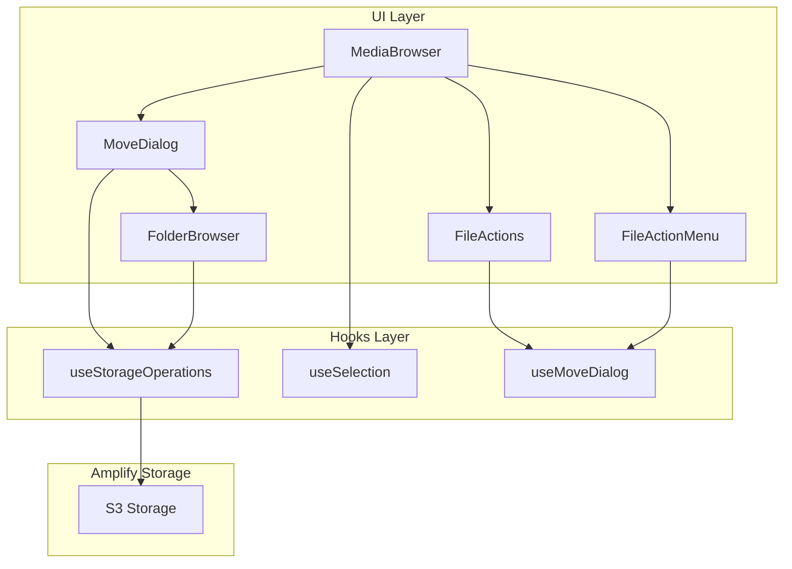
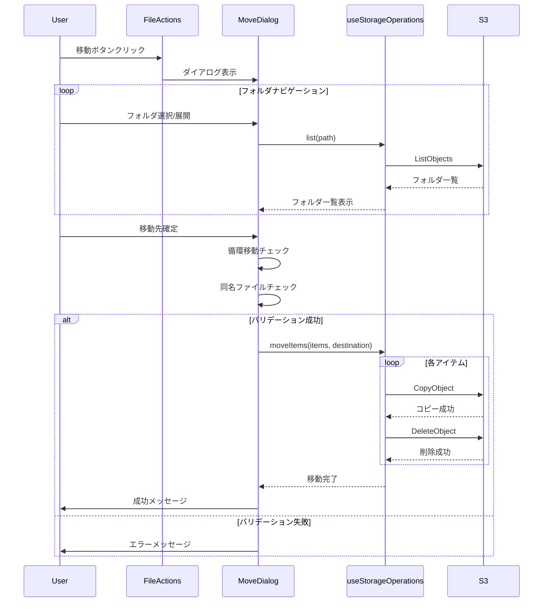

# Design Document: ファイル/フォルダ移動機能

## Overview

**Purpose**: ユーザーが S3 ストレージ内のファイルやフォルダを別のフォルダへ移動できるようにし、コンテンツの整理を容易にする。

**Users**: メディアファイルを管理するユーザーが、ファイルやフォルダを適切な場所に再配置するために使用する。

**Impact**: 既存の MediaBrowser コンポーネントに移動機能を追加し、`useStorageOperations` フックを拡張する。

### Goals

- ファイル/フォルダの単一・複数・一括移動をサポート
- 直感的な移動先選択 UI を提供
- 循環移動を防止し、データ整合性を保護
- 既存の選択機能（`useSelection`）と統合

### Non-Goals

- ドラッグ＆ドロップによる移動（将来検討）
- 異なるユーザー間でのファイル共有・移動
- 同名ファイル存在時の上書きオプション（初期実装では中止のみ）

## Architecture

### Existing Architecture Analysis

**現在のアーキテクチャ**:

- `MediaBrowser` がメインコンポーネント、`FileList` がアイテム表示
- `useStorageOperations` が S3 操作（list, upload, remove, copy, rename）を提供
- `useSelection` が複数選択状態を管理（Set ベース）
- `FileActionMenu` が個別アイテムのアクション（リネーム、削除）を提供

**拡張ポイント**:

- `useStorageOperations` に `moveItems` 関数を追加
- `FileActions`（一括操作 UI）に移動ボタンを追加
- 新規 `MoveDialog` コンポーネントで移動先選択

### Architecture Pattern & Boundary Map



**Architecture Integration**:

- **Selected pattern**: 既存の Hook + Component パターンを踏襲
- **Domain boundaries**: UI（ダイアログ）/ ロジック（フック）/ ストレージ（Amplify）の 3 層
- **Existing patterns preserved**: 単一責任フック、Co-location、Feature-first 構造
- **New components rationale**: `MoveDialog` はフォルダナビゲーションと循環移動防止ロジックをカプセル化

### Technology Stack

| Layer       | Choice / Version           | Role in Feature    | Notes              |
| ----------- | -------------------------- | ------------------ | ------------------ |
| Frontend    | React 19 + TypeScript      | UI コンポーネント  | 既存スタック       |
| State       | React useState/useCallback | ダイアログ状態管理 | 追加ライブラリ不要 |
| Storage API | aws-amplify/storage        | copy, remove, list | 既存 API を使用    |

## System Flows

### 移動操作フロー



**Key Decisions**:

- 循環移動チェックはダイアログ内で実行（UI での無効化 + 移動前バリデーション）
- 同名ファイルチェックは移動実行前に一括で行う
- copy 成功後に delete を実行することで部分失敗時のデータ保護

## Requirements Traceability

| Requirement | Summary                                | Components                              | Interfaces     | Flows                     |
| ----------- | -------------------------------------- | --------------------------------------- | -------------- | ------------------------- |
| 1.1         | 移動ボタンで UI 表示                   | FileActions, FileActionMenu, MoveDialog | useMoveDialog  | 移動操作フロー            |
| 1.2         | 移動先選択で移動実行                   | MoveDialog, useStorageOperations        | moveItems      | 移動操作フロー            |
| 1.3         | フォルダ配下の全オブジェクト移動       | useStorageOperations                    | moveItems      | -                         |
| 1.4         | 複数アイテム一括移動                   | useStorageOperations                    | moveItems      | -                         |
| 1.5         | S3 構造の正しい更新                    | useStorageOperations                    | refresh        | -                         |
| 2.1         | フォルダナビゲーション可能なダイアログ | MoveDialog, FolderBrowser               | -              | フォルダナビゲーション    |
| 2.2         | フォルダクリックで選択                 | FolderBrowser                           | onSelect       | -                         |
| 2.3         | フォルダダブルクリックで展開           | FolderBrowser                           | onNavigate     | -                         |
| 2.4         | 移動元フォルダへの移動無効化           | FolderBrowser                           | isDisabled     | -                         |
| 2.5         | 循環移動防止                           | FolderBrowser, MoveDialog               | isCircularMove | -                         |
| 2.6         | 親フォルダへ戻るナビゲーション         | FolderBrowser                           | onGoBack       | -                         |
| 3.1         | 進捗インジケーター表示                 | MoveDialog                              | MoveProgress   | 移動操作フロー            |
| 3.2         | 移動完了数/総数表示                    | MoveDialog                              | MoveProgress   | -                         |
| 3.3         | 処理中の操作制限                       | MoveDialog                              | isMoving       | -                         |
| 3.4         | 非同期実行                             | useStorageOperations                    | moveItems      | -                         |
| 4.1         | 同名ファイル存在時エラー               | MoveDialog, useStorageOperations        | MoveResult     | -                         |
| 4.2         | ネットワークエラー表示                 | MoveDialog                              | MoveResult     | -                         |
| 4.3         | 失敗アイテム一覧表示                   | MoveDialog                              | MoveResult     | -                         |
| 4.4         | 失敗時の元構造保持                     | useStorageOperations                    | moveItems      | -                         |
| 5.1         | ファイル一覧更新                       | MediaBrowser, useStorageOperations      | refresh        | -                         |
| 5.2         | 選択状態クリア                         | useSelection                            | clearSelection | -                         |
| 5.3         | 成功メッセージ表示                     | MoveDialog                              | -              | -                         |
| 5.4         | サムネイル表示維持                     | -                                       | -              | S3 キー変更により自動対応 |

## Components and Interfaces

### Summary

| Component            | Domain/Layer | Intent                                       | Req Coverage                   | Key Dependencies          | Contracts |
| -------------------- | ------------ | -------------------------------------------- | ------------------------------ | ------------------------- | --------- |
| MoveDialog           | UI           | 移動先選択ダイアログ                         | 2.1-2.6, 3.1-3.3, 4.1-4.3, 5.3 | useStorageOperations (P0) | State     |
| FolderBrowser        | UI           | フォルダナビゲーション表示                   | 2.1-2.6                        | useStorageOperations (P0) | -         |
| FileActions          | UI           | 一括操作ボタン群（既存拡張）                 | 1.1, 1.4                       | useMoveDialog (P0)        | -         |
| FileActionMenu       | UI           | 個別アイテムのアクションメニュー（既存拡張） | 1.1, 1.2                       | useMoveDialog (P0)        | -         |
| useStorageOperations | Hooks        | ストレージ操作（既存拡張）                   | 1.2-1.5, 3.4, 4.1-4.4, 5.1     | Amplify Storage (P0)      | Service   |
| useMoveDialog        | Hooks        | ダイアログ状態管理                           | 1.1                            | -                         | State     |

### UI Layer

#### MoveDialog

| Field        | Detail                                                       |
| ------------ | ------------------------------------------------------------ |
| Intent       | 移動先フォルダを選択し、移動操作を実行するモーダルダイアログ |
| Requirements | 2.1-2.6, 3.1-3.3, 4.1-4.3, 5.3                               |

**Responsibilities & Constraints**

- 移動先フォルダのナビゲーションと選択
- 循環移動のバリデーション
- 移動処理の進捗表示
- エラー/成功メッセージの表示

**Dependencies**

- Inbound: FileActions — ダイアログ表示トリガー (P0)
- Outbound: useStorageOperations — 移動操作実行 (P0)
- Outbound: FolderBrowser — フォルダナビゲーション表示 (P0)

**Contracts**: State [x]

##### State Management

```typescript
interface MoveDialogState {
  /** ダイアログ表示状態 */
  isOpen: boolean;
  /** 移動対象アイテム */
  itemsToMove: StorageItem[];
  /** 現在表示中のパス（ナビゲーション用） */
  browsePath: string;
  /** 選択中の移動先フォルダパス */
  selectedDestination: string | null;
  /** 移動処理中フラグ */
  isMoving: boolean;
  /** 移動進捗 */
  progress: MoveProgress | null;
  /** エラー状態 */
  error: MoveError | null;
}

interface MoveProgress {
  current: number;
  total: number;
}

interface MoveError {
  type: "duplicate" | "circular" | "network" | "partial";
  message: string;
  failedItems?: string[];
}
```

**Implementation Notes**

- Integration: 既存の `CreateFolderDialog`, `RenameDialog` と同様のモーダルパターン
- Validation: 移動先選択時に循環移動チェック、確定時に同名ファイルチェック
- Risks: 大量ファイル移動時の進捗表示パフォーマンス

#### FolderBrowser

| Field        | Detail                                         |
| ------------ | ---------------------------------------------- |
| Intent       | 移動先選択用のフォルダ一覧表示とナビゲーション |
| Requirements | 2.1-2.6                                        |

**Responsibilities & Constraints**

- 指定パス配下のフォルダ一覧を表示
- フォルダ選択/展開のイベントハンドリング
- 無効フォルダ（現在地、循環移動先）の視覚的表示

**Dependencies**

- Inbound: MoveDialog — 表示パス指定 (P0)
- Outbound: useStorageOperations — フォルダ一覧取得 (P0)

**Contracts**: なし（Props ベース）

```typescript
interface FolderBrowserProps {
  /** 表示するパス */
  path: string;
  /** 移動対象アイテムのキー一覧（無効化判定用） */
  movingItemKeys: string[];
  /** 選択中の移動先 */
  selectedPath: string | null;
  /** フォルダ選択時 */
  onSelect: (path: string) => void;
  /** フォルダ展開時（ダブルクリック） */
  onNavigate: (path: string) => void;
  /** 親フォルダへ戻る */
  onGoBack: () => void;
  /** ルートへ戻る */
  onGoRoot: () => void;
}
```

**Implementation Notes**

- Integration: `useStorageOperations.listFolders` を使用してフォルダのみ取得
- Validation: `isCircularMove(itemKey, destinationPath)` で循環移動を判定

#### FileActionMenu（既存拡張）

| Field        | Detail                                                     |
| ------------ | ---------------------------------------------------------- |
| Intent       | 個別アイテムのアクションメニューに「移動」オプションを追加 |
| Requirements | 1.1, 1.2                                                   |

**Responsibilities & Constraints**

- 既存のリネーム・削除に加えて「移動」メニュー項目を追加
- 単一アイテムの移動ダイアログをトリガー

**Dependencies**

- Inbound: FileList — 各アイテム行から表示 (P0)
- Outbound: useMoveDialog — ダイアログ表示トリガー (P0)

**Contracts**: なし（Props 拡張）

```typescript
interface FileActionMenuProps {
  /** 対象アイテム名（aria-label用） */
  itemName: string;
  /** 対象アイテム（移動用） */
  item: StorageItem;
  /** リネームコールバック */
  onRename: () => void;
  /** 削除コールバック */
  onDelete: () => void;
  /** 移動コールバック（新規追加） */
  onMove: () => void;
}
```

**Implementation Notes**

- Integration: 既存メニューに `FolderInput` アイコン付きの「移動」項目を追加
- Validation: なし（移動先選択は MoveDialog で実施）

### Hooks Layer

#### useStorageOperations（拡張）

| Field        | Detail                                  |
| ------------ | --------------------------------------- |
| Intent       | S3 ストレージ操作の提供（移動機能追加） |
| Requirements | 1.2-1.5, 3.4, 4.1-4.4, 5.1              |

**Responsibilities & Constraints**

- 既存の責務を維持（list, upload, remove, rename）
- 新規: ファイル/フォルダの移動操作
- 新規: 指定パス配下のフォルダ一覧取得

**Dependencies**

- External: aws-amplify/storage — copy, remove, list (P0)

**Contracts**: Service [x]

##### Service Interface

```typescript
/** 移動操作の結果 */
interface MoveResult {
  success: boolean;
  /** 移動に成功したアイテム数 */
  succeeded: number;
  /** 移動に失敗したアイテム数 */
  failed: number;
  /** 失敗したアイテムのキー */
  failedItems?: string[];
  /** 重複が検出されたアイテム */
  duplicates?: string[];
  /** エラーメッセージ */
  error?: string;
}

/** 移動進捗情報 */
interface MoveProgress {
  current: number;
  total: number;
}

// useStorageOperations に追加される関数

/**
 * 複数アイテムを指定先に移動する
 * @param items 移動対象のアイテム
 * @param destinationPath 移動先のパス（末尾 / なし）
 * @param onProgress 進捗コールバック
 */
moveItems: (
  items: StorageItem[],
  destinationPath: string,
  onProgress?: (progress: MoveProgress) => void,
) => Promise<MoveResult>;

/**
 * 指定パス配下のフォルダ一覧を取得
 * @param path 検索対象のパス
 */
listFolders: (path: string) => Promise<StorageItem[]>;

/** 移動処理中フラグ */
isMoving: boolean;
```

- Preconditions:
  - `items` が空でないこと
  - `destinationPath` が循環移動先でないこと
- Postconditions:
  - 成功時: 元のパスからアイテムが削除され、新パスに存在
  - 失敗時: 元のパスにアイテムが保持される
- Invariants:
  - copy 成功後のみ delete を実行（データ保護）

**Implementation Notes**

- Integration: 既存の `renameFolder` パターンを踏襲（copy + delete）
- Validation: 移動実行前に同名ファイルの存在チェック
- Risks: 大量ファイル移動時のタイムアウト → 進捗表示で対応

#### useMoveDialog

| Field        | Detail                                 |
| ------------ | -------------------------------------- |
| Intent       | 移動ダイアログの表示状態とアイテム管理 |
| Requirements | 1.1                                    |

**Responsibilities & Constraints**

- ダイアログの開閉状態管理
- 移動対象アイテムの保持

**Dependencies**

- なし

**Contracts**: State [x]

##### State Management

```typescript
interface UseMoveDialogReturn {
  /** ダイアログ表示状態 */
  isOpen: boolean;
  /** 移動対象アイテム */
  itemsToMove: StorageItem[];
  /** ダイアログを開く */
  openMoveDialog: (items: StorageItem[]) => void;
  /** ダイアログを閉じる */
  closeMoveDialog: () => void;
}
```

**Implementation Notes**

- Integration: `FileActions` から呼び出し、`MoveDialog` に状態を渡す
- Validation: なし（シンプルな状態管理）

## Data Models

### Domain Model

**Aggregates**:

- `StorageItem`: 既存のファイル/フォルダエンティティ（変更なし）

**Domain Events**:

- `ItemsMoved`: 移動完了時のイベント（UI 更新トリガー）

### Logical Data Model

移動操作は S3 オブジェクトのキー変更のみであり、新規データモデルは不要。

**キー変換ルール**:

```
移動元: media/{identityId}/photos/2024/image.jpg
移動先: media/{identityId}/archive/
結果:   media/{identityId}/archive/image.jpg

フォルダ移動:
移動元: media/{identityId}/photos/2024/
移動先: media/{identityId}/archive/
結果:   media/{identityId}/archive/2024/
  配下のファイルも同様にキー変換
```

## Error Handling

### Error Strategy

- **事前チェック優先**: 移動実行前に同名ファイル・循環移動をチェック
- **部分失敗対応**: 一括移動中の個別失敗を記録し、完了後にまとめて報告
- **データ保護**: copy 成功後のみ delete を実行

### Error Categories and Responses

**User Errors (4xx)**:

- 循環移動の試行 → ダイアログ内でエラーメッセージ、移動ボタン無効化
- 同名ファイル存在 → 移動前にチェック、エラーメッセージ表示

**System Errors (5xx)**:

- ネットワークエラー → エラーメッセージ表示、リトライは手動
- 部分失敗 → 成功/失敗件数と失敗アイテム一覧を表示

## Testing Strategy

### Unit Tests

- `useStorageOperations.moveItems`: 単一/複数/フォルダ移動の成功ケース
- `useStorageOperations.moveItems`: 同名ファイル存在時のエラー
- `useMoveDialog`: 開閉状態とアイテム管理
- `isCircularMove`: 循環移動判定ロジック

### Integration Tests

- `MoveDialog` + `useStorageOperations`: 移動フロー全体
- `FolderBrowser` + `useStorageOperations`: フォルダナビゲーション

### E2E/UI Tests

- ファイル選択 → 移動ボタン → 移動先選択 → 確定 → 一覧更新
- 循環移動の試行 → エラー表示
- 同名ファイル存在時のエラー表示
