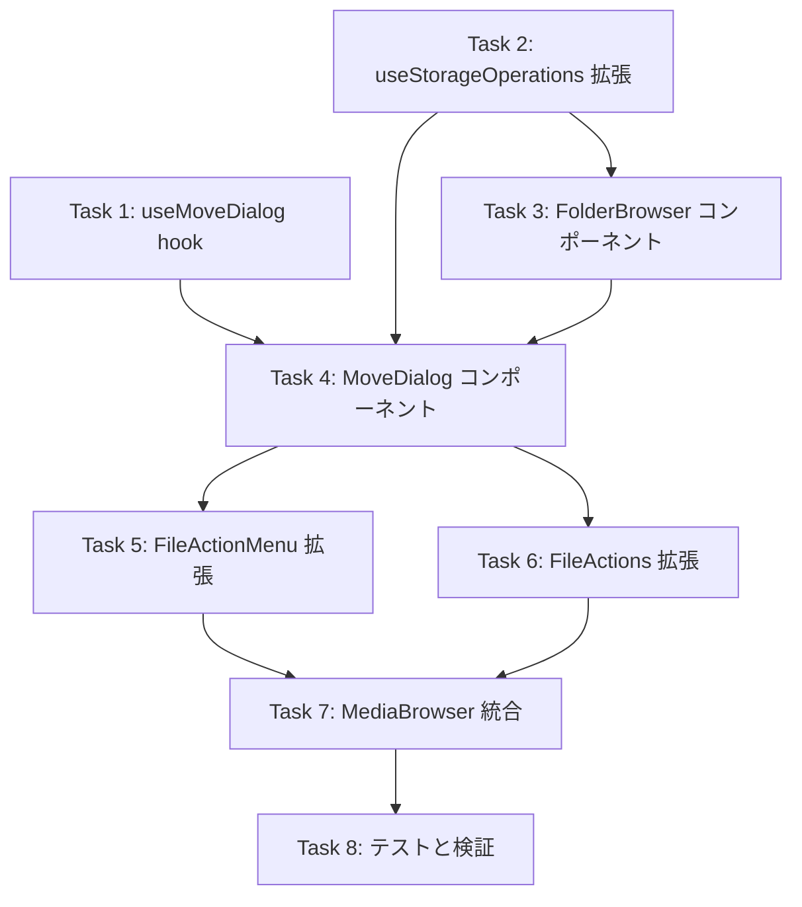

# Implementation Tasks: ファイル/フォルダ移動機能

## 概要

このドキュメントは、ファイル/フォルダ移動機能の実装タスクを定義します。各タスクは設計ドキュメントのコンポーネントと要件に基づいています。

## 依存関係グラフ



## Task 1: useMoveDialog フックの作成

**Priority**: P0
**Requirements**: 1.1
**Estimated Complexity**: Low

### 目的

移動ダイアログの表示状態と移動対象アイテムを管理するカスタムフックを作成する。

### 受入条件

- [x] 1.1: `useMoveDialog` フックが作成されている
- [x] 1.2: `isOpen` 状態でダイアログの開閉を管理できる
- [x] 1.3: `itemsToMove` で移動対象アイテムを保持できる
- [x] 1.4: `openMoveDialog(items)` で複数アイテムを渡してダイアログを開ける
- [x] 1.5: `closeMoveDialog()` でダイアログを閉じ、アイテムをクリアできる

### 実装ファイル

- `src/hooks/useMoveDialog.ts` (新規作成)

### インターフェース

```typescript
interface UseMoveDialogReturn {
  isOpen: boolean;
  itemsToMove: StorageItem[];
  openMoveDialog: (items: StorageItem[]) => void;
  closeMoveDialog: () => void;
}
```

---

## Task 2: useStorageOperations フックの拡張

**Priority**: P0
**Requirements**: 1.2-1.5, 3.4, 4.1-4.4, 5.1
**Estimated Complexity**: High

### 目的

既存の `useStorageOperations` フックに移動機能を追加する。

### 受入条件

- [x] 2.1: `moveItems` 関数が追加されている
- [x] 2.2: `listFolders` 関数が追加されている（フォルダのみ取得）
- [x] 2.3: `isMoving` 状態が追加されている
- [x] 2.4: 単一ファイルの移動が正常に動作する
- [x] 2.5: 複数ファイルの一括移動が正常に動作する
- [x] 2.6: フォルダの移動（配下オブジェクト含む）が正常に動作する
- [x] 2.7: 進捗コールバック (`onProgress`) が正しく呼び出される
- [x] 2.8: 同名ファイル存在時にエラーを返す（移動中止）
- [x] 2.9: 部分失敗時に失敗アイテム一覧を返す
- [x] 2.10: copy 成功後のみ delete を実行する（データ保護）
- [x] 2.11: 移動完了後に一覧が自動更新される

### 実装ファイル

- `src/hooks/useStorageOperations.ts` (拡張)

### インターフェース

```typescript
interface MoveResult {
  success: boolean;
  succeeded: number;
  failed: number;
  failedItems?: string[];
  duplicates?: string[];
  error?: string;
}

interface MoveProgress {
  current: number;
  total: number;
}

// 追加される関数
moveItems: (
  items: StorageItem[],
  destinationPath: string,
  onProgress?: (progress: MoveProgress) => void,
) => Promise<MoveResult>;

listFolders: (path: string) => Promise<StorageItem[]>;

isMoving: boolean;
```

### 実装メモ

- 既存の `renameFolder` パターン（copy + delete）を踏襲
- 日本語パスには `encodePathForCopy` を使用
- 循環移動チェックは呼び出し側で実施済みを前提

---

## Task 3: FolderBrowser コンポーネントの作成

**Priority**: P0
**Requirements**: 2.1-2.6
**Estimated Complexity**: Medium

### 目的

移動先選択用のフォルダ一覧表示とナビゲーションを提供するコンポーネントを作成する。

### 受入条件

- [x] 3.1: 指定パス配下のフォルダ一覧を表示できる
- [x] 3.2: フォルダをクリックで選択状態にできる
- [x] 3.3: フォルダをダブルクリックでそのフォルダ内にナビゲートできる
- [x] 3.4: 循環移動先のフォルダが無効化（グレーアウト）されている
- [x] 3.5: 現在の移動元フォルダへの移動が無効化されている
- [x] 3.6: 親フォルダへ戻るナビゲーションが機能する
- [x] 3.7: ルートへ戻るナビゲーションが機能する
- [x] 3.8: ローディング状態が表示される

### 実装ファイル

- `src/components/MediaBrowser/FolderBrowser.tsx` (新規作成)

### 依存関係

- Task 2: `useStorageOperations.listFolders` を使用

---

## Task 4: MoveDialog コンポーネントの作成

**Priority**: P0
**Requirements**: 2.1-2.6, 3.1-3.3, 4.1-4.3, 5.3
**Estimated Complexity**: High

### 目的

移動先フォルダを選択し、移動操作を実行するモーダルダイアログを作成する。

### 受入条件

- [x] 4.1: モーダルダイアログとして表示される
- [x] 4.2: FolderBrowser を内包してフォルダナビゲーションができる
- [x] 4.3: 選択中の移動先パスが表示される
- [x] 4.4: 「ここに移動」ボタンで移動を実行できる
- [x] 4.5: 移動先未選択時は「ここに移動」ボタンが無効化される
- [x] 4.6: 循環移動時にエラーメッセージを表示する
- [x] 4.7: 同名ファイル存在時にエラーメッセージを表示する
- [x] 4.8: 移動中に進捗インジケーターを表示する
- [x] 4.9: 移動中に進捗数（X/Y）を表示する
- [x] 4.10: 移動中は操作を制限する（キャンセル不可、フォルダ選択不可）
- [x] 4.11: 移動成功時に成功メッセージを表示する
- [x] 4.12: 部分失敗時に失敗アイテム一覧を表示する
- [x] 4.13: キャンセルボタンでダイアログを閉じられる

### 実装ファイル

- `src/components/MediaBrowser/MoveDialog.tsx` (新規作成)

### 依存関係

- Task 1: `useMoveDialog` から状態を受け取る
- Task 2: `useStorageOperations.moveItems` を使用
- Task 3: `FolderBrowser` を内包

---

## Task 5: FileActionMenu の拡張

**Priority**: P1
**Requirements**: 1.1, 1.2
**Estimated Complexity**: Low

### 目的

既存の FileActionMenu に「移動」オプションを追加し、単一ファイルの移動をトリガーできるようにする。

### 受入条件

- [x] 5.1: 「移動」メニュー項目が追加されている
- [x] 5.2: FolderInput アイコンが表示されている
- [x] 5.3: クリック時に `onMove` コールバックが呼び出される
- [x] 5.4: Props に `onMove` が追加されている

### 実装ファイル

- `src/components/MediaBrowser/FileActionMenu.tsx` (拡張)

### 依存関係

- Task 4: MoveDialog が存在すること

---

## Task 6: FileActions の拡張

**Priority**: P1
**Requirements**: 1.1, 1.4
**Estimated Complexity**: Low

### 目的

既存の FileActions コンポーネントに移動ボタンを追加し、一括移動をトリガーできるようにする。

### 受入条件

- [x] 6.1: 移動ボタンが追加されている
- [x] 6.2: 選択状態でのみ移動ボタンが有効化される
- [x] 6.3: クリック時に移動ダイアログが開く
- [x] 6.4: 選択中の全アイテムが移動対象として渡される

### 実装ファイル

- `src/components/MediaBrowser/FileActions.tsx` (拡張)

### 依存関係

- Task 1: `useMoveDialog.openMoveDialog` を使用
- Task 4: MoveDialog が存在すること

---

## Task 7: MediaBrowser への統合

**Priority**: P1
**Requirements**: 1.1-1.5, 5.1-5.4
**Estimated Complexity**: Medium

### 目的

すべての移動機能コンポーネントを MediaBrowser に統合し、エンドツーエンドで動作するようにする。

### 受入条件

- [x] 7.1: MoveDialog が MediaBrowser に追加されている
- [x] 7.2: useMoveDialog が MediaBrowser で使用されている
- [x] 7.3: FileActionMenu から単一ファイル移動ができる
- [x] 7.4: FileActions から一括移動ができる
- [x] 7.5: 移動完了後に現在のフォルダのファイル一覧が更新される
- [x] 7.6: 移動完了後に選択状態がクリアされる
- [x] 7.7: サムネイル表示が維持される（移動後も正しく表示）

### 実装ファイル

- `src/components/MediaBrowser/MediaBrowser.tsx` (拡張)
- `src/components/MediaBrowser/FileList.tsx` (必要に応じて拡張)

### 依存関係

- Task 1-6: すべての前提タスクが完了していること

---

## Task 8: テストと検証

**Priority**: P2
**Requirements**: 全要件
**Estimated Complexity**: Medium

### 目的

実装した機能のテストを作成し、すべての要件が満たされていることを検証する。

### 受入条件

- [x] 8.1: `useMoveDialog` のユニットテストが作成されている
- [x] 8.2: `useStorageOperations.moveItems` のユニットテストが作成されている
- [x] 8.3: 循環移動判定ロジックのユニットテストが作成されている
- [x] 8.4: 同名ファイルチェックのユニットテストが作成されている
- [x] 8.5: MoveDialog の基本的な UI テストが作成されている
- [x] 8.6: ビルドが成功する
- [x] 8.7: 既存のテストが通過する

### 実装ファイル

- `src/hooks/useMoveDialog.test.ts` (新規作成)
- `src/hooks/useStorageOperations.test.ts` (拡張)
- `src/components/MediaBrowser/MoveDialog.test.tsx` (新規作成)

### 依存関係

- Task 7: 統合が完了していること

---

## 並列実行可能なタスク

| タスクグループ   | タスク         | 備考                                  |
| ---------------- | -------------- | ------------------------------------- |
| Phase 1 (基盤)   | Task 1, Task 2 | 相互依存なし、並列実行可能            |
| Phase 2 (UI)     | Task 3, Task 4 | Task 2 完了後、Task 3 → Task 4 の順序 |
| Phase 3 (統合)   | Task 5, Task 6 | Task 4 完了後、並列実行可能           |
| Phase 4 (仕上げ) | Task 7, Task 8 | Task 5, 6 完了後、順次実行            |

## 要件カバレッジマトリクス

| 要件 | Task 1 | Task 2 | Task 3 | Task 4 | Task 5 | Task 6 | Task 7 | Task 8 |
| ---- | ------ | ------ | ------ | ------ | ------ | ------ | ------ | ------ |
| 1.1  | ✓      |        |        |        | ✓      | ✓      | ✓      |        |
| 1.2  |        | ✓      |        | ✓      | ✓      |        |        |        |
| 1.3  |        | ✓      |        |        |        |        |        |        |
| 1.4  |        | ✓      |        |        |        | ✓      |        |        |
| 1.5  |        | ✓      |        |        |        |        |        |        |
| 2.1  |        |        | ✓      | ✓      |        |        |        |        |
| 2.2  |        |        | ✓      |        |        |        |        |        |
| 2.3  |        |        | ✓      |        |        |        |        |        |
| 2.4  |        |        | ✓      |        |        |        |        |        |
| 2.5  |        |        | ✓      | ✓      |        |        |        |        |
| 2.6  |        |        | ✓      |        |        |        |        |        |
| 3.1  |        |        |        | ✓      |        |        |        |        |
| 3.2  |        |        |        | ✓      |        |        |        |        |
| 3.3  |        |        |        | ✓      |        |        |        |        |
| 3.4  |        | ✓      |        |        |        |        |        |        |
| 4.1  |        | ✓      |        | ✓      |        |        |        |        |
| 4.2  |        | ✓      |        | ✓      |        |        |        |        |
| 4.3  |        | ✓      |        | ✓      |        |        |        |        |
| 4.4  |        | ✓      |        |        |        |        |        |        |
| 5.1  |        |        |        |        |        |        | ✓      |        |
| 5.2  |        |        |        |        |        |        | ✓      |        |
| 5.3  |        |        |        | ✓      |        |        |        |        |
| 5.4  |        |        |        |        |        |        | ✓      |        |
