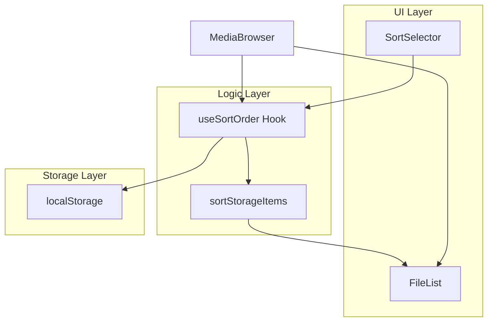
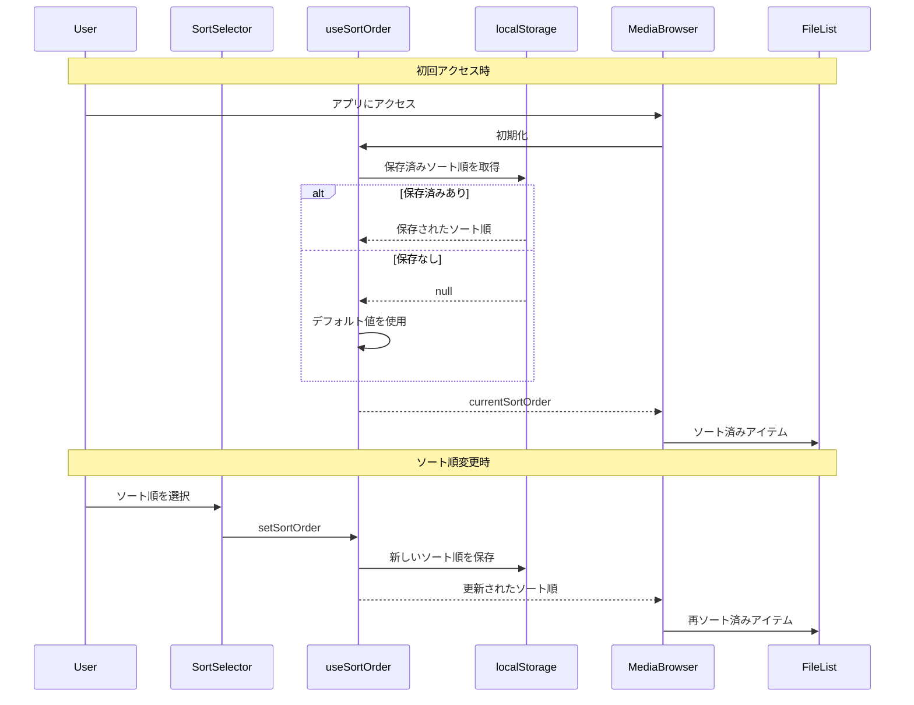

# Design Document: file-sort-order

## Overview

**Purpose**: メディアブラウザにファイル・フォルダのソート機能を追加し、ユーザーが目的のファイルを効率的に見つけられるようにする。

**Users**: 写真・動画を管理するエンドユーザーが、大量のメディアファイルを閲覧する際に使用する。

**Impact**: 既存の `parseStorageItems` のソートロジックを拡張し、新規コンポーネント・フックを追加する。

### Goals

- 4種類のソート順（新しい順、古い順、名前順、サイズ順）から選択可能にする
- ソート設定をブラウザに永続化し、再訪問時に復元する
- フォルダ優先表示を維持しつつ、選択したソート順を適用する

### Non-Goals

- URLクエリパラメータによるソート順の共有
- サーバーサイドでのソート処理
- ソート順のユーザーアカウント紐付け（ローカルストレージのみ）

## Architecture

### Existing Architecture Analysis

- 現在のソートロジックは `parseStorageItems.ts` (line 53-56) に実装済み
- `StorageItem` 型に `size`, `lastModified` フィールドが定義済み
- 単一責任フックパターン（`useIdentityId`, `useStoragePath`, `useSelection` など）が確立

### Architecture Pattern & Boundary Map



**Architecture Integration**:

- **Selected pattern**: Hook-based State Management（既存パターンとの整合性）
- **Domain boundaries**: ソートロジック（純粋関数）とUI（コンポーネント）を分離
- **Existing patterns preserved**: 単一責任フック、Feature-first構成
- **New components rationale**: `SortSelector`（UI）、`useSortOrder`（状態管理）、`sortStorageItems`（ロジック）

### Technology Stack

| Layer                | Choice / Version | Role in Feature            | Notes               |
| -------------------- | ---------------- | -------------------------- | ------------------- |
| Frontend             | React 19         | UIコンポーネント、状態管理 | 既存スタック        |
| Storage              | localStorage API | ソート設定の永続化         | 30日以上保持        |
| Internationalization | Intl.Collator    | 自然順ソート               | `{ numeric: true }` |

## System Flows



## Requirements Traceability

| Requirement | Summary                      | Components                     | Interfaces        | Flows              |
| ----------- | ---------------------------- | ------------------------------ | ----------------- | ------------------ |
| 1.1         | ソート選択UIの表示           | SortSelector                   | SortSelectorProps | -                  |
| 1.2         | 4つのソートオプション提供    | useSortOrder, SortSelector     | SortOrder型       | -                  |
| 1.3         | 即座の再並び替え             | sortStorageItems, MediaBrowser | SortOrder型       | ソート順変更フロー |
| 1.4         | 現在のソート順表示           | SortSelector                   | SortSelectorProps | -                  |
| 2.1         | ソート順の保存               | useSortOrder                   | -                 | ソート順変更フロー |
| 2.2         | 保存されたソート順の復元     | useSortOrder                   | -                 | 初回アクセスフロー |
| 2.3         | デフォルト値の適用           | useSortOrder                   | SortOrder型       | 初回アクセスフロー |
| 2.4         | 30日間保持                   | localStorage                   | -                 | -                  |
| 3.1         | フォルダ優先表示             | sortStorageItems               | -                 | -                  |
| 3.2         | フォルダ・ファイル個別ソート | sortStorageItems               | -                 | -                  |
| 3.3         | 自然順ソート                 | sortStorageItems               | -                 | -                  |
| 3.4         | 最終更新日時基準             | sortStorageItems               | -                 | -                  |
| 3.5         | ファイルサイズ基準           | sortStorageItems               | -                 | -                  |
| 4.1         | ファイル一覧上部に配置       | MediaBrowser, SortSelector     | -                 | -                  |
| 4.2         | キーボード操作対応           | SortSelector                   | -                 | -                  |
| 4.3         | ARIAラベル対応               | SortSelector                   | -                 | -                  |

## Components and Interfaces

| Component        | Domain/Layer  | Intent                           | Req Coverage                 | Key Dependencies   | Contracts |
| ---------------- | ------------- | -------------------------------- | ---------------------------- | ------------------ | --------- |
| SortSelector     | UI            | ソート順選択ドロップダウンを表示 | 1.1, 1.2, 1.4, 4.1, 4.2, 4.3 | useSortOrder (P0)  | State     |
| useSortOrder     | Logic/Hook    | ソート順の状態管理と永続化       | 2.1, 2.2, 2.3, 2.4           | localStorage (P0)  | State     |
| sortStorageItems | Logic/Utility | アイテム配列のソート処理         | 1.3, 3.1, 3.2, 3.3, 3.4, 3.5 | Intl.Collator (P0) | Service   |

### Logic Layer

#### useSortOrder

| Field        | Detail                                       |
| ------------ | -------------------------------------------- |
| Intent       | ソート順の状態管理と localStorage への永続化 |
| Requirements | 2.1, 2.2, 2.3, 2.4                           |

**Responsibilities & Constraints**

- ソート順の読み込み・保存・更新を担当
- localStorage が無効な環境でもデフォルト値で動作
- 30日以上の保持期間は localStorage の特性で自動的に満たされる

**Dependencies**

- External: localStorage — ソート設定の永続化 (P0)

**Contracts**: State [x]

##### State Management

```typescript
type SortOrder = "newest" | "oldest" | "name" | "size";

interface UseSortOrderReturn {
  sortOrder: SortOrder;
  setSortOrder: (order: SortOrder) => void;
}

function useSortOrder(): UseSortOrderReturn;
```

- State model: `SortOrder` 型で4つのソート順を表現
- Persistence: localStorage キー `s3-photo-browser:sort-order`
- Default: `"newest"`（新しい順）

**Implementation Notes**

- Integration: `MediaBrowser` から呼び出し、`SortSelector` と `sortStorageItems` に値を渡す
- Validation: 不正な値が保存されている場合はデフォルト値にフォールバック

#### sortStorageItems

| Field        | Detail                                       |
| ------------ | -------------------------------------------- |
| Intent       | StorageItem 配列を指定されたソート順でソート |
| Requirements | 1.3, 3.1, 3.2, 3.3, 3.4, 3.5                 |

**Responsibilities & Constraints**

- フォルダを常にファイルより先に配置
- フォルダ群・ファイル群それぞれに対してソートを適用
- 純粋関数として実装（副作用なし）

**Dependencies**

- External: Intl.Collator — 自然順ソート (P0)

**Contracts**: Service [x]

##### Service Interface

```typescript
type SortOrder = "newest" | "oldest" | "name" | "size";

function sortStorageItems(items: StorageItem[], sortOrder: SortOrder): StorageItem[];
```

- Preconditions: `items` は有効な `StorageItem` 配列
- Postconditions: フォルダ優先、指定順でソートされた新しい配列を返す
- Invariants: 元の配列は変更しない（イミュータブル）

**Implementation Notes**

- `lastModified` が `undefined` の場合は最も古い日付として扱う
- `size` が `undefined` の場合は 0 として扱う
- 名前ソートには `Intl.Collator('ja', { numeric: true })` を使用

### UI Layer

#### SortSelector

| Field        | Detail                                   |
| ------------ | ---------------------------------------- |
| Intent       | ソート順を選択するドロップダウンUIを提供 |
| Requirements | 1.1, 1.2, 1.4, 4.1, 4.2, 4.3             |

**Responsibilities & Constraints**

- 4つのソートオプションをドロップダウンで表示
- 現在選択されているソート順を明示的に表示
- キーボード操作とスクリーンリーダーに対応

**Dependencies**

- Inbound: MediaBrowser — props経由でソート順と変更ハンドラを受け取る (P0)

**Contracts**: State [x]

##### State Management

```typescript
interface SortSelectorProps {
  currentOrder: SortOrder;
  onChange: (order: SortOrder) => void;
}
```

**Implementation Notes**

- Integration: `MediaBrowser` の `<main>` 直前に配置
- Validation: 選択されたオプションが有効な `SortOrder` であることを型で保証
- Accessibility: `<select>` 要素を使用し、`aria-label` を設定

## Data Models

### Domain Model

```typescript
/**
 * ソート順を表す列挙型
 * - newest: 新しい順（lastModified 降順）
 * - oldest: 古い順（lastModified 昇順）
 * - name: 名前順（A→Z、自然順）
 * - size: サイズ順（大きい順、size 降順）
 */
type SortOrder = "newest" | "oldest" | "name" | "size";

/**
 * ソート順のラベル定義
 */
const SORT_ORDER_LABELS: Record<SortOrder, string> = {
  newest: "新しい順",
  oldest: "古い順",
  name: "名前順",
  size: "サイズ順",
};
```

### Data Contracts & Integration

**localStorage Schema**:

- Key: `s3-photo-browser:sort-order`
- Value: `SortOrder` 型の文字列（`"newest"` | `"oldest"` | `"name"` | `"size"`）
- Validation: 読み込み時に有効な値かチェックし、無効な場合はデフォルト値を使用

## Error Handling

### Error Strategy

- localStorage アクセス失敗時はデフォルト値を使用（サイレントフォールバック）
- 不正なソート順値は `"newest"` にフォールバック

### Error Categories and Responses

**User Errors**: なし（UIで不正な選択は不可能）

**System Errors**:

- localStorage 無効 → デフォルト値で動作継続
- localStorage 容量超過 → 保存失敗を無視し、セッション中は動作継続

## Testing Strategy

### Unit Tests

- `sortStorageItems`: 各ソート順で正しい順序になることを検証
- `sortStorageItems`: フォルダ優先表示が維持されることを検証
- `sortStorageItems`: `undefined` フィールドのフォールバック動作を検証
- `useSortOrder`: localStorage への保存・読み込みを検証
- `useSortOrder`: デフォルト値のフォールバックを検証

### Integration Tests

- `SortSelector` 操作でファイル一覧が再ソートされることを検証
- ページリロード後にソート順が復元されることを検証

### E2E Tests

- ソート順を変更し、ファイル一覧の順序が変わることを確認
- 異なるソート順でフォルダが常にファイルより先に表示されることを確認
