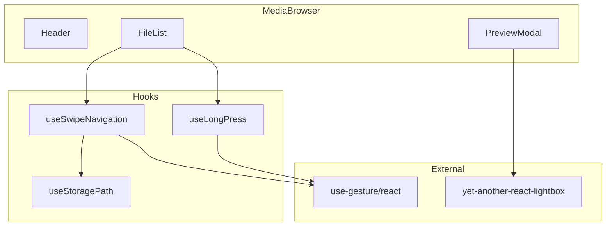
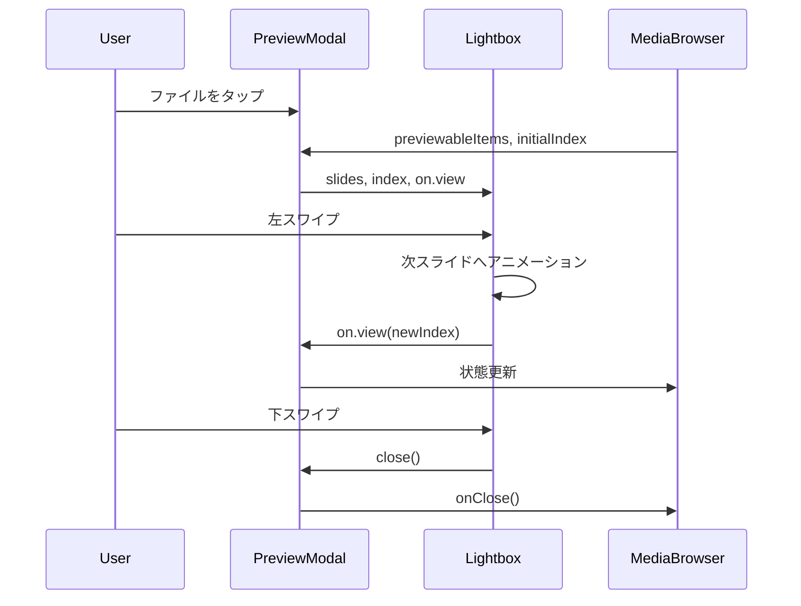
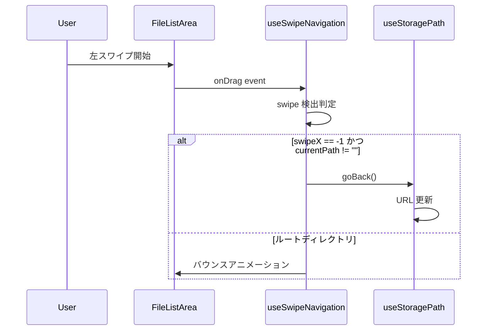
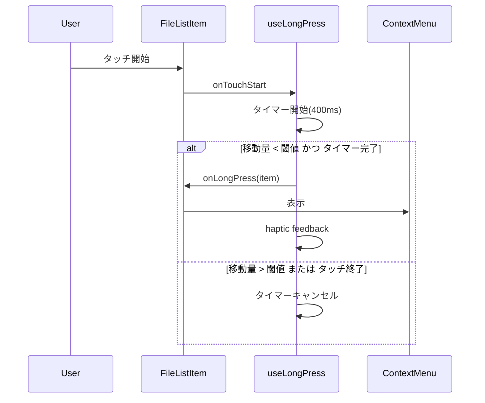

# Design Document

## Overview

**Purpose**: モバイルデバイスでの操作性を向上させるため、スワイプ・長押しなどのジェスチャー操作を導入し、ネイティブアプリに近い直感的なユーザー体験を提供する。

**Users**: モバイルデバイスまたはタッチ対応デバイスでメディアファイルを閲覧するユーザー。

**Impact**: 既存の PreviewModal、FileList、MediaBrowser コンポーネントを拡張し、ジェスチャー操作を追加。FileActionMenu コンポーネントは削除し、長押し操作に置き換える。

### Goals

- プレビュー画面での左右スワイプによる前後ファイルナビゲーション
- プレビュー画面での下スワイプによるクローズ
- ファイルリスト画面での左スワイプによる親ディレクトリへの移動
- ファイルアイテムの長押しによるアクションメニュー表示
- 滑らかなアニメーションによる視覚的フィードバック

### Non-Goals

- PC向けキーボードアクセシビリティ
- モバイルレスポンシブ対応の強化（グリッド列数変更等）
- スクリーンリーダー対応

## Architecture

### Existing Architecture Analysis

- **PreviewModal**: 現在は単一ファイルのみ表示。`slides` 配列は常に 1 要素で、複数スライドナビゲーション無効化
- **FileList**: `onClick` ハンドラでフォルダ/ファイルクリックを処理。FileActionMenu で個別アクション
- **FileActionMenu**: Ellipsis アイコンでドロップダウンメニュー表示（削除対象）
- **useStoragePath**: URL クエリパラメータと同期した `goBack()` 関数を提供

### Architecture Pattern & Boundary Map



**Architecture Integration**:

- **Selected pattern**: Feature-first + Hook 分離（既存パターン踏襲）
- **Domain boundaries**: ジェスチャー検出ロジックはカスタムフックに分離し、UI コンポーネントはプレゼンテーションに専念
- **Existing patterns preserved**: 単一責任フック、コンポーネントのコロケーション
- **New components rationale**:
  - useSwipeNavigation: 水平スワイプ検出と戻るナビゲーションを担当
  - useLongPress: 長押し検出とアクションメニュー表示トリガーを担当
- **Steering compliance**: hooks/ ディレクトリへの配置、TypeScript strict mode、any 型禁止

### Technology Stack

| Layer    | Choice / Version                   | Role in Feature                         | Notes        |
| -------- | ---------------------------------- | --------------------------------------- | ------------ |
| Frontend | @use-gesture/react ^10.x           | スワイプ・長押しジェスチャー検出        | 新規追加     |
| Frontend | yet-another-react-lightbox（既存） | スワイプナビゲーション、closeOnPullDown | 設定変更のみ |
| Frontend | React 19（既存）                   | コンポーネント・フック                  | 変更なし     |

## System Flows

### プレビュー画面スワイプナビゲーション



### ファイルリスト左スワイプで戻る



### ファイルアイテム長押し



## Requirements Traceability

| Requirement | Summary                          | Components                       | Interfaces                            | Flows              |
| ----------- | -------------------------------- | -------------------------------- | ------------------------------------- | ------------------ |
| 1.1, 1.2    | 左右スワイプで前後ファイル移動   | PreviewModal                     | Lightbox slides, index, on.view       | プレビュースワイプ |
| 1.3, 1.4    | 端到達時のフィードバック         | PreviewModal                     | Lightbox carousel.finite              | プレビュースワイプ |
| 1.5         | スワイプ中の視覚的フィードバック | PreviewModal                     | Lightbox 標準アニメーション           | プレビュースワイプ |
| 2.1, 2.2    | 下スワイプでクローズ             | PreviewModal                     | Lightbox controller.closeOnPullDown   | プレビュースワイプ |
| 2.3         | 閾値未達時の復帰                 | PreviewModal                     | Lightbox 標準動作                     | プレビュースワイプ |
| 2.4         | スワイプ方向判定                 | PreviewModal                     | Lightbox 標準動作                     | プレビュースワイプ |
| 2.5         | 閉じるボタン維持                 | PreviewModal                     | toolbar.buttons                       | -                  |
| 3.1, 3.2    | 左スワイプで戻る                 | MediaBrowser, useSwipeNavigation | useSwipeNavigation                    | 左スワイプで戻る   |
| 3.3         | スワイプ中のフィードバック       | MediaBrowser                     | CSS transform                         | 左スワイプで戻る   |
| 3.4         | スクロール中の誤発動防止         | useSwipeNavigation               | threshold, axis                       | 左スワイプで戻る   |
| 3.5         | 既存戻るボタン維持               | Header                           | 変更なし                              | -                  |
| 4.1, 4.2    | 長押しでアクションメニュー       | FileList, useLongPress           | useLongPress                          | 長押し             |
| 4.3         | 移動時の長押しキャンセル         | useLongPress                     | moveThreshold                         | 長押し             |
| 4.4         | フォルダの長押し対応             | FileList                         | 統一ハンドリング                      | 長押し             |
| 4.5         | メニューアイコン削除             | FileList                         | FileActionMenu 削除                   | -                  |
| 5.1         | 完了時アニメーション             | 各コンポーネント                 | CSS transition                        | -                  |
| 5.2         | キャンセル時アニメーション       | 各コンポーネント                 | CSS transition                        | -                  |
| 6.1         | ブラウザジェスチャー抑制         | MediaBrowser                     | CSS touch-action, overscroll-behavior | -                  |
| 6.2         | スクロール競合回避               | useSwipeNavigation               | axis: "x", threshold                  | -                  |
| 6.3         | タッチ/ポインター両対応          | useSwipeNavigation, useLongPress | pointer: true                         | -                  |

## Components and Interfaces

| Component          | Domain/Layer | Intent                                             | Req Coverage              | Key Dependencies        | Contracts |
| ------------------ | ------------ | -------------------------------------------------- | ------------------------- | ----------------------- | --------- |
| PreviewModal       | UI           | 複数ファイルのスワイプナビゲーション付きプレビュー | 1.1-1.5, 2.1-2.5, 5.1-5.2 | Lightbox (P0)           | State     |
| FileList           | UI           | ファイル一覧表示と長押しアクション                 | 4.1-4.5, 5.1-5.2          | useLongPress (P0)       | State     |
| MediaBrowser       | UI           | スワイプ戻るナビゲーション統合                     | 3.1-3.5, 6.1-6.3          | useSwipeNavigation (P0) | State     |
| useSwipeNavigation | Hooks        | 水平スワイプ検出と戻るナビゲーション               | 3.1-3.4, 6.2-6.3          | @use-gesture/react (P0) | Service   |
| useLongPress       | Hooks        | 長押し検出                                         | 4.1-4.3                   | -                       | Service   |

### Hooks

#### useSwipeNavigation

| Field        | Detail                                                       |
| ------------ | ------------------------------------------------------------ |
| Intent       | 水平スワイプを検出し、左スワイプ時に戻るナビゲーションを実行 |
| Requirements | 3.1, 3.2, 3.3, 3.4, 6.2, 6.3                                 |

**Responsibilities & Constraints**

- 水平スワイプのみを検出し、縦スクロールと競合しない
- ルートディレクトリでは戻る操作を無効化
- スワイプ進行状況をオフセット値として公開

**Dependencies**

- External: @use-gesture/react useDrag — スワイプ検出 (P0)
- Outbound: useStoragePath goBack — ナビゲーション実行 (P0)

**Contracts**: Service [x]

##### Service Interface

```typescript
interface UseSwipeNavigationOptions {
  /** 戻るナビゲーション実行関数 */
  onSwipeBack: () => void;
  /** ルートディレクトリかどうか */
  isAtRoot: boolean;
  /** スワイプ検出の水平閾値（px） */
  threshold?: number;
}

interface UseSwipeNavigationReturn {
  /** bind関数（コンテナ要素にスプレッド） */
  bind: () => ReturnType<typeof useDrag>;
  /** スワイプ中のX軸オフセット（アニメーション用） */
  offsetX: number;
  /** スワイプ中かどうか */
  isSwiping: boolean;
}

function useSwipeNavigation(options: UseSwipeNavigationOptions): UseSwipeNavigationReturn;
```

- Preconditions: onSwipeBack が有効な関数であること
- Postconditions: 左スワイプ検出時に onSwipeBack が呼び出される
- Invariants: 縦スクロール中はスワイプ検出しない

**Implementation Notes**

- Integration: MediaBrowser の content 領域に bind() をスプレッド
- Validation: threshold を超えた水平移動のみ検出
- Risks: iOS Safari のエッジスワイプとの競合 → touch-action で制御

#### useLongPress

| Field        | Detail                                       |
| ------------ | -------------------------------------------- |
| Intent       | タッチ要素の長押しを検出しコールバックを実行 |
| Requirements | 4.1, 4.2, 4.3                                |

**Responsibilities & Constraints**

- 400ms 以上のタッチで長押し判定
- タッチ中に指が動いた場合はキャンセル
- 触覚フィードバック（Vibration API）をサポートデバイスで実行

**Dependencies**

- External: Vibration API — 触覚フィードバック (P2)

**Contracts**: Service [x]

##### Service Interface

```typescript
interface UseLongPressOptions<T> {
  /** 長押し完了時のコールバック */
  onLongPress: (data: T) => void;
  /** 長押し判定時間（ms） */
  delay?: number;
  /** 移動キャンセル閾値（px） */
  moveThreshold?: number;
}

interface UseLongPressReturn {
  /** イベントハンドラオブジェクト */
  handlers: {
    onPointerDown: (e: React.PointerEvent) => void;
    onPointerUp: () => void;
    onPointerMove: (e: React.PointerEvent) => void;
    onPointerLeave: () => void;
  };
}

function useLongPress<T>(data: T, options: UseLongPressOptions<T>): UseLongPressReturn;
```

- Preconditions: data が null/undefined でないこと
- Postconditions: delay 経過後、移動なしで onLongPress(data) が呼び出される
- Invariants: 移動量が moveThreshold を超えるとキャンセル

**Implementation Notes**

- Integration: FileList の各アイテムにハンドラをスプレッド
- Validation: PointerEvent の座標変化を追跡
- Risks: スクロール中の誤発動 → moveThreshold で防止

### UI Components

#### PreviewModal（変更）

| Field        | Detail                                                   |
| ------------ | -------------------------------------------------------- |
| Intent       | 複数ファイル間のスワイプナビゲーション付きプレビュー表示 |
| Requirements | 1.1, 1.2, 1.3, 1.4, 1.5, 2.1, 2.2, 2.3, 2.4, 2.5         |

**Responsibilities & Constraints**

- プレビュー可能な全ファイルを slides として受け取る
- 現在のインデックスを外部から制御可能
- 下スワイプでクローズ

**Dependencies**

- External: yet-another-react-lightbox — Lightbox 表示 (P0)
- Inbound: MediaBrowser — プレビュー可能ファイル一覧とインデックス (P0)

**Contracts**: State [x]

##### State Management

```typescript
interface PreviewModalProps {
  isOpen: boolean;
  onClose: () => void;
  /** プレビュー可能なファイル一覧 */
  items: StorageItem[];
  /** 現在表示中のインデックス */
  currentIndex: number;
  /** インデックス変更コールバック */
  onIndexChange: (index: number) => void;
  getFileUrl: (key: string) => Promise<string>;
  onDelete?: (item: StorageItem) => void;
  onRename?: (item: StorageItem) => void;
  onMove?: (item: StorageItem) => void;
}
```

**Implementation Notes**

- Integration: Lightbox の `index`, `on.view`, `controller.closeOnPullDown` を活用
- Validation: items が空の場合は表示しない
- Risks: 大量ファイル時のスライドURL一括取得 → 遅延読み込み維持

#### FileList（変更）

| Field        | Detail                                               |
| ------------ | ---------------------------------------------------- |
| Intent       | ファイル一覧表示と長押しによるアクションメニュー表示 |
| Requirements | 4.1, 4.2, 4.3, 4.4, 4.5                              |

**Responsibilities & Constraints**

- 各アイテムに長押しハンドラを適用
- FileActionMenu を削除し、長押しでメニュー表示
- 長押しとタップ/クリックを区別

**Dependencies**

- Inbound: MediaBrowser — アイテム一覧と各種コールバック (P0)
- Internal: useLongPress — 長押し検出 (P0)

**Contracts**: State [x]

##### State Management

```typescript
interface FileListProps {
  items: StorageItem[];
  onFolderClick: (folderName: string) => void;
  onFileClick: (item: StorageItem) => void;
  recentlyUploadedKeys?: string[];
  isSelectionMode?: boolean;
  selectedKeys?: ReadonlySet<string>;
  onToggleSelection?: (key: string) => void;
  /** 長押し時のアクションメニュー表示 */
  onShowActionMenu: (item: StorageItem, position: { x: number; y: number }) => void;
}
```

**Implementation Notes**

- Integration: useLongPress フックを各アイテムに適用
- Validation: 選択モード中は長押しを無効化
- Risks: タップと長押しの判定競合 → delay 調整で対応

#### MediaBrowser（変更）

| Field        | Detail                                                     |
| ------------ | ---------------------------------------------------------- |
| Intent       | スワイプ戻るナビゲーションの統合とコンテキストメニュー管理 |
| Requirements | 3.1, 3.2, 3.3, 3.4, 3.5, 6.1, 6.2, 6.3                     |

**Responsibilities & Constraints**

- コンテンツ領域に水平スワイプハンドラを適用
- ContextMenu の表示状態を管理
- プレビュー可能ファイルとインデックスを管理

**Dependencies**

- Internal: useSwipeNavigation — スワイプ検出 (P0)
- Internal: useStoragePath — パス管理 (P0)

**Contracts**: State [x]

##### State Management

```typescript
// 追加する状態
interface ContextMenuState {
  isOpen: boolean;
  item: StorageItem | null;
  position: { x: number; y: number };
}

interface PreviewState {
  /** プレビュー可能なファイル一覧（sortedItems からフィルタ） */
  previewableItems: StorageItem[];
  /** 現在のプレビューインデックス */
  currentPreviewIndex: number;
}
```

**Implementation Notes**

- Integration: content 領域の `<main>` に useSwipeNavigation.bind() を適用
- Validation: ルートディレクトリでは goBack を呼ばない
- Risks: スクロールとの競合 → CSS touch-action で制御

#### ContextMenu（新規）

| Field        | Detail                                                    |
| ------------ | --------------------------------------------------------- |
| Intent       | ファイル/フォルダのアクションメニューをポップオーバー表示 |
| Requirements | 4.1, 4.4                                                  |

**Responsibilities & Constraints**

- 指定位置にメニューを表示
- 外部クリックで閉じる
- アクション実行後に閉じる

**Dependencies**

- Inbound: MediaBrowser — 表示状態と対象アイテム (P0)

**Contracts**: State [x]

##### State Management

```typescript
interface ContextMenuProps {
  isOpen: boolean;
  item: StorageItem | null;
  position: { x: number; y: number };
  onClose: () => void;
  onRename: () => void;
  onMove: () => void;
  onDelete: () => void;
}
```

**Implementation Notes**

- Integration: MediaBrowser 内でポータルまたは絶対配置で表示
- Validation: item が null の場合は表示しない
- Risks: 画面端でのメニュー位置調整が必要

## Error Handling

### Error Strategy

- ジェスチャー検出失敗時は既存のボタン操作にフォールバック
- 触覚フィードバック失敗は無視（オプション機能）

### Error Categories and Responses

**User Errors (4xx)**: 該当なし（ジェスチャー操作は入力バリデーション不要）

**System Errors (5xx)**:

- URL 読み込み失敗 → 既存のエラー表示を継続
- ナビゲーション失敗 → 状態を変更せず現在位置を維持

**Business Logic Errors (422)**: 該当なし

## Testing Strategy

### Unit Tests

- useSwipeNavigation: 左スワイプ検出、閾値判定、ルートでの無効化
- useLongPress: タイマー動作、移動キャンセル、コールバック呼び出し
- ContextMenu: 表示/非表示切り替え、位置計算

### Integration Tests

- PreviewModal: スワイプナビゲーションでのインデックス更新
- FileList + useLongPress: 長押しでのメニュー表示
- MediaBrowser + useSwipeNavigation: スワイプでの goBack 呼び出し

### E2E/UI Tests

- プレビュー画面で左右スワイプして前後ファイルに移動
- プレビュー画面で下スワイプして閉じる
- ファイルリストで左スワイプして親ディレクトリに移動
- ファイルアイテム長押しでアクションメニュー表示
