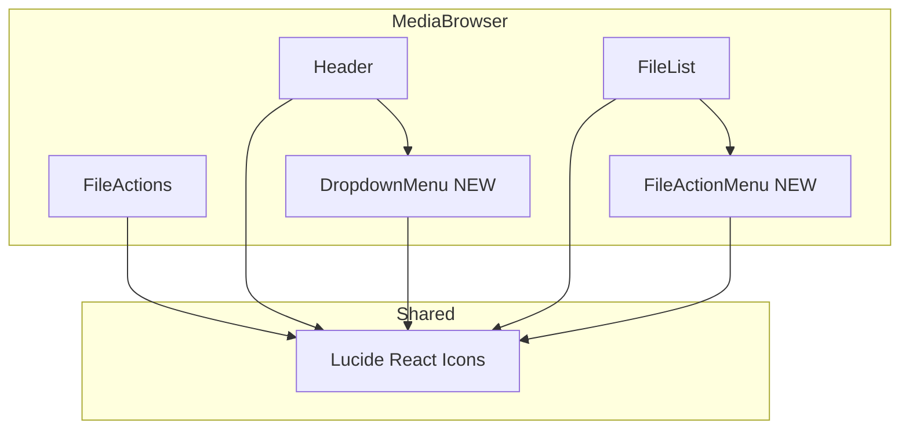
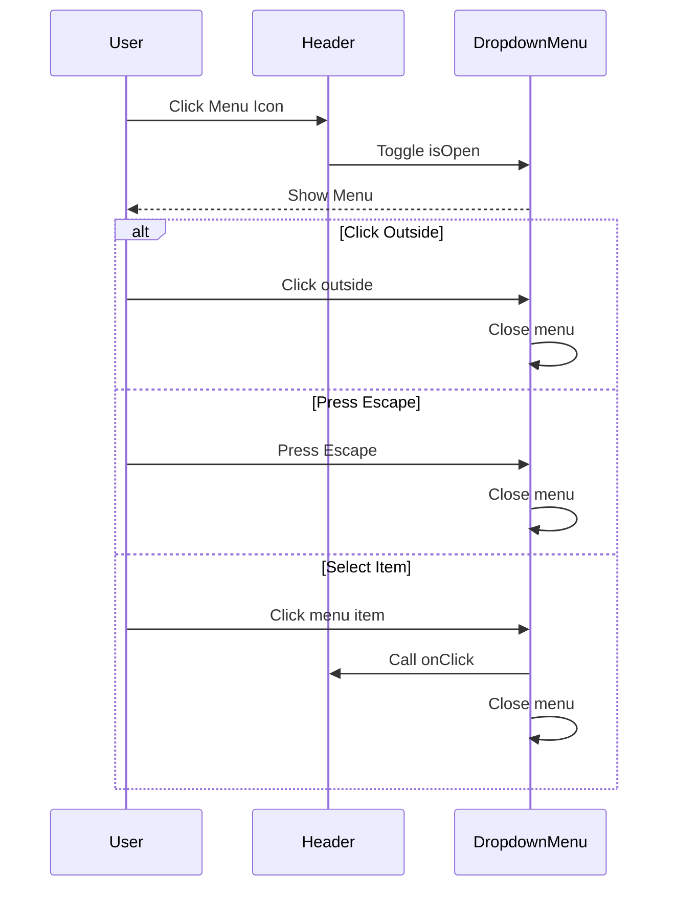
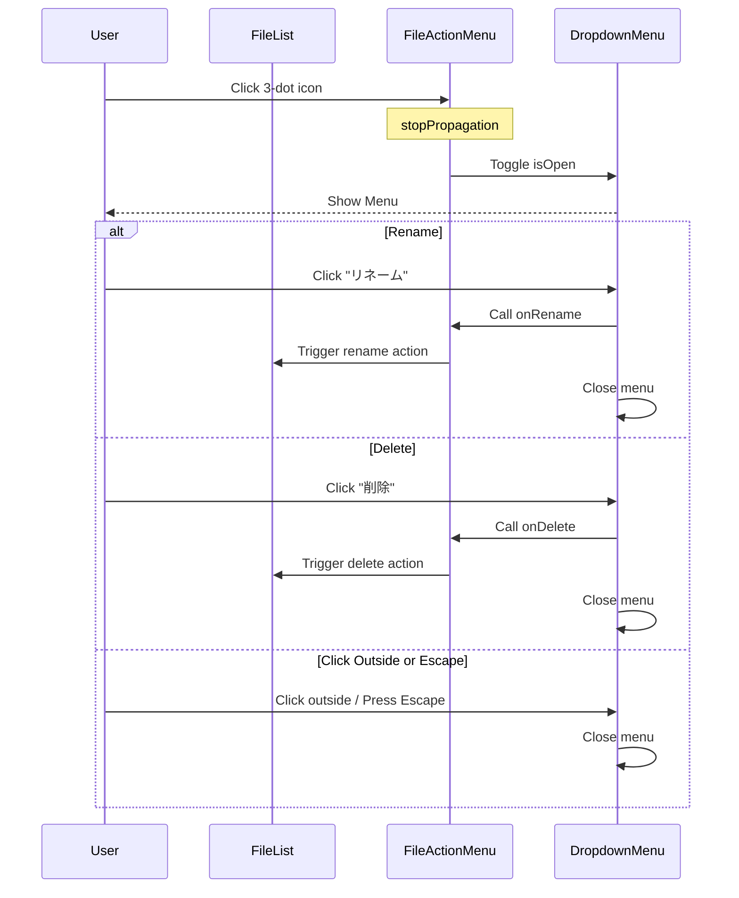

# Design Document: icon-ui-enhancement

## Overview

**Purpose**: 本機能は、AWS S3 Photo Browser アプリケーションにおいて、現在絵文字や文字で表現されているUIアイコンを、専用のアイコンライブラリ（Lucide React）に置き換えることで、視認性・一貫性・アクセシビリティを向上させる。

**Users**: アプリケーションを使用するすべてのユーザーが、改善されたビジュアル体験を享受する。開発者は一貫したアイコンAPIを使用できる。

**Impact**: 既存の絵文字/文字ベースのアイコンをSVGアイコンに置き換え、設定・サインアウト機能をハンバーガーメニューに集約し、ファイル/フォルダごとのアクション（リネーム、削除）を3点リーダーメニューに統合。

### Goals

- すべてのUIアイコンを Lucide React に統一
- アクセシビリティ（ARIA属性）の適切な設定
- 使用頻度の低い機能（設定・サインアウト）をハンバーガーメニューに集約
- ファイル/フォルダごとのアクション（リネーム、削除）を3点リーダーメニューに統合
- 既存テストの互換性維持

### Non-Goals

- アイコンのカスタムデザイン作成
- アニメーション効果の追加
- モバイル専用UIの設計

## Architecture

### Existing Architecture Analysis

現在のアーキテクチャ:

- `FileList.tsx`: `getFileIcon()` 関数で絵文字を返却、リネームボタン（✏️）を個別配置
- `FileActions.tsx`: ボタン内に絵文字/文字を直接記述
- `Header.tsx`: ボタンにテキストまたは文字を表示
- CSSで44pxタッチターゲット確保済み

### Architecture Pattern & Boundary Map



**Architecture Integration**:

- Selected pattern: 既存コンポーネント拡張（レンダリング部分のみ変更）+ 共通メニューコンポーネント抽出
- Domain/feature boundaries: MediaBrowser 内で完結、新規 DropdownMenu と FileActionMenu コンポーネント追加
- Existing patterns preserved: 単一責任フック、Co-location、相対パスインポート
- New components rationale: DropdownMenu は汎用メニュー機能、FileActionMenu はファイル操作メニューのカプセル化
- Steering compliance: TypeScript strict mode、コンポーネント単位テスト

### Technology Stack

| Layer        | Choice / Version      | Role in Feature            | Notes        |
| ------------ | --------------------- | -------------------------- | ------------ |
| Frontend     | React 19 + Vite       | 既存                       | 変更なし     |
| Icon Library | lucide-react (latest) | SVGアイコン提供            | **新規追加** |
| Styling      | CSS (既存パターン)    | アイコン・メニュースタイル | 変更なし     |

## Requirements Traceability

| Requirement | Summary                      | Components                   | Interfaces             | Flows          |
| ----------- | ---------------------------- | ---------------------------- | ---------------------- | -------------- |
| 1.1-1.4     | アイコンライブラリ導入       | 全コンポーネント             | LucideIconProps        | -              |
| 2.1-2.5     | ファイルアイコン置き換え     | FileList                     | FileIconProps          | -              |
| 2.6         | contentType ベース判別       | fileTypes, parseStorageItems | StorageItem            | -              |
| 3.1-3.4     | アクションボタンアイコン     | FileActions                  | -                      | -              |
| 4.1-4.5     | ナビゲーションアイコン       | Header                       | -                      | -              |
| 4.6         | [WANT] 3状態チェックボックス | Header                       | SelectAllCheckboxProps | -              |
| 5.1-5.7     | ハンバーガーメニュー         | Header, DropdownMenu         | DropdownMenuProps      | MenuFlow       |
| 6.1-6.4     | アクセシビリティ             | 全コンポーネント             | ARIA属性               | -              |
| 7.1-7.3     | テスト維持                   | 全テストファイル             | -                      | -              |
| 8.1-8.9     | ファイルアクションメニュー   | FileList, FileActionMenu     | FileActionMenuProps    | FileActionFlow |

## Components and Interfaces

| Component      | Domain/Layer    | Intent                     | Req Coverage | Key Dependencies                       | Contracts    |
| -------------- | --------------- | -------------------------- | ------------ | -------------------------------------- | ------------ |
| FileList       | UI/MediaBrowser | ファイル一覧表示           | 2.1-2.5, 8.1 | lucide-react (P0), FileActionMenu (P1) | Props        |
| FileActions    | UI/MediaBrowser | FABアクションボタン        | 3.1-3.4      | lucide-react (P0)                      | Props        |
| Header         | UI/MediaBrowser | ヘッダーナビゲーション     | 4.1-4.6, 5.1 | lucide-react (P0), DropdownMenu (P1)   | Props        |
| DropdownMenu   | UI/MediaBrowser | 汎用ドロップダウンメニュー | 5.1-5.7      | lucide-react (P0)                      | Props, State |
| FileActionMenu | UI/MediaBrowser | ファイル操作ドロップダウン | 8.1-8.9      | lucide-react (P0), DropdownMenu (P0)   | Props        |

### Data Layer

#### StorageItem Type Extension

| Field        | Detail                                          |
| ------------ | ----------------------------------------------- |
| Intent       | ファイル種別判定に contentType を使用可能にする |
| Requirements | 2.6                                             |

**Type Changes**

```typescript
// src/types/storage.ts
export interface StorageItem {
  key: string;
  name: string;
  type: "file" | "folder";
  size?: number;
  lastModified?: Date;
  contentType?: string; // NEW: S3 から取得した MIME type
}
```

**Implementation Notes**

- `parseStorageItems()` で `ListOutputItemWithPath.contentType` を `StorageItem.contentType` にマッピング
- `S3ListItem` インターフェースに `contentType?: string` を追加

---

#### fileTypes Utility Enhancement

| Field        | Detail                                     |
| ------------ | ------------------------------------------ |
| Intent       | contentType ベースのファイル種別判定を追加 |
| Requirements | 2.6                                        |

**Function Changes**

```typescript
// src/utils/fileTypes.ts

// 既存: 拡張子ベース（フォールバック用に維持）
export function isImageFile(filename: string): boolean;
export function isVideoFile(filename: string): boolean;

// 新規: contentType ベース（優先）
export function isImageContentType(contentType?: string): boolean;
export function isVideoContentType(contentType?: string): boolean;

// 新規: StorageItem を受け取る統合関数
export function getFileCategory(item: StorageItem): "folder" | "image" | "video" | "file";
```

**Implementation Notes**

- `getFileCategory()` は contentType を優先し、未設定の場合は拡張子にフォールバック
- Image: `contentType?.startsWith("image/")`
- Video: `contentType?.startsWith("video/")`
- FileList の `getFileIconComponent()` は `getFileCategory()` を使用

---

### UI Layer

#### FileList

| Field        | Detail                                    |
| ------------ | ----------------------------------------- |
| Intent       | ファイル/フォルダアイテムにアイコンを表示 |
| Requirements | 2.1, 2.2, 2.3, 2.4, 2.5, 2.6, 8.1         |

**Responsibilities & Constraints**

- `getFileIcon()` 関数を Lucide アイコンコンポーネントを返すよう変更
- アイコンサイズは既存の `.file-icon` CSSに合わせて調整（48px相当）
- `aria-hidden="true"` を設定（ファイル名が隣接するため装飾的）
- リネームボタン（✏️）を FileActionMenu（3点リーダー）に置き換え

**Dependencies**

- External: lucide-react — Folder, Image, Video, File アイコン (P0)
- Inbound: FileActionMenu — ファイル操作メニュー表示 (P1)

**Contracts**: State [ ]

##### Icon Mapping

| File Type | Current | New Icon | Lucide Component |
| --------- | ------- | -------- | ---------------- |
| folder    | 📁      | フォルダ | `Folder`         |
| image     | 🖼️      | 画像     | `Image`          |
| video     | 🎬      | 動画     | `Video`          |
| other     | 📄      | ファイル | `File`           |

**Implementation Notes**

- Integration: `getFileIcon()` を `getFileIconComponent()` に変更し JSX を返す
- Integration: リネームボタンを FileActionMenu に置き換え
- Validation: 既存テストは aria-hidden 属性でのクエリに更新
- Risks: アイコンサイズが既存レイアウトに影響する可能性 → CSS調整で対応

---

#### FileActions

| Field        | Detail                    |
| ------------ | ------------------------- |
| Intent       | FABボタンにアイコンを表示 |
| Requirements | 3.1, 3.2, 3.3, 3.4        |

**Responsibilities & Constraints**

- フォルダ作成ボタン: `FolderPlus` アイコン
- アップロードボタン: `Upload` アイコン
- 閉じるボタン: `X` アイコン
- 既存のaria-labelを維持

**Dependencies**

- External: lucide-react — FolderPlus, Upload, X アイコン (P0)

**Contracts**: Props [ ]

##### Button Icon Mapping

| Button        | Current | New Icon     | Lucide Component |
| ------------- | ------- | ------------ | ---------------- |
| Create Folder | 📁+     | フォルダ+    | `FolderPlus`     |
| Upload        | ⬆️      | アップロード | `Upload`         |
| Close Modal   | ✕       | X            | `X`              |

**Implementation Notes**

- Integration: ボタン内のテキスト/絵文字をアイコンコンポーネントに置換
- Validation: アイコンに `aria-hidden="true"`、ボタンに既存の `aria-label` を維持
- Risks: FABサイズ（56px）に対してアイコンサイズ調整が必要

---

#### Header

| Field        | Detail                                                 |
| ------------ | ------------------------------------------------------ |
| Intent       | ナビゲーションボタンにアイコンを表示、メニュー機能追加 |
| Requirements | 4.1, 4.2, 4.3, 4.4, 4.5, 4.6, 5.1                      |

**Responsibilities & Constraints**

- 戻るボタン: `ArrowLeft` アイコン
- 削除ボタン（選択モード時）: `Trash2` アイコンのみ（テキストなし）
- キャンセルボタン: `X` アイコンのみ
- 選択モードボタン: `CopyCheck` アイコンのみ
- 全選択/全解除: [WANT] 3状態チェックボックス（`Square`, `SquareCheck`, `SquareMinus`）
- メニューボタン: `EllipsisVertical` アイコン（縦3点リーダー）
- 設定・サインアウトボタンを削除し、DropdownMenu経由で表示

**Dependencies**

- External: lucide-react — ArrowLeft, Trash2, X, SquareCheck, Square, SquareMinus, EllipsisVertical, Settings, LogOut, CopyCheck (P0)
- Inbound: DropdownMenu — メニュー表示 (P1)

**Contracts**: Props [ ], State [ ]

##### Header Button Icon Mapping

| Button         | Current    | New Icon      | Lucide Component               | Display                       |
| -------------- | ---------- | ------------- | ------------------------------ | ----------------------------- |
| Back           | ←          | 矢印左        | `ArrowLeft`                    | アイコンのみ                  |
| Delete         | 削除       | ゴミ箱        | `Trash2`                       | アイコンのみ                  |
| Cancel         | キャンセル | X             | `X`                            | アイコンのみ                  |
| Selection Mode | 選択       | 複数選択      | `CopyCheck`                    | アイコンのみ                  |
| Select All     | 全選択     | チェック済み  | `SquareCheck` or `SquareMinus` | アイコンのみ/チェックボックス |
| Menu           | (新規)     | 縦3点リーダー | `EllipsisVertical`             | アイコンのみ                  |

##### Select All Checkbox Interface (WANT)

```typescript
interface SelectAllCheckboxProps {
  /** 選択状態: 'none' | 'partial' | 'all' */
  selectionState: "none" | "partial" | "all";
  /** トグル時のコールバック */
  onToggle: () => void;
  /** アクセシビリティラベル */
  ariaLabel: string;
}
```

**Implementation Notes**

- Integration: 設定・サインアウトボタンを削除し、DropdownMenu をヘッダー右側に配置
- Validation: すべてのアイコンボタンに適切な `aria-label` を設定
- Risks: ボタンからテキストを削除することで直感性が低下する可能性 → ツールチップ追加を将来検討

---

#### DropdownMenu (新規)

| Field        | Detail                            |
| ------------ | --------------------------------- |
| Intent       | 汎用ドロップダウンメニュー表示    |
| Requirements | 5.1, 5.2, 5.3, 5.4, 5.5, 5.6, 5.7 |

**Responsibilities & Constraints**

- メニューの開閉状態管理
- 外部クリックでの閉じる処理
- キーボードナビゲーション（Tab, Enter, Escape）
- ARIA属性の適切な設定
- 再利用可能な汎用コンポーネントとして設計

**Dependencies**

- External: lucide-react — アイコンは呼び出し側から渡される (P0)

**Contracts**: Props [ ], State [ ]

##### DropdownMenu Props Interface

```typescript
interface DropdownMenuProps {
  /** メニュー項目 */
  items: DropdownMenuItem[];
  /** トリガーアイコン */
  triggerIcon: React.ComponentType<{ size?: number; "aria-hidden"?: boolean }>;
  /** メニュートリガーのaria-label */
  triggerLabel: string;
  /** メニュー位置（デフォルト: 'bottom-right'） */
  position?: "bottom-left" | "bottom-right";
}

interface DropdownMenuItem {
  /** 項目のラベル */
  label: string;
  /** アイコンコンポーネント */
  icon: React.ComponentType<{ size?: number; "aria-hidden"?: boolean }>;
  /** クリック時のコールバック */
  onClick: () => void;
  /** 危険なアクション（削除など）かどうか */
  danger?: boolean;
}
```

##### State Management

```typescript
interface DropdownMenuState {
  isOpen: boolean;
}
```

##### Accessibility Requirements

| Attribute       | Element        | Value          |
| --------------- | -------------- | -------------- |
| `aria-haspopup` | trigger button | `"menu"`       |
| `aria-expanded` | trigger button | `isOpen`       |
| `aria-label`    | trigger button | `triggerLabel` |
| `role`          | menu container | `"menu"`       |
| `role`          | menu item      | `"menuitem"`   |

**Implementation Notes**

- Integration: `useEffect` で document クリックイベントを監視し外部クリック検出
- Validation: Escape キーでメニュー閉じる、Tab でフォーカス移動
- Risks: フォーカス管理の複雑さ → 基本的なキーボードナビゲーションに限定

---

#### FileActionMenu (新規)

| Field        | Detail                                      |
| ------------ | ------------------------------------------- |
| Intent       | ファイル/フォルダ単位の操作メニュー         |
| Requirements | 8.1, 8.2, 8.3, 8.4, 8.5, 8.6, 8.7, 8.8, 8.9 |

**Responsibilities & Constraints**

- 横3点リーダー（`EllipsisHorizontal`）をトリガーとして表示
- 「リネーム」と「削除」のメニュー項目を提供
- DropdownMenu を内部で使用（コンポジション）
- クリックイベントの伝播を停止（親リストアイテムのクリックと干渉しない）

**Dependencies**

- External: lucide-react — Ellipsis, Pencil, Trash2 (P0)
- Inbound: DropdownMenu — メニュー表示機能 (P0)

**Contracts**: Props [ ]

##### FileActionMenu Props Interface

```typescript
interface FileActionMenuProps {
  /** 対象アイテム名（aria-label用） */
  itemName: string;
  /** リネームコールバック */
  onRename: () => void;
  /** 削除コールバック */
  onDelete: () => void;
}
```

##### Menu Items

| Item     | Icon      | Lucide Component | Action   | Style         |
| -------- | --------- | ---------------- | -------- | ------------- |
| リネーム | 編集/鉛筆 | `Pencil`         | onRename | 通常          |
| 削除     | ゴミ箱    | `Trash2`         | onDelete | danger (赤色) |

**Implementation Notes**

- Integration: FileList の rename-button を FileActionMenu に置き換え
- Integration: DropdownMenu を position='bottom-right' で使用
- Validation: メニューオープン時に親要素のクリックイベントを阻止
- Risks: 小さいタッチターゲット → ボタンサイズを最低 44x44px 確保

---

## System Flows

### Menu Open/Close Flow (Header)



### File Action Menu Flow



## Testing Strategy

### Unit Tests

- `FileList`: アイコンコンポーネントの正しいレンダリング（aria-hidden確認）、FileActionMenu の表示
- `FileActions`: 各ボタンのアイコン表示と aria-label 確認
- `Header`: アイコンボタンのレンダリングとクリックイベント
- `DropdownMenu`: 開閉状態、キーボードナビゲーション、ARIA属性
- `FileActionMenu`: リネーム/削除ボタンのクリックイベント、イベント伝播の阻止

### Integration Tests

- ハンバーガーメニューから設定モーダルを開く
- ハンバーガーメニューからサインアウトを実行
- 選択モードでの全選択チェックボックス動作
- ファイルアクションメニューからリネームを実行
- ファイルアクションメニューから削除を実行

### E2E/UI Tests

- 全アイコンの視覚的表示確認
- タッチターゲットサイズ（44px）の確認
- キーボードのみでの操作確認
- メニューのフォーカストラップ動作確認

## Error Handling

### Error Strategy

- アイコン読み込み失敗: SVGはインラインのため発生しない
- メニュー外部クリック検出失敗: イベントリスナーのクリーンアップを確実に実施
- コールバック未設定: TypeScript の必須プロパティで防止

## Optional Sections

### Security Considerations

- 本機能はUI表示のみの変更であり、セキュリティへの影響はなし

### Performance & Scalability

- Lucide React の tree-shaking により、使用するアイコンのみがバンドルに含まれる
- 推定追加バンドルサイズ: 15-25KB（使用アイコン数増加により若干増加）
- FileActionMenu は各ファイルアイテムにレンダリングされるが、メニュー本体は開いた時のみDOMに追加
