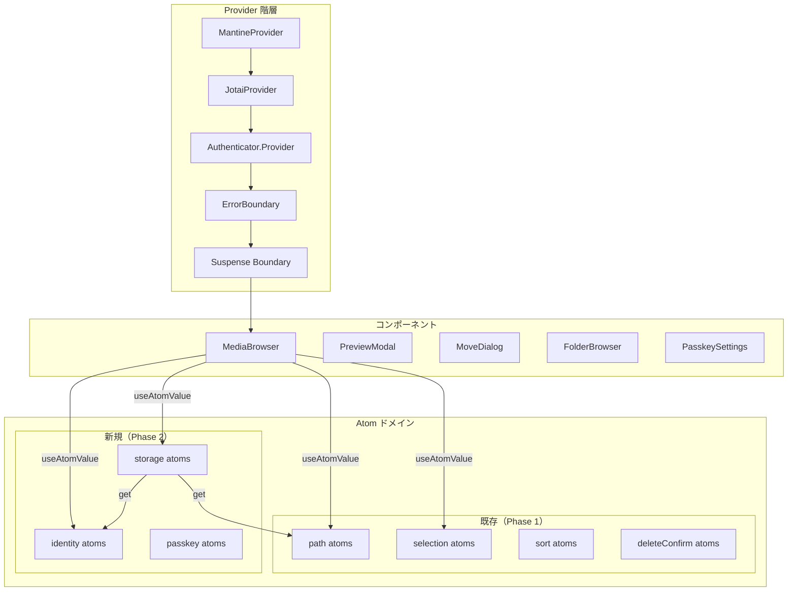
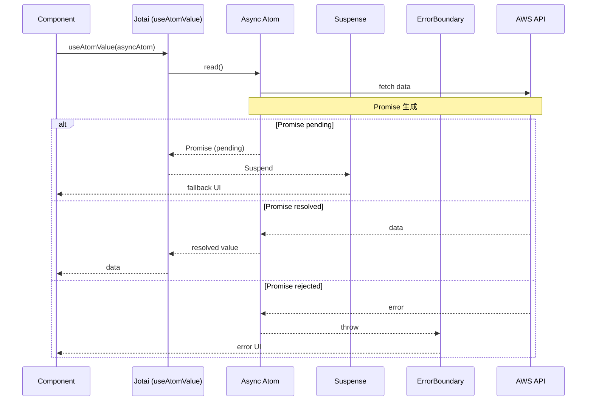
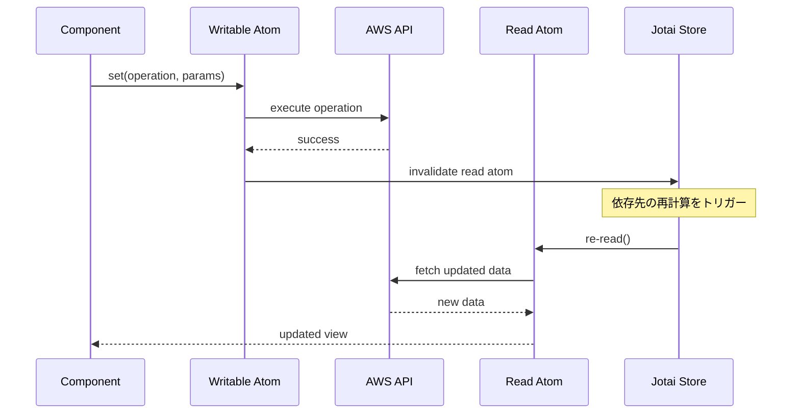
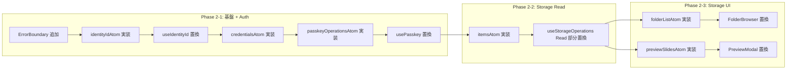

# Design Document

## Overview

**Purpose**: この機能は、AWS S3 Photo Browser の非同期データ取得を Jotai + Suspense パターンに移行し、Phase 3（サムネイル遅延表示バグ修正）の基盤を整備します。

**Users**: 開発者が恩恵を受けます。useEffect + useState による手動状態管理から、Suspense による宣言的なローディング/エラー管理に移行することで、コードの可読性と保守性が向上します。

**Impact**: 現在の5箇所のデータ取得 useEffect を async 派生 atom に置換し、useState による手動ローディング/エラー管理を Suspense + ErrorBoundary に移行します。

### Goals

- データ取得 useEffect を 5 箇所から 0 箇所に削減
- ローディング/エラー状態の手動管理を Suspense + ErrorBoundary で宣言的に管理
- すべての状態（同期 + 非同期）を Jotai atom で統一的に管理
- Phase 3 でのサムネイル遅延管理改善の基盤を構築

### Non-Goals

- ThumbnailImage.tsx のサムネイル URL 取得（Phase 3 スコープ）
- useUploadTracker.ts のアップロード状態管理（Phase 3 スコープ）
- Storage Write 操作の atom 化（Upload/Delete/Move/Rename/CreateFolder）（Phase 3 スコープ）
- TanStack Query の導入（Jotai 単体で実現）
- 高度なキャッシュ戦略（staleTime, gcTime など）

## Architecture

### Existing Architecture Analysis

**現在のパターン**:

- クライアント状態: Jotai atom（selection, path, sort, deleteConfirm ドメイン）
- 非同期データ取得: useState + useEffect パターン（5箇所に分散）
- Provider 構造: MantineProvider > JotaiProvider > Authenticator.Provider

**現在の問題点**:

- 非同期状態（loading, error, data）が各フック内で個別管理
- useEffect の依存配列による実行タイミングの追跡が困難
- データ更新後の手動 refetch が必要

### Architecture Pattern & Boundary Map



**Architecture Integration**:

- **Selected pattern**: Jotai + Suspense（async 派生 atom による宣言的非同期管理）
- **Domain/feature boundaries**: identity, storage, passkey の3つの新規非同期ドメインを追加
- **Existing patterns preserved**: atom の命名規則、debugLabel、ドメイン分離を踏襲
- **New components rationale**: ErrorBoundary コンポーネントを追加（エラー回復 UI のため）
- **Steering compliance**: useEffect 使用基準（Phase 1 定義）を維持

### Technology Stack

| Layer    | Choice / Version                     | Role in Feature    | Notes                                   |
| -------- | ------------------------------------ | ------------------ | --------------------------------------- |
| Frontend | React 19 + Jotai                     | Suspense 対応 atom | -                                       |
| UI       | Mantine 8                            | Suspense fallback  | Loader, Alert, Button など既存活用      |
| State    | Jotai 2.x                            | async 派生 atom    | loadable, atomFamily を必要に応じて使用 |
| Error UI | react-error-boundary                 | エラー回復 UI      | 新規追加                                |
| DevTools | Redux DevTools (jotai-devtools 経由) | 状態可視化         | 既存（Phase 1 で導入済み）              |

## System Flows

### 非同期データ取得フロー（Suspense パターン）



### データ更新フロー（writable atom パターン）



## Requirements Traceability

| Requirement | Summary                      | Components                             | Interfaces           | Flows        |
| ----------- | ---------------------------- | -------------------------------------- | -------------------- | ------------ |
| 1           | Suspense 対応基盤の構築      | ErrorBoundary, AppWithSuspense         | -                    | Read         |
| 2           | 認証状態の atom 化           | identityIdAtom                         | Identity State       | Read         |
| 3           | ストレージ一覧取得の atom 化 | itemsAtom                              | Storage State        | Read         |
| 4           | フォルダ選択の atom 化       | folderListAtom, FolderBrowser          | -                    | Read         |
| 5           | プレビュー URL の atom 化    | previewSlidesAtom, PreviewModal        | -                    | Read         |
| 6           | パスキー管理の atom 化       | credentialsAtom, passkeyOperationsAtom | Passkey State        | Read + Write |
| 7           | 既存機能の互換性維持         | 全コンポーネント                       | 既存インターフェース | -            |

> **Note:** Storage Write 操作（storageOperationsAtom）は Phase 3 で対応します。

## Components and Interfaces

### コンポーネント概要

| Component             | Domain/Layer | Intent                         | Req Coverage | Key Dependencies         | Contracts |
| --------------------- | ------------ | ------------------------------ | ------------ | ------------------------ | --------- |
| ErrorBoundary         | UI           | エラー回復 UI                  | 1            | -                        | -         |
| identityIdAtom        | Identity     | 認証 ID の非同期取得           | 2            | fetchAuthSession (P0)    | State     |
| credentialsAtom       | Passkey      | クレデンシャル一覧の非同期取得 | 6            | listWebAuthnCredentials  | State     |
| passkeyOperationsAtom | Passkey      | パスキー操作の実行             | 6            | credentialsAtom          | State     |
| itemsAtom             | Storage      | ファイル一覧の非同期取得       | 3            | identityIdAtom, pathAtom | State     |
| folderListAtom        | Storage      | フォルダ一覧の非同期取得       | 4            | identityIdAtom           | State     |
| previewSlidesAtom     | Preview      | プレビュー URL の非同期取得    | 5            | itemsAtom                | State     |

> **Note:** storageOperationsAtom（Storage CRUD 操作）は Phase 3 で対応します。

---

### UI Layer

#### ErrorBoundary

| Field        | Detail                                          |
| ------------ | ----------------------------------------------- |
| Intent       | async atom のエラーをキャッチし、回復 UI を表示 |
| Requirements | 1.8                                             |

**Responsibilities & Constraints**

- react-error-boundary ライブラリの ErrorBoundary コンポーネントを使用
- fallback prop でエラー UI を定義
- resetKeys または onReset でエラー状態をリセット

**Dependencies**

- External: react-error-boundary — ErrorBoundary (P0)
- Inbound: App コンポーネント — ラップ (P0)

**Implementation Notes**

- `react-error-boundary` パッケージをインストール
- FallbackComponent でカスタムエラー UI を定義（Mantine Alert + Button）
- resetKeys に依存する状態を指定し、状態変更時に自動リセット

---

### Identity Domain

#### identityIdAtom

| Field        | Detail                                        |
| ------------ | --------------------------------------------- |
| Intent       | Cognito 認証セッションから Identity ID を取得 |
| Requirements | 2.1, 2.2, 2.3, 2.4                            |

**Responsibilities & Constraints**

- fetchAuthSession() を実行し、identityId を返す
- Promise をキャッシュし、同一セッション内での再計算を回避
- エラー時は Promise が reject し、ErrorBoundary でキャッチ

**Dependencies**

- External: aws-amplify/auth — fetchAuthSession (P0)

**Contracts**: State [x]

##### State Management

```typescript
// src/stores/atoms/identity.ts

/**
 * 認証セッションから Identity ID を取得する async 派生 atom
 * Promise をキャッシュし、同一セッション内では再計算されない
 */
export const identityIdAtom = atom(async (): Promise<string> => {
  const session = await fetchAuthSession();
  if (!session.identityId) {
    throw new Error("Identity ID not found in session");
  }
  return session.identityId;
});
identityIdAtom.debugLabel = "identity/id";
```

- Preconditions: ユーザーが認証済みであること
- Postconditions: 有効な Identity ID 文字列を返す
- Invariants: 認証セッションが有効である限り、同じ ID を返す

**Implementation Notes**

- 既存の useIdentityId フックは async 派生 atom + useAtomValue に置換
- loading 状態は Suspense fallback で処理
- error 状態は ErrorBoundary で処理

---

### Storage Domain

#### itemsAtom

| Field        | Detail                                      |
| ------------ | ------------------------------------------- |
| Intent       | 現在のパスにあるファイル/フォルダ一覧を取得 |
| Requirements | 3.1, 3.2                                    |

**Responsibilities & Constraints**

- identityIdAtom と currentPathAtom に依存
- 依存先の変更で自動的に再計算（新しい Promise を生成）
- ソート済みの StorageItem 配列を返す

**Dependencies**

- Inbound: identityIdAtom — 認証 ID (P0)
- Inbound: currentPathAtom — 現在のパス (P0)
- External: aws-amplify/storage — list (P0)

**Contracts**: State [x]

##### State Management

```typescript
// src/stores/atoms/storage.ts

/**
 * 現在のパスにあるファイル/フォルダ一覧を取得する async 派生 atom
 */
export const itemsAtom = atom(async (get): Promise<StorageItem[]> => {
  const identityId = await get(identityIdAtom);
  const currentPath = get(currentPathAtom);

  const result = await list({
    path: ({ identityId: id }) => `private/${id}/${currentPath}`,
    options: { listAll: true },
  });

  return toStorageItems(result.items, currentPath);
});
itemsAtom.debugLabel = "storage/items";

/**
 * items の再取得をトリガーするための refresh atom
 * set すると itemsAtom が再計算される
 */
export const refreshItemsAtom = atom(0);
refreshItemsAtom.debugLabel = "storage/refreshTrigger";

/**
 * refreshTrigger に依存する items atom
 */
export const itemsWithRefreshAtom = atom(async (get): Promise<StorageItem[]> => {
  get(refreshItemsAtom); // 再計算トリガー
  return get(itemsAtom);
});
itemsWithRefreshAtom.debugLabel = "storage/itemsWithRefresh";
```

**Implementation Notes**

- toStorageItems は既存の変換ロジックを抽出
- sortOrderAtom との統合は後続タスクで検討

#### storageOperationsAtom（Phase 3 で対応）

> **Note:** Storage Write 操作（Upload/Delete/Move/Rename/CreateFolder）の atom 化は Phase 3 で対応します。
> Phase 2 では itemsAtom（Read のみ）を実装し、既存の useStorageOperations の Write 操作はそのまま維持します。

---

#### folderListAtom

| Field        | Detail                                       |
| ------------ | -------------------------------------------- |
| Intent       | 指定パスのフォルダ一覧を取得（移動先選択用） |
| Requirements | 4.1, 4.2                                     |

**Responsibilities & Constraints**

- パラメータとして選択中のパスを受け取る
- フォルダのみをフィルタリングして返す

**Dependencies**

- Inbound: identityIdAtom — 認証 ID (P0)
- External: aws-amplify/storage — list (P0)

**Contracts**: State [x]

##### State Management

```typescript
// src/stores/atoms/storage.ts

/**
 * 移動ダイアログで選択中のパス
 */
export const moveDialogPathAtom = atom<string>("");
moveDialogPathAtom.debugLabel = "storage/moveDialogPath";

/**
 * 移動ダイアログ用のフォルダ一覧を取得する async 派生 atom
 */
export const folderListAtom = atom(async (get): Promise<StorageItem[]> => {
  const identityId = await get(identityIdAtom);
  const path = get(moveDialogPathAtom);

  const result = await list({
    path: ({ identityId: id }) => `private/${id}/${path}`,
    options: { listAll: true },
  });

  return toStorageItems(result.items, path).filter((item) => item.isFolder);
});
folderListAtom.debugLabel = "storage/folderList";
```

**Implementation Notes**

- FolderBrowser.tsx 内の useEffect + useState を置換
- MoveDialog を開いたときに moveDialogPathAtom を初期化

---

### Preview Domain

#### previewSlidesAtom

| Field        | Detail                                      |
| ------------ | ------------------------------------------- |
| Intent       | プレビュー対象アイテムのメディア URL を取得 |
| Requirements | 5.1, 5.2                                    |

**Responsibilities & Constraints**

- プレビュー対象アイテム配列に依存
- 各アイテムの署名付き URL を取得
- Lightbox 用の Slide 配列を返す

**Dependencies**

- External: aws-amplify/storage — getUrl (P0)

**Contracts**: State [x]

##### State Management

```typescript
// src/stores/atoms/preview.ts

/**
 * プレビュー対象アイテム
 */
export const previewItemsAtom = atom<StorageItem[]>([]);
previewItemsAtom.debugLabel = "preview/items";

/**
 * 現在のプレビューインデックス
 */
export const previewIndexAtom = atom<number>(0);
previewIndexAtom.debugLabel = "preview/index";

/**
 * プレビューモーダルが開いているか
 */
export const isPreviewOpenAtom = atom<boolean>(false);
isPreviewOpenAtom.debugLabel = "preview/isOpen";

/**
 * プレビュー用スライド配列を取得する async 派生 atom
 */
export const previewSlidesAtom = atom(async (get): Promise<Slide[]> => {
  const items = get(previewItemsAtom);
  const isOpen = get(isPreviewOpenAtom);

  if (!isOpen || items.length === 0) {
    return [];
  }

  const slides = await Promise.all(
    items.map(async (item) => {
      const result = await getUrl({ path: item.key });
      // Slide オブジェクトを構築...
      return slide;
    }),
  );

  return slides;
});
previewSlidesAtom.debugLabel = "preview/slides";
```

**Implementation Notes**

- PreviewModal.tsx 内の useEffect + useState を置換
- モーダルを開いたときに previewItemsAtom を設定

---

### Passkey Domain

#### credentialsAtom

| Field        | Detail                            |
| ------------ | --------------------------------- |
| Intent       | WebAuthn クレデンシャル一覧を取得 |
| Requirements | 6.1                               |

**Responsibilities & Constraints**

- listWebAuthnCredentials を実行
- ページネーションを処理して全件取得

**Dependencies**

- External: aws-amplify/auth — listWebAuthnCredentials (P0)

**Contracts**: State [x]

##### State Management

```typescript
// src/stores/atoms/passkey.ts

/**
 * クレデンシャル一覧の再取得トリガー
 */
export const refreshCredentialsAtom = atom(0);
refreshCredentialsAtom.debugLabel = "passkey/refreshTrigger";

/**
 * WebAuthn クレデンシャル一覧を取得する async 派生 atom
 */
export const credentialsAtom = atom(async (get): Promise<WebAuthnCredential[]> => {
  get(refreshCredentialsAtom); // 再計算トリガー

  const allCredentials: WebAuthnCredential[] = [];
  let nextToken: string | undefined;

  do {
    const response = await listWebAuthnCredentials(nextToken ? { nextToken } : undefined);
    if (response.credentials) {
      const validCredentials = response.credentials
        .map(toWebAuthnCredential)
        .filter((c): c is WebAuthnCredential => c !== null);
      allCredentials.push(...validCredentials);
    }
    nextToken = response.nextToken;
  } while (nextToken);

  return allCredentials;
});
credentialsAtom.debugLabel = "passkey/credentials";
```

**Implementation Notes**

- usePasskey フックから取得ロジックを抽出
- toWebAuthnCredential 変換関数は既存を再利用

#### passkeyOperationsAtom

| Field        | Detail                         |
| ------------ | ------------------------------ |
| Intent       | パスキーの登録・削除操作を実行 |
| Requirements | 6.2, 6.3, 6.4                  |

**Responsibilities & Constraints**

- register, delete 操作を提供
- 各操作成功時に refreshCredentialsAtom を更新

**Dependencies**

- Outbound: refreshCredentialsAtom — 再取得トリガー (P0)
- External: aws-amplify/auth — associateWebAuthnCredential, deleteWebAuthnCredential (P0)

**Contracts**: State [x]

##### State Management

```typescript
// src/stores/atoms/passkey.ts

/**
 * パスキー操作の状態
 */
export const passkeyOperationStateAtom = atom<{
  isRegistering: boolean;
}>({
  isRegistering: false,
});
passkeyOperationStateAtom.debugLabel = "passkey/operationState";

/**
 * パスキーを登録する writable atom
 */
export const registerPasskeyAtom = atom(null, async (_get, set) => {
  set(passkeyOperationStateAtom, { isRegistering: true });
  try {
    await associateWebAuthnCredential();
    set(refreshCredentialsAtom, (prev) => prev + 1);
  } finally {
    set(passkeyOperationStateAtom, { isRegistering: false });
  }
});
registerPasskeyAtom.debugLabel = "passkey/register";

/**
 * パスキーを削除する writable atom
 */
export const deletePasskeyAtom = atom(null, async (_get, set, credentialId: string) => {
  await deleteWebAuthnCredential({ credentialId });
  set(refreshCredentialsAtom, (prev) => prev + 1);
});
deletePasskeyAtom.debugLabel = "passkey/delete";
```

**Implementation Notes**

- 既存の usePasskey フックを置換
- エラーは ErrorBoundary でキャッチ

---

## Error Handling

### Error Strategy

| Error Type         | 処理方法                 | 回復アクション            |
| ------------------ | ------------------------ | ------------------------- |
| 認証エラー         | ErrorBoundary でキャッチ | 再ログインへ誘導          |
| ネットワークエラー | ErrorBoundary でキャッチ | 「再試行」ボタン          |
| 操作エラー         | 操作 atom 内で try-catch | エラー通知 + 状態リセット |
| 不正データ         | atom 内でバリデーション  | エラースロー              |

### Error Categories and Responses

**System Errors (5xx)**:

- AWS API タイムアウト → ErrorBoundary で「再試行」ボタン表示
- S3 アクセスエラー → ErrorBoundary でエラーメッセージ表示

**Business Logic Errors**:

- 重複ファイル → 確認ダイアログで上書き確認（既存ロジック維持）
- 無効なフォルダ名 → バリデーションエラー表示

### Monitoring

- 開発環境: Redux DevTools（jotai-devtools）で状態遷移を可視化
- エラー発生時: console.error でスタックトレースを出力

---

## Testing Strategy

### Unit Tests

- identityIdAtom: 認証セッション取得のモック、エラー時の動作
- itemsAtom: 依存 atom の変更による再計算、リスト変換ロジック
- storageOperationsAtom: 各操作の成功/失敗、refreshTrigger の更新
- credentialsAtom: ページネーション処理、データ変換

### Integration Tests

- Suspense 境界: ローディング状態の表示/解消
- ErrorBoundary: エラー時の UI 表示、再試行機能
- データ更新フロー: 操作実行 → 一覧再取得の連携

### E2E Tests（既存テストの動作確認）

- ファイル一覧表示: パス遷移時のデータ取得
- ファイルアップロード: アップロード後の一覧更新
- ファイル削除: 削除後の一覧更新
- プレビュー表示: モーダル表示時の URL 取得

---

## Performance & Scalability

### パフォーマンス目標

| 指標                 | 目標値  | 備考                       |
| -------------------- | ------- | -------------------------- |
| 初回ファイル一覧表示 | < 2秒   | Suspense fallback 表示含む |
| 操作後の一覧更新     | < 1秒   | 操作完了から一覧更新まで   |
| プレビュー URL 取得  | < 500ms | 署名付き URL 生成含む      |

### 最適化戦略

- **Promise キャッシュ**: async 派生 atom の Promise は依存が変わらない限りキャッシュ
- **部分的なサスペンド**: 機能単位で Suspense 境界を配置し、部分更新を実現
- **並列取得**: Promise.all で複数 URL を並列取得（previewSlidesAtom）

---

## Migration Strategy

### 移行フェーズ

Auth 関連を先に完了させ、Storage 関連はその後に実装します。



### 移行ステップ

1. **基盤構築 + Auth（Phase 2-1）**
   - ErrorBoundary コンポーネント作成
   - identityIdAtom 実装、useIdentityId → async atom 置換
   - credentialsAtom, passkeyOperationsAtom 実装
   - usePasskey → atom 置換

2. **ストレージ Read 移行（Phase 2-2）**
   - itemsAtom 実装
   - useStorageOperations の Read 部分（fetchItems）を async atom 置換
   - **Note:** Write 操作（Upload/Delete/Move/Rename/CreateFolder）は既存のまま維持

3. **Storage UI 移行（Phase 2-3）**
   - folderListAtom 実装、FolderBrowser 更新
   - previewSlidesAtom 実装、PreviewModal 更新

### ロールバック戦略

- 各フェーズは独立してロールバック可能
- Git ブランチで各フェーズを管理
- 問題発生時は前フェーズの状態に戻す

---

## Supporting References

詳細な調査結果と決定の背景は [research.md](./research.md) を参照してください。

- Jotai + Suspense パターンの調査
- 既存コードベースの分析
- アーキテクチャパターンの評価
