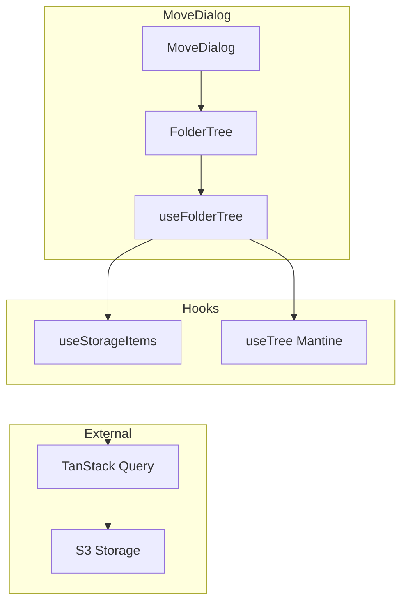
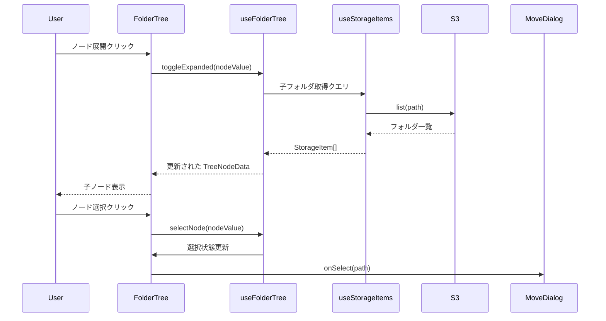

# Technical Design Document

## Overview

**Purpose**: MoveDialog コンポーネントのディレクトリ選択 UI を現在のフラットリスト表示から Mantine Tree コンポーネントを使用した階層ツリー表示に置き換える。ユーザーがフォルダ階層を視覚的に把握しながら移動先を選択できるようにし、深い階層への移動時の UX を向上させる。

**Users**: アプリケーション利用者（ファイル/フォルダの移動操作を行うユーザー）

**Impact**: MoveDialog 内の FolderBrowser コンポーネントを FolderTree に置き換え。既存の MoveDialogProps および useMoveDialog フックのインターフェースは維持。

### Goals

- フォルダ階層をツリー形式で一覧表示し、直感的なフォルダ選択を実現
- ノード展開時に S3 から子フォルダを非同期取得し、必要なデータのみを読み込む
- 循環移動防止・移動元フォルダ除外のロジックをツリー UI に統合
- 既存の移動機能（プログレス表示、成功/エラー表示）を完全に維持

### Non-Goals

- FolderBrowser コンポーネントの廃止（他の用途で使用される可能性を考慮し存続）
- ツリーの仮想化（大量フォルダ対応は将来的な拡張として検討）
- ドラッグ＆ドロップによる移動操作
- ツリーノードのチェックボックス選択（単一選択のみ）

## Architecture

### Existing Architecture Analysis

現在の MoveDialog は FolderBrowser コンポーネントを内包し、フラットリスト形式でフォルダを表示している。ユーザーは「上へ」「ホーム」ボタンでナビゲーションし、フォルダをクリックして移動先を変更する。

- **現在のパターン**: browsePath 状態で表示中のフォルダを管理、FolderBrowser が該当パスのフォルダ一覧を表示
- **統合ポイント**: useStorageItems フック（TanStack Query）でフォルダ一覧取得
- **維持すべき機能**: 循環移動防止（disabledPaths）、移動元除外、プログレス/成功/エラー表示

### Architecture Pattern & Boundary Map



**Architecture Integration**:

- **Selected pattern**: コンポーネント + カスタムフック構成（プロジェクト既存パターンに準拠）
- **Domain boundaries**: FolderTree は UI 表示とイベント処理、useFolderTree はツリーデータ管理と非同期読み込み
- **Existing patterns preserved**: TanStack Query によるデータフェッチ
- **New components rationale**: FolderTree（ツリー表示専用）、useFolderTree（ツリー状態管理）

### Technology Stack

| Layer        | Choice / Version          | Role in Feature              | Notes                    |
| ------------ | ------------------------- | ---------------------------- | ------------------------ |
| Frontend     | React 19 + TypeScript 5.x | コンポーネント実装           | strict mode              |
| UI Library   | @mantine/core 8.3.12      | Tree コンポーネント          | useTree フック含む       |
| Server State | TanStack Query            | 非同期データ取得・キャッシュ | 既存パターン継続         |
| Local State  | React useState            | ツリー状態管理               | Jotai 不使用（下記参照） |
| Icons        | lucide-react              | フォルダアイコン             | 既存パターン継続         |

**状態管理の選択理由**:

プロジェクトでは Jotai を「複数コンポーネント間で共有される状態」に使用している（useStoragePath, useSelection 等）。一方、FolderTree の状態（selectedPath, expandedPaths, loadingPaths, treeData）は以下の特性を持つ：

- MoveDialog 内でのみ使用（他コンポーネントと共有不要）
- ダイアログを閉じたらリセットされる一時的な状態
- key 属性による再マウントで初期化

これは既存の useMoveDialog（useState 使用）と同じパターンであり、Jotai ではなく useState によるローカル状態管理が適切。

## System Flows

### ツリーノード展開・選択フロー



**Key Decisions**:

- ノード展開時にのみ子フォルダを取得（遅延読み込み）
- TanStack Query のキャッシュを活用し、既に取得済みのフォルダは再フェッチしない
- 選択と展開は独立したイベントとして処理

## Requirements Traceability

| Requirement | Summary                  | Components                | Interfaces          | Flows            |
| ----------- | ------------------------ | ------------------------- | ------------------- | ---------------- |
| 1.1         | ツリー形式表示           | FolderTree                | FolderTreeProps     | -                |
| 1.2         | フォルダ選択             | FolderTree, useFolderTree | onSelect callback   | ノード選択フロー |
| 1.3         | 選択パス反映             | MoveDialog                | -                   | -                |
| 1.4         | Mantine Tree 使用        | FolderTree                | Tree, useTree       | -                |
| 2.1         | ノード展開               | FolderTree, useFolderTree | toggleExpanded      | ノード展開フロー |
| 2.2         | ノード折りたたみ         | FolderTree, useFolderTree | toggleExpanded      | -                |
| 2.3         | 非同期取得               | useFolderTree             | useStorageItems     | ノード展開フロー |
| 2.4         | ローディング表示         | FolderTree                | renderNode          | -                |
| 2.5         | 空フォルダアイコン非表示 | FolderTree                | hasChildren         | -                |
| 3.1         | 移動対象フォルダ無効化   | MoveDialog, FolderTree    | disabledPaths       | -                |
| 3.2         | 配下フォルダ無効化       | MoveDialog                | isCircularMove      | -                |
| 3.3         | 無効ノード選択無視       | useFolderTree             | selectNode          | -                |
| 3.4         | 無効ノードスタイル       | FolderTree                | renderNode          | -                |
| 4.1         | 移動元フォルダ無効化     | MoveDialog                | disabledPaths       | -                |
| 4.2         | 移動元選択無視           | useFolderTree             | selectNode          | -                |
| 4.3         | 移動元スタイル           | FolderTree                | renderNode          | -                |
| 5.1         | プログレス表示維持       | MoveDialog                | -                   | -                |
| 5.2         | 成功メッセージ維持       | MoveDialog                | -                   | -                |
| 5.3         | エラー表示維持           | MoveDialog                | -                   | -                |
| 5.4         | useMoveDialog 維持       | useMoveDialog             | UseMoveDialogReturn | -                |
| 5.5         | MoveDialogProps 維持     | MoveDialog                | MoveDialogProps     | -                |

## Components and Interfaces

| Component     | Domain/Layer | Intent                 | Req Coverage               | Key Dependencies                            | Contracts    |
| ------------- | ------------ | ---------------------- | -------------------------- | ------------------------------------------- | ------------ |
| FolderTree    | UI           | ツリー形式フォルダ表示 | 1.1-1.4, 2.1-2.5, 3.4, 4.3 | useFolderTree (P0), @mantine/core Tree (P0) | Props, State |
| useFolderTree | Hooks/UI     | ツリーデータ・状態管理 | 2.1-2.3, 3.3, 4.2          | useStorageItems (P0), useTree (P0)          | Hook Return  |
| MoveDialog    | UI           | 移動ダイアログ全体     | 3.1-3.2, 4.1, 5.1-5.5      | FolderTree (P0), useMoveDialog (P0)         | Props        |

### UI Layer

#### FolderTree

| Field        | Detail                                                |
| ------------ | ----------------------------------------------------- |
| Intent       | Mantine Tree を使用したフォルダ階層表示コンポーネント |
| Requirements | 1.1, 1.2, 1.3, 1.4, 2.1, 2.2, 2.4, 2.5, 3.4, 4.3      |

**Responsibilities & Constraints**

- フォルダ階層をツリー形式で描画
- ユーザーインタラクション（クリック）を useFolderTree に委譲
- 無効ノード（disabledPaths）のグレーアウト表示
- ローディング状態の表示

**Dependencies**

- Inbound: MoveDialog — ツリー表示要求 (P0)
- Outbound: useFolderTree — ツリーデータ・イベントハンドラ (P0)
- External: @mantine/core Tree — ツリー UI (P0)

**Contracts**: Props [ ✅ ] / State [ ✅ ]

##### Props Interface

```typescript
interface FolderTreeProps {
  /** Identity ID（認証ユーザーのID） */
  identityId: string;
  /** ルートパス（ツリーの起点） */
  rootPath: string;
  /** 無効化するパス（循環移動防止・移動元除外） */
  disabledPaths: string[];
  /** 現在のパス（移動元、無効化対象） */
  currentPath: string;
  /** フォルダ選択時コールバック */
  onSelect: (path: string) => void;
}
```

- Preconditions: identityId が有効な文字列
- Postconditions: 選択時に onSelect が呼び出される
- Invariants: disabledPaths に含まれるパスは選択不可

##### State Management

```typescript
interface FolderTreeState {
  /** 選択中のノードパス */
  selectedPath: string | null;
  /** 展開中のノードパス Set */
  expandedPaths: Set<string>;
  /** ローディング中のノードパス Set */
  loadingPaths: Set<string>;
  /** ツリーデータ（TreeNodeData 形式） */
  treeData: TreeNodeData[];
}
```

**Implementation Notes**

- renderNode で Folder アイコン、ローディングスピナー、無効状態スタイルを適用
- useTree フックの expandOnClick=false とし、展開アイコンクリックのみで展開
- selectOnClick=false とし、ノードクリックで独自の選択処理を実行

---

#### MoveDialog（既存コンポーネント修正）

| Field        | Detail                                                                |
| ------------ | --------------------------------------------------------------------- |
| Intent       | ファイル/フォルダ移動ダイアログ（FolderBrowser を FolderTree に置換） |
| Requirements | 3.1, 3.2, 4.1, 5.1, 5.2, 5.3, 5.4, 5.5                                |

**Responsibilities & Constraints**

- FolderBrowser を FolderTree に置き換え
- disabledPaths の計算ロジックを維持
- 既存の移動処理・プログレス・成功/エラー表示を維持
- MoveDialogProps インターフェースを変更しない

**Dependencies**

- Inbound: MediaBrowser — ダイアログ表示要求 (P0)
- Outbound: FolderTree — ツリー表示 (P0)
- External: @mantine/core Modal — モーダル UI (P0)

**Contracts**: Props [ ✅ ]

##### Props Interface（維持）

```typescript
interface MoveDialogProps {
  isOpen: boolean;
  items: StorageItem[];
  currentPath: string;
  rootPath: string;
  identityId: string;
  onClose: () => void;
  onMove: (
    items: StorageItem[],
    destinationPath: string,
    onProgress?: (progress: MoveProgress) => void,
  ) => Promise<MoveResult>;
}
```

**Implementation Notes**

- FolderBrowser のインポートを FolderTree に変更
- handleNavigate を onSelect に変更（選択時に browsePath を更新）
- 「上へ」「ホーム」ボタンは削除（ツリー表示で不要）
- 既存の循環移動防止ロジック（isCircularMove, disabledPaths）を維持

---

### Hooks Layer

#### useFolderTree

| Field        | Detail                                             |
| ------------ | -------------------------------------------------- |
| Intent       | フォルダツリーのデータ管理と非同期読み込みロジック |
| Requirements | 2.1, 2.2, 2.3, 3.3, 4.2                            |

**Responsibilities & Constraints**

- ルートフォルダから始まるツリーデータの構築
- ノード展開時に useStorageItems で子フォルダを取得
- StorageItem から TreeNodeData への変換
- 無効ノードの選択を防止

**Dependencies**

- Inbound: FolderTree — ツリーデータ・ハンドラ要求 (P0)
- Outbound: useStorageItems — フォルダ一覧取得 (P0)
- External: @mantine/core useTree — 展開状態管理 (P0)

**Contracts**: Hook Return [ ✅ ]

##### Hook Interface

```typescript
interface UseFolderTreeOptions {
  /** Identity ID */
  identityId: string;
  /** ルートパス */
  rootPath: string;
  /** 無効化するパス */
  disabledPaths: string[];
  /** 現在のパス（移動元） */
  currentPath: string;
}

interface UseFolderTreeReturn {
  /** ツリーデータ（Mantine Tree 用） */
  treeData: TreeNodeData[];
  /** 選択中のパス */
  selectedPath: string | null;
  /** ローディング中のパス Set */
  loadingPaths: Set<string>;
  /** Mantine useTree コントローラ */
  tree: TreeController;
  /** ノード選択ハンドラ */
  selectNode: (path: string) => void;
  /** ノード展開ハンドラ */
  toggleExpanded: (path: string) => void;
  /** パスが無効かどうか判定 */
  isDisabled: (path: string) => boolean;
}
```

- Preconditions: identityId が有効
- Postconditions: treeData は常に有効な TreeNodeData 配列
- Invariants: disabledPaths に含まれるパスは選択されない

**Implementation Notes**

- 初期状態でルートフォルダのみを treeData に設定
- ノード展開時に該当パスの子フォルダを取得し、treeData を更新
- 既に取得済みのパスは TanStack Query のキャッシュを利用
- loadingPaths で非同期取得中のノードを追跡

---

### Utility Layer

#### toTreeNodeData

| Field        | Detail                                 |
| ------------ | -------------------------------------- |
| Intent       | StorageItem から TreeNodeData への変換 |
| Requirements | -                                      |

**Responsibilities & Constraints**

- StorageItem（フォルダのみ）を TreeNodeData 形式に変換
- 純粋関数として実装

**Contracts**: Utility Function [ ✅ ]

```typescript
function toTreeNodeData(folder: StorageItem, children?: TreeNodeData[]): TreeNodeData;

// 使用例
const node = toTreeNodeData(folder, loadedChildren);
// => { value: folder.key, label: folder.name, children: loadedChildren }
```

## Data Models

### Domain Model

- **TreeNodeData**: Mantine Tree が要求するノードデータ形式
  - value: string（フォルダの key = S3 パス）
  - label: string（フォルダ名）
  - children: TreeNodeData[]（子ノード、未取得時は undefined）
- **StorageItem**: 既存のファイル/フォルダ表現（変更なし）

### Logical Data Model

**ツリーデータ構造**:

```
Root (value: "")
├── folder-a (value: "folder-a/")
│   ├── sub-1 (value: "folder-a/sub-1/")
│   └── sub-2 (value: "folder-a/sub-2/")
└── folder-b (value: "folder-b/")
    └── (未展開)
```

- value には S3 の完全パス（末尾スラッシュ付き）を使用
- 未展開ノードは children: undefined（hasChildren の判定用に別途フラグ管理）

## Error Handling

### Error Strategy

- **フォルダ取得失敗**: ノード展開失敗時はエラー状態を表示し、再試行可能に
- **ネットワークエラー**: TanStack Query の retry ロジックに委譲

### Error Categories and Responses

**System Errors (5xx)**: S3 リクエスト失敗 → ツリー上でエラーアイコン表示、再試行ボタン提供

## Testing Strategy

### Unit Tests

- useFolderTree: ノード展開時の状態更新、無効ノード選択防止
- toTreeNodeData: StorageItem から TreeNodeData への変換

### Integration Tests

- FolderTree + useFolderTree: ツリー表示、ノード展開・選択
- MoveDialog + FolderTree: 循環移動防止、移動処理

### E2E/UI Tests（必要に応じて）

- 移動ダイアログ開く → ツリー表示 → フォルダ選択 → 移動実行
- 無効フォルダの選択不可確認
