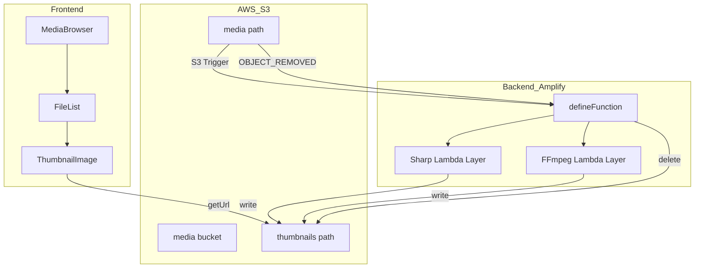
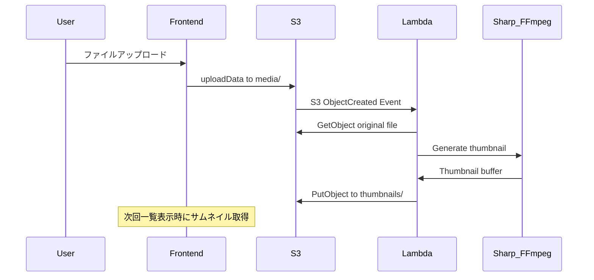
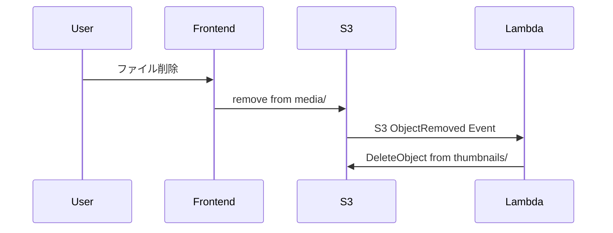

# Technical Design Document - Phase 3

## Overview

**Purpose**: 本機能は、S3 メディアブラウザにサムネイル自動生成機能を追加し、ファイル一覧での視覚的なコンテンツ識別を可能にする。

**Users**: 個人ユーザーがメディアファイル（画像・動画）をアップロードした際に、自動的にサムネイルが生成され、ファイル一覧で素早くコンテンツを確認できる。

**Impact**: Phase 2 で構築したカスタムファイルブラウザに、バックエンド（Lambda）でのサムネイル生成処理と、フロントエンドでのサムネイル表示機能を追加する。

### Goals

- 画像・動画アップロード時の自動サムネイル生成
- ファイル一覧での高速なサムネイル表示（遅延読み込み対応）
- オリジナルファイル削除時のサムネイル連動削除
- iPhone 16e での 3 カラム表示に最適化（400x400 ピクセル）
- **OSS 配布対応**: Lambda Layer ARN を環境変数でパラメータ化

### Non-Goals

- サムネイルの手動再生成
- サムネイルサイズ・品質のカスタマイズ
- 既存ファイルの一括サムネイル生成（Migration）
- PDF/Office ドキュメントのサムネイル対応
- イベント駆動によるサムネイル表示更新（将来拡張として検討）

## Architecture

### Existing Architecture Analysis

Phase 2 で構築済みのアーキテクチャ:

- フロントエンド: React + カスタム MediaBrowser コンポーネント
- バックエンド: Amplify Gen2（Auth + Storage）
- ストレージ: S3 `media/{entity_id}/*` パス構造
- 認証: Cognito による entity_id ベースのユーザー分離

### Architecture Pattern & Boundary Map



**Architecture Integration**:

- **Selected pattern**: S3 Event Trigger → defineFunction (Lambda Layer) → S3（イベント駆動アーキテクチャ）
- **Domain boundaries**: バックエンド（サムネイル生成）とフロントエンド（サムネイル表示）の責務分離
- **Existing patterns preserved**: Amplify Gen2 の `defineStorage` でバケット定義、`defineFunction` で Lambda 定義
- **New components rationale**:
  - `defineFunction` + Lambda Layer（Sharp/FFmpeg を外部 Layer として参照）
  - 環境変数で Layer ARN をパラメータ化（OSS 配布対応）
  - ThumbnailImage コンポーネント（遅延読み込み）
- **Steering compliance**: Amplify Gen2 のネイティブパターンを活用
- **Key Decision**: 動画サムネイル生成に FFmpeg Layer が必須のため、画像・動画ともに Lambda Layer 方式で統一。Layer ARN を環境変数で設定し、OSS ユーザーが各自のアカウントにデプロイした Layer を使用可能に（詳細は `research.md` 参照）

### Technology Stack

| Layer            | Choice / Version          | Role in Feature                           | Notes                     |
| ---------------- | ------------------------- | ----------------------------------------- | ------------------------- |
| Frontend         | React 18 + TypeScript     | サムネイル表示 UI                         | 既存                      |
| Image Processing | Sharp Lambda Layer (SAR)  | 画像サムネイル生成                        | 環境変数で ARN 設定       |
| Video Processing | FFmpeg Lambda Layer (SAR) | 動画サムネイル生成                        | 環境変数で ARN 設定       |
| Backend          | Amplify defineFunction    | サムネイル生成・削除処理                  | Node.js 20 + x86_64       |
| Storage          | Amazon S3                 | サムネイル保存                            | thumbnails/{entity_id}/\* |
| Infrastructure   | Amplify Gen2              | defineStorage.triggers で S3 イベント統合 | Docker 不要               |

## System Flows

### サムネイル生成フロー



### サムネイル削除フロー



## Requirements Traceability

| Requirement | Summary                        | Components               | Interfaces      | Flows          |
| ----------- | ------------------------------ | ------------------------ | --------------- | -------------- |
| 1.1         | 画像サムネイル自動生成         | onUploadHandler, Sharp   | S3Handler       | サムネイル生成 |
| 1.2         | 動画サムネイル自動生成         | onUploadHandler, FFmpeg  | S3Handler       | サムネイル生成 |
| 1.3         | サムネイル保存パス             | storage/resource.ts      | StorageAccess   | -              |
| 1.4         | サムネイルサイズ制限           | onUploadHandler          | ThumbnailConfig | -              |
| 1.5         | 生成失敗時のフォールバック     | ThumbnailImage           | -               | -              |
| 2.1         | 一覧でのサムネイル表示         | FileList, ThumbnailImage | StorageItem     | -              |
| 2.2         | 読み込み中プレースホルダー     | ThumbnailImage           | -               | -              |
| 2.3         | サムネイル不在時のデフォルト   | ThumbnailImage           | -               | -              |
| 2.4         | 遅延読み込み                   | ThumbnailImage           | loading="lazy"  | -              |
| 3.1         | ファイル削除時のサムネイル削除 | onDeleteHandler          | S3Handler       | サムネイル削除 |
| 3.2         | フォルダ削除時の連動削除       | onDeleteHandler          | S3Handler       | サムネイル削除 |
| 3.3         | パス対応付け                   | pathUtils                | ThumbnailPath   | -              |

## Components and Interfaces

### Component Summary

| Component         | Domain/Layer   | Intent             | Req Coverage  | Key Dependencies    | Contracts |
| ----------------- | -------------- | ------------------ | ------------- | ------------------- | --------- |
| onUploadHandler   | Backend/Lambda | サムネイル生成     | 1.1, 1.2, 1.4 | Sharp, FFmpeg (P0)  | Service   |
| onDeleteHandler   | Backend/Lambda | サムネイル削除     | 3.1, 3.2      | S3 Client (P0)      | Service   |
| ThumbnailImage    | Frontend/UI    | サムネイル表示     | 2.1-2.4, 1.5  | useStorage (P1)     | State     |
| FileList (拡張)   | Frontend/UI    | 一覧表示           | 2.1           | ThumbnailImage (P1) | -         |
| useStorage (拡張) | Frontend/Hook  | アップロード後遅延 | 2.1           | -                   | -         |
| pathUtils         | Shared/Util    | パス変換           | 3.3           | -                   | -         |

### Backend Layer

#### onUploadHandler

| Field        | Detail                                              |
| ------------ | --------------------------------------------------- |
| Intent       | S3 アップロードイベントをトリガーにサムネイルを生成 |
| Requirements | 1.1, 1.2, 1.4                                       |

**Responsibilities & Constraints**

- media/ プレフィックスのファイルアップロードをトリガー
- 画像ファイル: Sharp で最大 400x400 にリサイズ（`fit: 'inside'` でアスペクト比を維持）
- 動画ファイル: FFmpeg で代表フレーム抽出（blackframe フィルターで黒フレームをスキップ）→ Sharp でリサイズ（アスペクト比維持）
- thumbnails/ に JPEG 形式で保存

**Dependencies**

- Inbound: S3 Event — ObjectCreated トリガー (P0)
- External: Sharp — 画像処理 (P0)
- External: FFmpeg — 動画フレーム抽出 (P0)
- Outbound: S3 Client — サムネイル書き込み (P0)

**Contracts**: Service [x]

##### Service Interface

```typescript
import type { S3Handler, S3Event } from 'aws-lambda';

interface ThumbnailConfig {
  maxWidth: 400;
  maxHeight: 400;
  format: 'jpeg';
  quality: 80;
  /** アスペクト比を維持してリサイズ（Sharp の fit: 'inside' に対応） */
  fit: 'inside';
}

interface ProcessResult {
  success: boolean;
  thumbnailPath: string | null;
  error?: string;
}

// Lambda Handler
export const handler: S3Handler = async (event: S3Event): Promise<void>;

// Internal functions
function isImageFile(key: string): boolean;
function isVideoFile(key: string): boolean;
function generateImageThumbnail(bucket: string, key: string): Promise<ProcessResult>;
/**
 * 動画から代表フレームを抽出してサムネイル生成
 * FFmpeg の blackframe フィルターを使用して黒フレームをスキップ
 * コマンド例: ffmpeg -i input.mp4 -vf "blackframe=0,metadata=select:key=lavfi.blackframe.pblack:value=50:function=less" -frames:v 1 out.jpg
 */
function generateVideoThumbnail(bucket: string, key: string): Promise<ProcessResult>;
function getThumbnailPath(originalKey: string): string;
```

- Preconditions: S3 イベントに有効なオブジェクトキーが含まれる
- Postconditions: サムネイルが thumbnails/ に保存される、または処理がスキップされる
- Invariants: media/ プレフィックスのファイルのみ処理

**Implementation Notes**

- Integration: `defineFunction` + `defineStorage.triggers` で S3 イベントトリガーを設定
- Validation: ファイル拡張子で画像/動画を判定
- Risks: 大きな動画ファイルでのタイムアウト → Lambda タイムアウト 30 秒、メモリ 1024MB
- Layer: Sharp/FFmpeg は Lambda Layer から提供（環境変数で ARN 設定）

#### onDeleteHandler

| Field        | Detail                                      |
| ------------ | ------------------------------------------- |
| Intent       | S3 削除イベントをトリガーにサムネイルを削除 |
| Requirements | 3.1, 3.2                                    |

**Responsibilities & Constraints**

- media/ プレフィックスのファイル削除をトリガー
- 対応するサムネイルを thumbnails/ から削除

**Dependencies**

- Inbound: S3 Event — ObjectRemoved トリガー (P0)
- Outbound: S3 Client — サムネイル削除 (P0)

**Contracts**: Service [x]

##### Service Interface

```typescript
import type { S3Handler, S3Event } from 'aws-lambda';

export const handler: S3Handler = async (event: S3Event): Promise<void>;

function deleteThumbnail(bucket: string, originalKey: string): Promise<void>;
```

- Preconditions: S3 削除イベントに有効なオブジェクトキーが含まれる
- Postconditions: 対応するサムネイルが削除される（存在しない場合はスキップ）

**Implementation Notes**

- Integration: `defineStorage.triggers.onDelete` で S3 削除イベントトリガーを設定（onUpload と同一 Lambda）
- Validation: サムネイル存在確認は不要（削除は冪等）

### Frontend Layer

#### ThumbnailImage

| Field        | Detail                             |
| ------------ | ---------------------------------- |
| Intent       | サムネイル画像の遅延読み込みと表示 |
| Requirements | 2.1, 2.2, 2.3, 2.4, 1.5            |

**Responsibilities & Constraints**

- `loading="lazy"` によるネイティブ遅延読み込み
- 固定サイズコンテナ（aspect-ratio: 1/1）+ `object-fit: contain` でレイアウトシフト防止
- サムネイル未生成時は楽観的に URL を生成し、`onError` でデフォルトアイコンにフォールバック
- 読み込み中はプレースホルダー表示

**Dependencies**

- Inbound: FileList — 表示要求 (P1)
- External: Amplify Storage — getUrl (P0)

**Contracts**: State [x]

##### State Management

```typescript
interface ThumbnailImageProps {
  /** オリジナルファイルのキー（media/...） */
  originalKey: string;
  /** ファイル名（alt テキスト用） */
  fileName: string;
  /** ファイルタイプ（フォールバックアイコン判定用） */
  fileType: "image" | "video";
}

type ThumbnailState = "loading" | "loaded" | "error";

interface ThumbnailImageState {
  state: ThumbnailState;
  url: string | null;
}
```

- State model: loading → loaded | error
- Persistence: なし（毎回取得）
- Concurrency: `loading="lazy"` でブラウザが最適化

**Implementation Notes**

- Integration: FileList コンポーネント内で使用
- Validation: thumbnails/ パスへの変換は pathUtils を使用
- Risks: 大量ファイル時のリクエスト数 → `loading="lazy"` で軽減
- Future: IntersectionObserver でエラー後の再取得（画面外→画面内で再試行）

#### useStorage (拡張)

| Field        | Detail                                                     |
| ------------ | ---------------------------------------------------------- |
| Intent       | アップロード後にサムネイル生成完了を待機してからリスト更新 |
| Requirements | 2.1                                                        |

**Responsibilities & Constraints**

- アップロード完了後、3秒待機してからリストを更新（fetchItems）
- 待機中はサムネイル生成が完了する可能性が高い（Lambda は通常2-10秒で完了）
- 将来的にはイベント駆動（action → dispatch → subscriber）に分離可能

**Implementation Notes**

```typescript
const uploadFiles = useCallback(
  async (files: File[]) => {
    // ... 既存のアップロード処理 ...

    // サムネイル生成完了を待機（3秒）
    await new Promise((resolve) => setTimeout(resolve, 3000));

    await fetchItems();
  },
  [getBasePath, fetchItems],
);
```

### Shared Layer

#### pathUtils

| Field        | Detail                                           |
| ------------ | ------------------------------------------------ |
| Intent       | オリジナルファイルパスとサムネイルパスの相互変換 |
| Requirements | 3.3                                              |

```typescript
/**
 * オリジナルファイルパスからサムネイルパスを生成
 * @example
 * getThumbailPath('media/abc123/photos/image.jpg')
 * // => 'thumbnails/abc123/photos/image.jpg.thumb.jpg'
 */
function getThumbnailPath(originalPath: string): string;

/**
 * サムネイルパスからオリジナルファイルパスを復元
 */
function getOriginalPath(thumbnailPath: string): string;

/**
 * サムネイル対象のファイルかどうかを判定
 */
function isThumbnailTarget(fileName: string): boolean;
```

## Data Models

### Storage Path Structure

```
{bucket}/
├── media/
│   └── {entity_id}/
│       ├── photos/
│       │   └── image.jpg
│       └── videos/
│           └── video.mp4
└── thumbnails/
    └── {entity_id}/
        ├── photos/
        │   └── image.jpg.thumb.jpg
        └── videos/
            └── video.mp4.thumb.jpg
```

### Storage Access Configuration

```typescript
// amplify/functions/thumbnail/resource.ts
import { defineFunction } from "@aws-amplify/backend";

// 環境変数が未設定の場合は早期にエラー
const SHARP_LAYER_ARN = process.env.SHARP_LAYER_ARN;
if (!SHARP_LAYER_ARN) {
  throw new Error(
    "SHARP_LAYER_ARN environment variable is required. " +
      "Deploy Sharp Lambda Layer from SAR and set the ARN.",
  );
}

export const thumbnailFunction = defineFunction({
  name: "thumbnail",
  entry: "./handler.ts",
  timeoutSeconds: 30,
  memoryMB: 1024,
  layers: {
    // モジュール名をキーにすると esbuild が自動で external に
    sharp: SHARP_LAYER_ARN,
  },
  environment: {
    // FFmpeg Layer のパスは /opt/bin/ffmpeg
    FFMPEG_PATH: "/opt/bin/ffmpeg",
  },
});
```

```typescript
// amplify/storage/resource.ts
import { defineStorage } from "@aws-amplify/backend";
import { thumbnailFunction } from "../functions/thumbnail/resource";

export const storage = defineStorage({
  name: "mediaBucket",
  access: (allow) => ({
    "media/{entity_id}/*": [allow.entity("identity").to(["read", "write", "delete"])],
    "thumbnails/{entity_id}/*": [
      allow.entity("identity").to(["read"]),
      // Lambda がサムネイルを書き込むための権限
      allow.resource(thumbnailFunction).to(["read", "write", "delete"]),
    ],
  }),
  triggers: {
    onUpload: thumbnailFunction,
    onDelete: thumbnailFunction,
  },
});
```

```typescript
// amplify/backend.ts
import { defineBackend } from "@aws-amplify/backend";
import { auth } from "./auth/resource";
import { storage } from "./storage/resource";
import { thumbnailFunction } from "./functions/thumbnail/resource";

defineBackend({ auth, storage, thumbnailFunction });
```

**Access Control**:

- `media/`: ユーザーは read/write/delete 可能
- `thumbnails/`: ユーザーは read のみ、Lambda が write/delete

**Key Implementation Notes**:

- `defineFunction` の `layers` オプションで Lambda Layer を参照
- `layers` のキーにモジュール名（`sharp`）を指定すると esbuild が自動で external 化
- `defineStorage.triggers` で S3 イベントトリガーを設定（Docker bundling 不要）
- Layer ARN は環境変数 `SHARP_LAYER_ARN` で設定（OSS ユーザーが各自のアカウントにデプロイ）

**環境変数設定**:

- **ローカル開発**: `export SHARP_LAYER_ARN=arn:aws:lambda:...` で設定後 `npx ampx sandbox` で起動
- **Amplify Hosting**: Console → App settings → Environment variables で設定
- **未設定時**: `resource.ts` の読み込み時に例外がスローされ、明確なエラーメッセージを表示

## Error Handling

### Error Strategy

| Error Type          | Scenario                 | Handling                 | User Impact            |
| ------------------- | ------------------------ | ------------------------ | ---------------------- |
| サムネイル生成失敗  | 破損ファイル、未対応形式 | ログ記録、処理スキップ   | デフォルトアイコン表示 |
| サムネイル取得失敗  | ネットワークエラー       | リトライなし、エラー状態 | デフォルトアイコン表示 |
| Lambda タイムアウト | 大きな動画ファイル       | CloudWatch アラート      | サムネイルなし         |

### Monitoring

- CloudWatch Logs: Lambda 実行ログ
- CloudWatch Metrics: Lambda エラー率、実行時間
- アラート: エラー率 > 5% で通知

## Testing Strategy

### Unit Tests

- pathUtils: パス変換ロジック
- ファイルタイプ判定（isImageFile, isVideoFile）
- ThumbnailImage: 状態遷移（loading → loaded | error）

### Integration Tests

- Lambda ハンドラー: S3 イベント → サムネイル生成
- onUploadHandler + onDeleteHandler の連携

### E2E Tests

- ファイルアップロード → サムネイル表示確認
- ファイル削除 → サムネイル削除確認

## Security Considerations

**アクセス制御**:

- thumbnails/ への書き込みは Lambda のみ（IAM ロールで制御）
- ユーザーは自分の entity_id のサムネイルのみ read 可能
- Presigned URL による一時的アクセス権付与

**データ保護**:

- オリジナルファイルと同じ暗号化設定を継承
- サムネイルに EXIF 情報は含めない（Sharp でストリップ）

## Performance & Scalability

**Target Metrics**:

- サムネイル生成時間: 画像 < 2 秒、動画 < 10 秒
- 一覧表示: サムネイル遅延読み込みで初期表示 < 1 秒

**Optimization**:

- Lambda ARM64 による処理速度向上とコスト削減
- `loading="lazy"` による表示領域外のリクエスト抑制
- 400x400 サイズに最適化（iPhone 16e Retina 対応）
