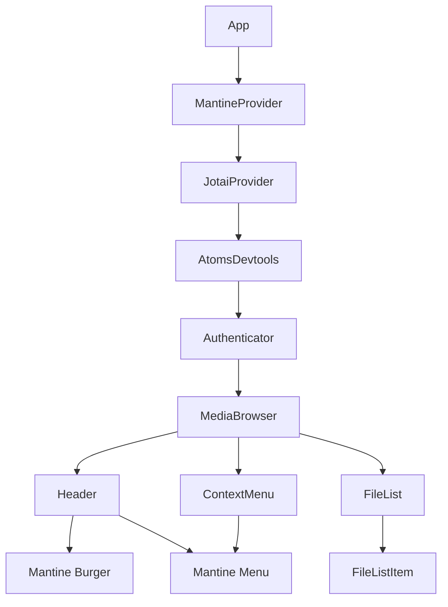

# Technical Design: Mantine UI ライブラリ導入

## 1. Overview

### 1.1 目的

Mantine 8 UI ライブラリを導入し、以下を実現する：

1. **ブロッカー解消**: jotai-devtools の DevTools UI を廃止し useAtomsDevtools に移行、npm overrides で Mantine 8 を強制導入
2. **最優先バグ修正**: カスタム useLongPress フックを Mantine useLongPress に移行し、長押し操作のバグを修正
3. 独自実装の ContextMenu を Mantine Menu コンポーネントに移行
4. Header のグローバルメニューを Mantine Burger + Menu に移行

### 1.2 設計方針

- **依存関係問題の解決**: npm overrides で jotai-devtools の Mantine 7 依存を Mantine 8 に上書き
- **最優先バグ修正**: 長押し操作の 3 件のバグを Mantine 移行で解決
- **最小限の変更**: 既存インターフェースを維持し、内部実装のみ置換
- **段階的移行**: 既存機能を壊さず順次置き換え
- **標準パターン採用**: Mantine の推奨パターンに従う

---

## 2. Goals / Non-Goals

### Goals

- **ブロッカー解消**: jotai-devtools DevTools UI → useAtomsDevtools への移行
- **ブロッカー解消**: npm overrides による Mantine 8 の強制導入
- **最優先**: カスタム useLongPress フックの Mantine useLongPress への移行
- **最優先**: 長押し後の誤ナビゲーション、削除ボタン動作不良、iOS ネイティブメニューの 3 件のバグ修正
- ContextMenu の Mantine Menu への移行
- Header グローバルメニューの Mantine Burger + Menu への移行
- 独自 useEffect ロジックの撤廃（4 箇所）
- 独自 DropdownMenu コンポーネントの削除

### Non-Goals

- 他の UI コンポーネント（Dialog, Modal 等）の移行（将来スコープ）
- Mantine テーマのフルカスタマイズ
- 既存のアイコンライブラリ（Lucide React）の置き換え
- jotai-devtools の DevTools UI の継続使用（Mantine 7 依存のため廃止）

---

## 3. Requirements Traceability

| Requirement | Summary                         | Components      | Interfaces            | Flows              |
| ----------- | ------------------------------- | --------------- | --------------------- | ------------------ |
| 1           | DevTools UI → useAtomsDevtools  | AtomsDevtools   | useAtomsDevtools      | DevTools 連携      |
| 2           | npm overrides で Mantine 8 導入 | package.json    | -                     | ビルド             |
| 3           | 長押し操作の安定化【最優先】    | FileListItem    | useLongPress handlers | 長押し/タップ判定  |
| 4           | ContextMenu 移行                | ContextMenu     | Menu API              | メニュー表示フロー |
| 5           | Header グローバルメニュー移行   | Header          | Burger + Menu API     | メニュー表示フロー |
| 6           | 独自コンポーネント撤廃          | 複数            | -                     | -                  |
| 7           | 既存機能の互換性維持            | 複数            | 既存 Props 維持       | -                  |
| 8           | スタイル統一                    | MantineProvider | Theme 設定            | -                  |
| 9           | 将来的な拡張性                  | MantineProvider | -                     | -                  |

---

## 4. Architecture

### 4.1 コンポーネント階層



### 4.2 Key Decisions

- MantineProvider はアプリケーションルートに配置し、全コンポーネントで Mantine を利用可能にする
- JotaiProvider 内で AtomsDevtools をラップし、開発環境でのみ Redux DevTools と連携
- DevTools UI コンポーネントは廃止し、useAtomsDevtools フックのみ使用（Mantine 依存を排除）
- 既存の Authenticator（Amplify UI）との共存を維持
- FileListItem は Mantine useLongPress フックを使用し、長押しとクリックを分離
- Header のグローバルメニューは Mantine Burger + Menu を使用（独自 DropdownMenu 廃止）
- ContextMenu は Mantine Menu を内部で使用し、外部インターフェースは維持

---

## 5. Technology Stack

| Layer          | Tool/Library   | Version | Role                               |
| -------------- | -------------- | ------- | ---------------------------------- |
| UI Framework   | @mantine/core  | ^8.0.0  | コアコンポーネント（Menu, Burger） |
| UI Hooks       | @mantine/hooks | ^8.0.0  | useLongPress フック                |
| State/DevTools | jotai-devtools | ^0.13.0 | useAtomsDevtools（utils のみ使用） |
| Icons          | lucide-react   | 既存    | アイコン表示（変更なし）           |

### 新規依存関係

- `@mantine/core`: Menu, Burger, MantineProvider
- `@mantine/hooks`: useLongPress

### npm overrides（重要）

jotai-devtools が Mantine 7 に依存しているため、npm overrides で Mantine 8 を強制する：

```json
{
  "dependencies": {
    "@mantine/core": "^8.0.0",
    "@mantine/hooks": "^8.0.0"
  },
  "overrides": {
    "@mantine/core": "^8.0.0",
    "@mantine/hooks": "^8.0.0"
  }
}
```

これにより jotai-devtools の DevTools UI は動作しなくなるが、useAtomsDevtools は Mantine に依存しないため正常に動作する。

---

## 6. Components & Interfaces

### 6.1 Component Summary

| Component       | Domain            | Intent                      | Requirements | Dependencies         |
| --------------- | ----------------- | --------------------------- | ------------ | -------------------- |
| AtomsDevtools   | Stores            | Redux DevTools 連携         | 1            | jotai-devtools/utils |
| MantineProvider | UI Infrastructure | Mantine テーマプロバイダー  | 2, 8         | @mantine/core        |
| FileListItem    | MediaBrowser      | ファイル/フォルダ表示・操作 | 3, 6         | useLongPress         |
| ContextMenu     | MediaBrowser      | 右クリック/長押しメニュー   | 4, 6, 7      | Menu                 |
| Header          | MediaBrowser      | グローバルメニュー          | 5, 6, 7      | Burger, Menu         |

### 6.2 AtomsDevtools（Stores）

**Intent**: 開発環境で全アトムを Redux DevTools に接続

**Contracts**: [x] State

**Implementation**:

```tsx
// src/stores/AtomsDevtools.tsx
import type { ReactNode } from "react";
import { useAtomsDevtools } from "jotai-devtools/utils";

export function AtomsDevtools({ children }: { children: ReactNode }) {
  useAtomsDevtools("aws-s3-photo-browser");
  return children;
}
```

```tsx
// src/stores/JotaiProvider.tsx
import { Provider } from "jotai";
import { AtomsDevtools } from "./AtomsDevtools";

export function JotaiProvider({ children }: JotaiProviderProps) {
  return (
    <Provider>
      {import.meta.env.DEV ? <AtomsDevtools>{children}</AtomsDevtools> : children}
    </Provider>
  );
}
```

**削除対象**:

- `import { DevTools } from "jotai-devtools";`
- `import "jotai-devtools/styles.css";`
- `{import.meta.env.DEV && <DevTools />}`

**Implementation Notes**:

- useAtomsDevtools は Provider 直下で呼び出す必要がある
- Redux DevTools 未インストール時もエラーなく動作
- 本番ビルドでは AtomsDevtools がレンダリングされないため、コードが除外される

### 6.3 MantineProvider（Infrastructure）

**Intent**: アプリケーション全体に Mantine テーマとスタイルを提供

**Contracts**: [x] State

**Configuration**:

- CSS スタイル: `@mantine/core/styles.css` を読み込み
- `modern-normalize.min.css` は削除（Mantine の最小リセットで十分）
- 既存の CSS カスタムプロパティとの競合がある場合は調整

**CSS Load Order**:

| Order | File                       | Location          |
| ----- | -------------------------- | ----------------- |
| 1     | @mantine/core/styles.css   | main.tsx (import) |
| 2     | アプリケーション固有の CSS | 各コンポーネント  |

**Mantine 最小 CSS リセット（styles.css に含まれる）**:

```css
body {
  margin: 0;
}
*,
*::before,
*::after {
  box-sizing: border-box;
}
input,
button,
textarea,
select {
  font: inherit;
}
button,
select {
  text-transform: none;
}
```

**Implementation**:

```tsx
// src/main.tsx
import "@mantine/core/styles.css"; // Mantine の最小リセット含む
import "./index.css"; // アプリ固有スタイル（Mantine より後）

// src/App.tsx
import { MantineProvider } from "@mantine/core";

function App() {
  return (
    <MantineProvider>
      <JotaiProvider>{/* App content */}</JotaiProvider>
    </MantineProvider>
  );
}
```

**Implementation Notes**:

- App.tsx のルートに配置
- JotaiProvider の外側でラップ
- モダンブラウザ前提のため `modern-normalize.min.css` は不要
- Mantine の最小リセットで十分なクロスブラウザ一貫性を確保

### 6.4 FileListItem（長押し操作）【最優先】

**Intent**: ファイル・フォルダの表示と長押し/タップ操作の分離

**Contracts**: [x] Service

**useLongPress 使用方法**:

| Option    | Type                                      | Description                    |
| --------- | ----------------------------------------- | ------------------------------ |
| threshold | number                                    | 長押し判定時間（400ms）        |
| onStart   | (event: MouseEvent \| TouchEvent) => void | 長押し開始時コールバック       |
| onFinish  | (event: MouseEvent \| TouchEvent) => void | 長押し完了時コールバック       |
| onCancel  | (event: MouseEvent \| TouchEvent) => void | 長押しキャンセル時コールバック |

**Behavior**:

- 400ms 以上の押下で長押しと判定し、コンテキストメニューを表示
- 400ms 未満の押下は通常クリックとして処理（ナビゲーション）
- 長押し完了後は onClick を抑制するフラグ制御
- 選択モード時は長押しを無効化

**iOS/Android ネイティブメニュー抑制**:

| CSS Property          | Value        | Purpose                    |
| --------------------- | ------------ | -------------------------- |
| -webkit-touch-callout | none         | iOS ネイティブメニュー抑制 |
| -webkit-user-select   | none         | iOS テキスト選択抑制       |
| user-select           | none         | 汎用テキスト選択抑制       |
| touch-action          | manipulation | タッチジェスチャー制御     |

**削除対象**:

- `src/hooks/useLongPress.ts`（カスタムフック 108 行）
- `src/hooks/useLongPress.test.ts`（テストファイル）
- 移動キャンセル機能（moveThreshold）- 問題があれば後日対応
- 触覚フィードバック機能（navigator.vibrate）- 不要

### 6.5 ContextMenu

**Intent**: ファイル・フォルダの右クリック/長押しで表示されるアクションメニュー

**Contracts**: [x] Service

**Interface（維持）**:

| Prop     | Type                     | Description          |
| -------- | ------------------------ | -------------------- |
| isOpen   | boolean                  | メニュー表示状態     |
| item     | StorageItem \| null      | 対象アイテム         |
| position | { x: number; y: number } | 表示位置（ピクセル） |
| onClose  | () => void               | 閉じるコールバック   |
| onRename | () => void               | リネームアクション   |
| onMove   | () => void               | 移動アクション       |
| onDelete | () => void               | 削除アクション       |

**Behavior**:

- `isOpen=true` かつ `item` が存在する場合にメニューを表示
- `position` の座標にメニューを配置
- 外部クリックで自動的に閉じる（Mantine 組み込み）
- Escape キーで自動的に閉じる（Mantine 組み込み）
- 画面端での位置調整は自動（Mantine 組み込み）

**Menu Items**:

| Label      | Icon        | Action   | Style        |
| ---------- | ----------- | -------- | ------------ |
| 名前を変更 | Pencil      | onRename | default      |
| 移動       | FolderInput | onMove   | default      |
| 削除       | Trash2      | onDelete | danger (red) |

**削除対象ロジック**:

- useEffect: 外部クリック検出
- useEffect: Escape キー処理
- adjustedPosition(): 位置調整計算
- MenuButton: 内部コンポーネント

### 6.6 Header（Burger + Menu）

**Intent**: ヘッダーのグローバルメニュー（設定・サインアウト）を Mantine Burger + Menu で実装

**Contracts**: [x] Service

**Props（既存維持）**:

| Prop           | Type       | Description            |
| -------------- | ---------- | ---------------------- |
| onOpenSettings | () => void | 設定ダイアログを開く   |
| onSignOut      | () => void | サインアウト処理を実行 |

**State**:

| State      | Type    | Description        |
| ---------- | ------- | ------------------ |
| menuOpened | boolean | メニューの開閉状態 |

**Behavior**:

- Burger クリックでメニュー開閉（☰ ↔ ✕ アニメーション）
- 外部クリックで自動的に閉じる（Mantine 組み込み）
- Escape キーで自動的に閉じる（Mantine 組み込み）

**Menu Items**:

| Label        | Icon     | Action         | Style        |
| ------------ | -------- | -------------- | ------------ |
| 設定         | Settings | onOpenSettings | default      |
| サインアウト | LogOut   | onSignOut      | danger (red) |

**Implementation**:

```tsx
// src/components/MediaBrowser/Header.tsx
import { useState } from "react";
import { Burger, Menu } from "@mantine/core";
import { Settings, LogOut } from "lucide-react";

// Header 内部
const [menuOpened, setMenuOpened] = useState(false);

<Menu opened={menuOpened} onChange={setMenuOpened}>
  <Menu.Target>
    <Burger
      opened={menuOpened}
      onClick={() => setMenuOpened((o) => !o)}
      aria-label="メニューを開く"
      size="sm"
    />
  </Menu.Target>
  <Menu.Dropdown>
    <Menu.Item leftSection={<Settings size={16} />} onClick={onOpenSettings}>
      設定
    </Menu.Item>
    <Menu.Item leftSection={<LogOut size={16} />} color="red" onClick={onSignOut}>
      サインアウト
    </Menu.Item>
  </Menu.Dropdown>
</Menu>;
```

**削除対象**:

- DropdownMenu.tsx（独自コンポーネント）
- DropdownMenu.css（独自スタイル）
- Header.tsx 内の DropdownMenu 使用箇所

---

## 7. File Changes

### 7.1 修正ファイル

| File                                        | Change Type | Description                               |
| ------------------------------------------- | ----------- | ----------------------------------------- |
| package.json                                | 追加        | @mantine/core, @mantine/hooks + overrides |
| index.html                                  | 修正        | modern-normalize.min.css の link 削除     |
| src/App.tsx                                 | 修正        | MantineProvider でラップ、CSS import      |
| src/stores/JotaiProvider.tsx                | 修正        | AtomsDevtools に移行、DevTools UI 削除    |
| src/stores/AtomsDevtools.tsx                | 新規        | useAtomsDevtools ラッパーコンポーネント   |
| src/components/MediaBrowser/FileList.tsx    | 修正        | Mantine useLongPress に移行               |
| src/components/MediaBrowser/FileList.css    | 修正        | iOS/Android ネイティブメニュー抑制 CSS    |
| src/components/MediaBrowser/ContextMenu.tsx | 書き換え    | Mantine Menu ベースに移行                 |
| src/components/MediaBrowser/Header.tsx      | 修正        | Burger + Menu に移行、DropdownMenu 削除   |

### 7.2 削除ファイル

| File                                         | Reason                           |
| -------------------------------------------- | -------------------------------- |
| public/modern-normalize.min.css              | Mantine の最小リセットで代替     |
| src/hooks/useLongPress.ts                    | Mantine useLongPress に移行      |
| src/hooks/useLongPress.test.ts               | カスタムフック削除に伴い不要     |
| src/components/MediaBrowser/ContextMenu.css  | Mantine スタイル使用のため不要   |
| src/components/MediaBrowser/DropdownMenu.tsx | Header 内で Burger + Menu に移行 |
| src/components/MediaBrowser/DropdownMenu.css | Header 内で Burger + Menu に移行 |

---

## 8. Testing Strategy

### 8.1 ユニットテスト

| Component     | Test Cases                                                           |
| ------------- | -------------------------------------------------------------------- |
| AtomsDevtools | Redux DevTools 連携確認（開発環境のみ）                              |
| FileListItem  | 長押しでメニュー表示、短いタップでナビゲーション、選択モード時の動作 |
| ContextMenu   | isOpen=true で表示、各アクションのコールバック呼び出し、ARIA 属性    |
| Header        | Burger クリックで開閉、設定・サインアウトアクション、danger スタイル |

### 8.2 統合テスト

- FileListItem: 長押し → メニュー表示 → ナビゲーション抑制
- FileListItem: 短いタップ → ナビゲーション実行
- ContextMenu: 右クリック → メニュー表示 → アクション実行 → ダイアログ表示
- Header: Burger クリック → メニュー表示 → 設定/サインアウト実行

### 8.3 デバイス別テスト

| デバイス | テスト内容                             |
| -------- | -------------------------------------- |
| PC       | マウスクリック、右クリック動作確認     |
| iOS      | 長押し動作、ネイティブメニュー抑制確認 |
| Android  | 長押し動作、ネイティブメニュー抑制確認 |

### 8.4 アクセシビリティテスト

- キーボードナビゲーション（矢印キー、Enter、Escape）
- ARIA 属性（role, aria-expanded, aria-label）

---

## 9. Migration Steps

| Phase | Description                                                  | Validation                 |
| ----- | ------------------------------------------------------------ | -------------------------- |
| 1     | 依存関係追加（overrides 含む）、MantineProvider セットアップ | ビルド成功、既存テストパス |
| 2     | JotaiProvider → AtomsDevtools 移行、DevTools UI 削除         | Redux DevTools 連携確認    |
| 3     | FileListItem の useLongPress 移行【最優先】                  | 長押し 3 件のバグ修正確認  |
| 4     | ContextMenu 移行、CSS 削除                                   | 右クリック/長押し動作確認  |
| 5     | Header の Burger + Menu 移行、DropdownMenu 削除              | Burger 動作確認            |
| 6     | カスタムフック削除、クリーンアップ、全体テスト               | 全テストパス、ビルド成功   |

---

## 10. Risks and Mitigations

| Risk                         | Impact | Likelihood | Mitigation                                         |
| ---------------------------- | ------ | ---------- | -------------------------------------------------- |
| バンドルサイズ増加           | 中     | 高         | Tree-shaking 確認、必要なコンポーネントのみ import |
| スタイル競合                 | 低     | 中         | CSS 読み込み順序調整、CSS 変数活用                 |
| 既存テスト失敗               | 中     | 中         | テスト修正を各 Phase に含める                      |
| 移動キャンセル機能の削除     | 低     | 中         | 今回は削除。スクロール時の誤発火があれば後日対応   |
| 触覚フィードバック機能の削除 | 低     | 低         | 今回は削除。ユーザー要望があれば後日対応           |

---

## 11. Success Criteria

- [ ] `npm run check-all` がパスする
- [ ] npm overrides で Mantine 8 が正常にインストールされる
- [ ] Redux DevTools で Jotai アトムが確認できる（開発環境）
- [ ] 長押し後の誤ナビゲーションが発生しない
- [ ] コンテキストメニューの削除ボタンが動作する
- [ ] iOS で長押し時にネイティブメニューが表示されない
- [ ] ContextMenu の右クリック・長押しが動作する
- [ ] Header の Burger クリックでメニューが動作する
- [ ] 外部クリックでメニューが閉じる
- [ ] Escape キーでメニューが閉じる
- [ ] キーボードナビゲーションが動作する
- [ ] ContextMenu 内の useEffect が 0 箇所になる
- [ ] カスタム useLongPress フックが削除されている
- [ ] DropdownMenu コンポーネントが削除されている
- [ ] DevTools UI（jotai-devtools）が削除されている
