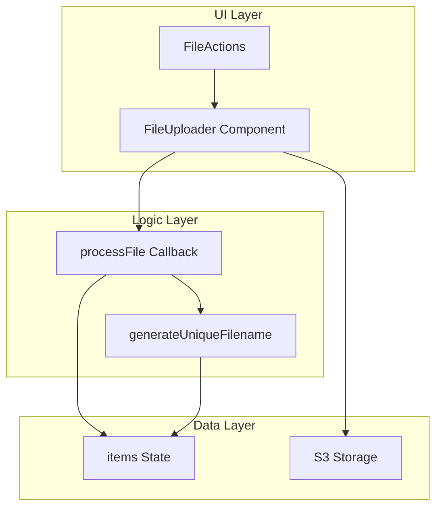
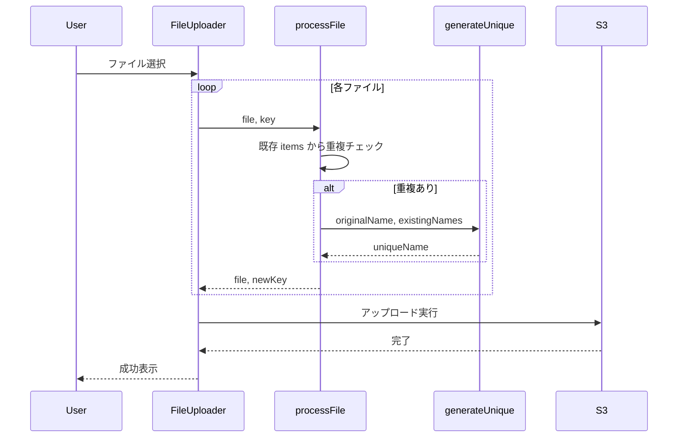

# Design Document

## Overview

**Purpose**: この機能は、ファイルアップロード時の重複チェックと自動リネームを提供し、意図しないファイル上書きを防止する。

**Users**: Media Browser を使用するすべてのユーザーが、ファイルアップロード時にこの機能を利用する。

**Impact**: 既存の FileUploader コンポーネントに `processFile` コールバックを追加し、アップロード前にファイル名の重複チェックと自動リネームを実行する。

### Goals

- アップロード時に既存ファイルとの重複を自動検知
- 重複時は `ファイル名 (N).拡張子` 形式で自動リネーム
- 既存のアップロード操作（UI/UX）を変更しない
- 既存のバリデーションルール（長さ制限）を遵守

### Non-Goals

- ユーザーによる重複時の操作選択（スキップ/上書き/手動リネーム）
- フォルダアップロード時の重複チェック
- アップロード後のリネーム通知UI

## Architecture

### Existing Architecture Analysis

現在のアップロード機能:

- `FileActions.tsx`: FileUploader コンポーネントを表示
- `@aws-amplify/ui-react-storage`: FileUploader で S3 へ直接アップロード
- `useStorageOperations`: `items` ステートで現在フォルダのファイル一覧を保持

既存パターン:

- 重複チェック: `validateRename.ts` で同名ファイル検索
- ストレージ操作: `useStorageOperations` フック

### Architecture Pattern & Boundary Map



**Architecture Integration**:

- **Selected pattern**: コールバック拡張パターン。既存の FileUploader に processFile を追加。
- **Domain/feature boundaries**: ファイル名生成ロジックを独立したユーティリティに分離
- **Existing patterns preserved**: useStorageOperations の items 利用、validateRename のバリデーションルール
- **New components rationale**: `generateUniqueFilename` — 連番付与ロジックのテスト容易性と再利用性
- **Steering compliance**: hooks/ にユーティリティ配置、単一責任の原則

### Technology Stack

| Layer    | Choice / Version                         | Role in Feature            | Notes    |
| -------- | ---------------------------------------- | -------------------------- | -------- |
| Frontend | React 19 + @aws-amplify/ui-react-storage | FileUploader + processFile | 既存依存 |

## System Flows

### アップロード時の重複チェックフロー



## Requirements Traceability

| Requirement | Summary                      | Components                 | Interfaces             | Flows                      |
| ----------- | ---------------------------- | -------------------------- | ---------------------- | -------------------------- |
| 1.1         | 既存ファイルとの比較         | FileActions, processFile   | processFile callback   | アップロード時重複チェック |
| 1.2         | 複数ファイル同時チェック     | processFile                | -                      | 各ファイルで実行           |
| 1.3         | 大文字小文字区別             | generateUniqueFilename     | -                      | -                          |
| 2.1         | 連番付与                     | generateUniqueFilename     | generateUniqueFilename | -                          |
| 2.2         | ファイル名形式               | generateUniqueFilename     | -                      | -                          |
| 2.3         | 連番増加                     | generateUniqueFilename     | -                      | -                          |
| 2.4         | 重複解消まで増加             | generateUniqueFilename     | -                      | -                          |
| 2.5         | 長さ制限確認                 | generateUniqueFilename     | -                      | -                          |
| 3.1         | 決定ファイル名でアップロード | FileUploader + processFile | -                      | アップロード時重複チェック |
| 3.2         | 進捗表示                     | FileUploader               | -                      | 既存機能                   |
| 3.3         | ファイル一覧更新             | FileActions                | onUploadComplete       | 既存機能                   |
| 3.4         | エラー表示                   | FileUploader               | -                      | 既存機能                   |
| 4.1         | 重複なし時は元ファイル名     | processFile                | -                      | -                          |
| 4.2         | 既存UX維持                   | FileActions                | -                      | -                          |

## Components and Interfaces

| Component              | Domain/Layer | Intent                            | Req Coverage       | Key Dependencies                                   | Contracts |
| ---------------------- | ------------ | --------------------------------- | ------------------ | -------------------------------------------------- | --------- |
| FileActions            | UI           | アップロードUIとprocessFileの統合 | 1.1, 3.1, 3.3, 4.2 | FileUploader (P0), useStorageOperations.items (P0) | -         |
| generateUniqueFilename | Logic/Utils  | 重複しないファイル名を生成        | 1.3, 2.1-2.5, 4.1  | -                                                  | Service   |

### Logic Layer

#### generateUniqueFilename

| Field        | Detail                                                       |
| ------------ | ------------------------------------------------------------ |
| Intent       | 既存ファイル名リストを考慮し、重複しないファイル名を生成する |
| Requirements | 1.3, 2.1, 2.2, 2.3, 2.4, 2.5, 4.1                            |

**Responsibilities & Constraints**

- 入力ファイル名と既存ファイル名リストから一意のファイル名を生成
- 重複時は `ファイル名 (N).拡張子` 形式で連番付与
- 大文字小文字を区別して比較
- 生成されたファイル名が100文字を超える場合はエラー

**Dependencies**

- Inbound: FileActions processFile — ファイル名生成依頼 (P0)
- External: なし

**Contracts**: Service [x]

##### Service Interface

```typescript
interface GenerateUniqueFilenameOptions {
  /** 元のファイル名 */
  originalName: string;
  /** 現在フォルダ内の既存ファイル名リスト */
  existingNames: string[];
}

interface GenerateUniqueFilenameResult {
  /** 成功フラグ */
  success: boolean;
  /** 生成されたファイル名（成功時） */
  filename?: string;
  /** エラーメッセージ（失敗時） */
  error?: string;
  /** リネームされたかどうか */
  renamed: boolean;
}

/**
 * 重複しないファイル名を生成する
 *
 * @param options ファイル名生成オプション
 * @returns 生成結果
 */
function generateUniqueFilename(
  options: GenerateUniqueFilenameOptions,
): GenerateUniqueFilenameResult;
```

- Preconditions:
  - `originalName` は空文字でない
  - `existingNames` は現在フォルダのファイル名リスト
- Postconditions:
  - 成功時: `filename` は `existingNames` に含まれない
  - 成功時: `filename` は100文字以内
  - `renamed` は元のファイル名から変更があった場合 true
- Invariants:
  - 連番は1から開始し、空きがあるまで増加

**Implementation Notes**

- Integration: `src/utils/` に配置、純粋関数として実装
- Validation: 長さ制限100文字を超える場合は `success: false` を返す
- Risks: なし（純粋関数のため副作用なし）

### UI Layer

#### FileActions（変更箇所）

| Field        | Detail                                                                 |
| ------------ | ---------------------------------------------------------------------- |
| Intent       | FileUploader に processFile を追加し、重複チェックと自動リネームを統合 |
| Requirements | 1.1, 1.2, 3.1, 4.2                                                     |

**Responsibilities & Constraints**

- `processFile` コールバックを FileUploader に渡す
- `useStorageOperations` の `items` から既存ファイル名リストを取得
- 重複検知時は `generateUniqueFilename` でリネーム

**Dependencies**

- Inbound: MediaBrowser — props 経由 (P0)
- Outbound: generateUniqueFilename — ファイル名生成 (P0)
- External: FileUploader processFile — Amplify UI API (P0)

**Contracts**: State [x]

##### State Management

- State model: `useStorageOperations` の `items` を参照（変更なし）
- Persistence & consistency: なし（processFile はステートレス）
- Concurrency strategy: 各ファイルの processFile は順次実行されると想定

**Implementation Notes**

- Integration: FileUploader の `processFile` prop を追加
- Validation: processFile 内で generateUniqueFilename を呼び出し、失敗時はエラーをスロー
- Risks: 同時アップロード時のファイル間重複は processFile 実行順序に依存

## Data Models

本機能はデータモデルの変更を伴わない。

## Error Handling

### Error Strategy

- 長さ制限超過: `generateUniqueFilename` が `success: false` を返し、processFile でエラーをスロー
- FileUploader がエラーを表示

### Error Categories and Responses

**User Errors (4xx)**:

- ファイル名が長すぎる（100文字超過） → 連番付与後も超過する場合、アップロード失敗としてエラー表示

**System Errors (5xx)**:

- S3 アップロード失敗 → 既存の FileUploader エラーハンドリング

## Testing Strategy

### Unit Tests

- `generateUniqueFilename`: 重複なし時は元のファイル名を返す
- `generateUniqueFilename`: 重複あり時は連番付きファイル名を返す
- `generateUniqueFilename`: 連番が既に存在する場合は次の連番を返す
- `generateUniqueFilename`: 大文字小文字を区別する
- `generateUniqueFilename`: 長さ制限超過時はエラーを返す

### Integration Tests

- FileActions: processFile で重複ファイルがリネームされる
- FileActions: 複数ファイル同時アップロード時の重複チェック

### E2E/UI Tests

- アップロードダイアログで重複ファイルを選択し、自動リネームでアップロード成功
- 長いファイル名で連番付与が失敗するケース
