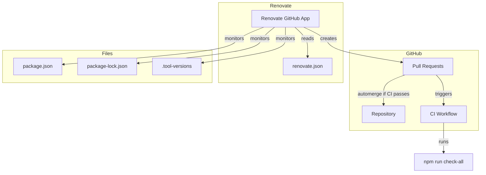
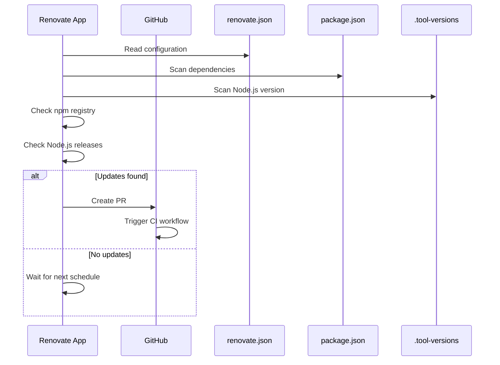
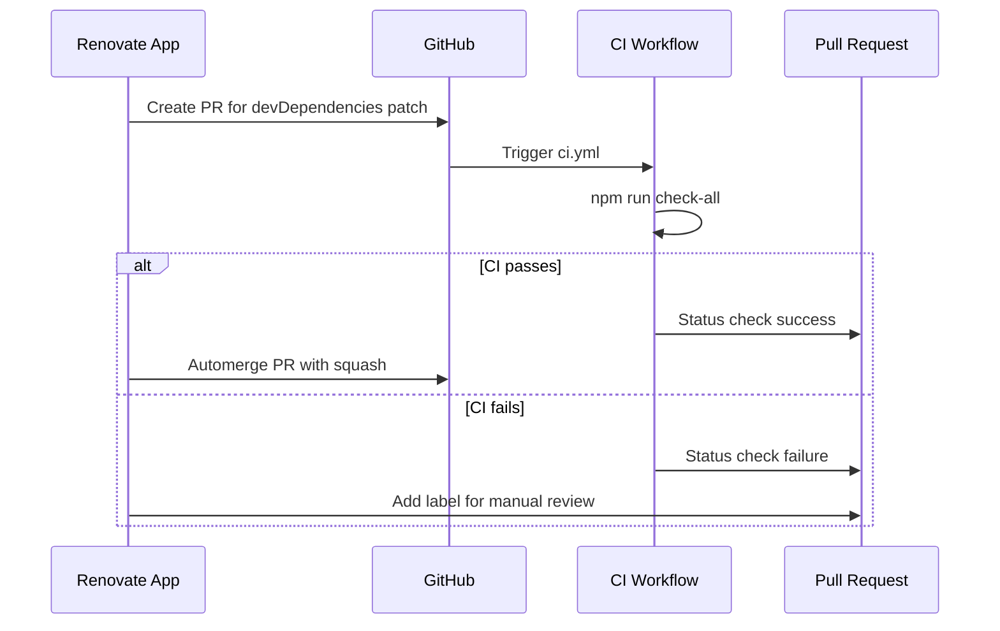

# Design Document: Automated Dependency Updates

## Overview

**Purpose**: Renovate GitHub App を導入し、npm 依存関係と Node.js ランタイムバージョンの自動アップデートを実現する。

**Users**: 開発者がプルリクエストベースで依存関係の更新をレビュー・マージできるようになる。

**Impact**: 手動での依存関係管理の負担を軽減し、セキュリティパッチの適用を迅速化する。

### Goals

- Renovate GitHub App による依存関係の自動監視と PR 作成
- 関連パッケージのグループ化によるレビュー負担の軽減
- devDependencies パッチアップデートの自動マージによる運用コスト削減
- `.tool-versions` ファイルの Node.js バージョン管理

### Non-Goals

- Dependabot との併用（Renovate 単独で全要件をカバー）
- セルフホスティング（GitHub App を使用）
- production dependencies の自動マージ（手動レビュー必須）
- Amplify バックエンド（Lambda）の Node.js バージョン管理（別途対応）

## Architecture

### Architecture Pattern & Boundary Map

本機能は設定ファイルの追加のみで完結し、アプリケーションコードの変更は不要。



**Architecture Integration**:

- Selected pattern: 外部サービス連携（GitHub App）
- Domain/feature boundaries: CI/CD パイプラインの拡張、アプリケーションコードとは独立
- Existing patterns preserved: 既存の CI ワークフロー（`.github/workflows/ci.yml`）をそのまま活用
- New components rationale: `renovate.json` のみ追加、既存ファイルへの変更なし
- Steering compliance: 運用コスト最小化、Amplify 統合バックエンドとの親和性

### Technology Stack

| Layer           | Choice / Version    | Role in Feature              | Notes                               |
| --------------- | ------------------- | ---------------------------- | ----------------------------------- |
| Automation      | Renovate GitHub App | 依存関係監視・PR 作成        | Mend 提供の無料ホスティングサービス |
| Configuration   | renovate.json       | ツール設定                   | JSON 形式、リポジトリルートに配置   |
| Package Manager | npm (asdf manager)  | 依存関係・ランタイム管理対象 | `package.json`, `.tool-versions`    |
| CI/CD           | GitHub Actions      | PR 検証                      | 既存の `ci.yml` を使用              |

## Requirements Traceability

| Requirement | Summary                           | Components             | Interfaces | Flows          |
| ----------- | --------------------------------- | ---------------------- | ---------- | -------------- |
| 1.1         | GitHub で利用可能なツール使用     | RenovateConfig         | -          | -              |
| 1.2         | 設定ファイルの配置場所            | RenovateConfig         | -          | -              |
| 1.3         | リポジトリスキャン                | Renovate App           | -          | DependencyScan |
| 1.4         | dependencies/devDependencies 対象 | RenovateConfig         | -          | -              |
| 2.1         | PR 自動作成                       | Renovate App           | -          | PRCreation     |
| 2.2         | パッケージ・バージョン情報明記    | Renovate App           | -          | -              |
| 2.3         | changelog リンク                  | Renovate App           | -          | -              |
| 2.4         | CI トリガー                       | GitHub Actions         | -          | CIValidation   |
| 3.1         | 週次チェック                      | RenovateConfig         | -          | -              |
| 3.2         | セキュリティ優先                  | RenovateConfig         | -          | -              |
| 3.3         | スケジュール変更可能              | RenovateConfig         | -          | -              |
| 4.1         | パッケージグループ化              | RenovateConfig         | -          | -              |
| 4.2         | devDependencies グループ化        | RenovateConfig         | -          | -              |
| 4.3         | メジャーアップデート個別 PR       | RenovateConfig         | -          | -              |
| 5.1         | パッチ自動マージ設定              | RenovateConfig         | -          | Automerge      |
| 5.2         | CI 成功時自動マージ               | RenovateConfig, GitHub | -          | Automerge      |
| 5.3         | CI 失敗時手動レビュー             | RenovateConfig         | -          | -              |
| 5.4         | devDependencies のみ自動マージ    | RenovateConfig         | -          | -              |
| 6.1         | パッケージ除外機能                | RenovateConfig         | -          | -              |
| 6.2         | バージョン固定機能                | RenovateConfig         | -          | -              |
| 6.3         | overrides 考慮                    | RenovateConfig         | -          | -              |
| 7.1         | .tool-versions 監視               | Renovate asdf Manager  | -          | -              |
| 7.2         | Node.js LTS アップデート PR       | Renovate App           | -          | NodeUpdate     |
| 7.3         | Node.js 個別 PR                   | RenovateConfig         | -          | -              |

## Components and Interfaces

| Component           | Domain/Layer     | Intent                | Req Coverage                                         | Key Dependencies  | Contracts |
| ------------------- | ---------------- | --------------------- | ---------------------------------------------------- | ----------------- | --------- |
| RenovateConfig      | Configuration    | Renovate の動作設定   | 1.1-1.4, 3.1-3.3, 4.1-4.3, 5.1-5.4, 6.1-6.3, 7.1-7.3 | Renovate App (P0) | State     |
| Renovate GitHub App | External Service | 依存関係監視・PR 作成 | 2.1-2.4, 7.2                                         | GitHub API (P0)   | Service   |

### Configuration Layer

#### RenovateConfig

| Field        | Detail                                               |
| ------------ | ---------------------------------------------------- |
| Intent       | Renovate の動作を制御する設定ファイル                |
| Requirements | 1.1-1.4, 3.1-3.3, 4.1-4.3, 5.1-5.4, 6.1-6.3, 7.1-7.3 |

**Responsibilities & Constraints**

- 依存関係のスキャン対象（npm, asdf）の指定
- アップデートスケジュールの制御
- パッケージグループ化ルールの定義
- 自動マージ条件の設定
- 除外パッケージの指定

**Dependencies**

- External: Renovate GitHub App — 設定の読み取りと実行 (P0)
- External: GitHub API — PR 作成・マージ (P0)

**Contracts**: State [x]

##### State Management

```json5
{
  // IDE での入力補完・検証を有効化する JSON Schema 参照
  $schema: "https://docs.renovatebot.com/renovate-schema.json",

  // 継承するプリセット設定
  // - config:recommended: Renovate 推奨設定（セマンティックバージョニング分類、適切なデフォルト値）
  // - :disableDependencyDashboard: Dashboard Issue を無効化し、PR のみで管理
  extends: ["config:recommended", ":disableDependencyDashboard"],

  // スケジュール評価に使用するタイムゾーン
  timezone: "Asia/Tokyo",

  // アップデートチェックのスケジュール（毎週月曜 9:00 前）
  schedule: ["before 9am on monday"],

  // 1時間あたりの PR 作成上限（ノイズ軽減）
  prHourlyLimit: 5,

  // 同時にオープンできる PR の最大数
  prConcurrentLimit: 10,

  // 有効にするパッケージマネージャー
  // - npm: package.json の依存関係
  // - asdf: .tool-versions の Node.js バージョン
  enabledManagers: ["npm", "asdf"],

  packageRules: [
    // ===== パッケージグループ化ルール =====
    // 関連パッケージを単一の PR にまとめ、レビュー負担を軽減

    // AWS Amplify: バージョン互換性を保つため一括更新
    {
      description: "AWS Amplify packages",
      matchPackagePatterns: ["^@aws-amplify/", "^aws-amplify$"],
      groupName: "aws-amplify",
    },

    // TanStack (React Query 等): 内部依存があるため一括更新
    {
      description: "TanStack packages",
      matchPackagePatterns: ["^@tanstack/"],
      groupName: "tanstack",
    },

    // Mantine UI: コンポーネント間の整合性を保つため一括更新
    {
      description: "Mantine packages",
      matchPackagePatterns: ["^@mantine/"],
      groupName: "mantine",
    },

    // テスト関連: 開発ワークフローへの影響が類似
    {
      description: "Testing packages",
      matchPackagePatterns: ["^@testing-library/", "^vitest$", "^@vitest/"],
      groupName: "testing",
    },

    // 型定義: 低リスクのため一括更新
    {
      description: "Type definitions",
      matchPackagePatterns: ["^@types/"],
      groupName: "types",
    },

    // ===== 自動マージ設定 =====
    // devDependencies のパッチアップデートのみ自動マージ
    // - 本番依存 (dependencies) は手動レビュー必須
    // - minor/major アップデートは手動レビュー必須
    {
      description: "Automerge devDependencies patch updates",
      matchDepTypes: ["devDependencies"],
      matchUpdateTypes: ["patch"],
      automerge: true,
      automergeType: "pr", // PR 経由でマージ
      automergeStrategy: "squash", // squash マージで履歴をクリーンに
    },

    // devDependencies のマイナーアップデートをグループ化
    {
      description: "Group devDependencies minor updates",
      matchDepTypes: ["devDependencies"],
      matchUpdateTypes: ["minor"],
      groupName: "devDependencies-minor",
    },

    // ===== Node.js バージョン管理 =====
    // .tool-versions の Node.js を監視
    // - メジャー/マイナーを別々の PR で作成（影響度を明確化）
    // - ランタイム変更は手動レビュー必須
    {
      description: "Node.js updates as separate PRs",
      matchManagers: ["asdf"],
      matchPackageNames: ["node"],
      separateMajorMinor: true,
      automerge: false,
    },
  ],

  // ===== セキュリティアラート =====
  // 脆弱性発見時は通常スケジュールを無視して即座に PR 作成
  vulnerabilityAlerts: {
    enabled: true,
    schedule: ["at any time"],
  },
}
```

- State model: JSON 設定ファイル（`renovate.json`）、リポジトリルートに配置
- Persistence & consistency: Git によるバージョン管理
- Concurrency strategy: N/A（静的設定）

**設定の拡張例**

```json5
// 特定パッケージを除外する場合
{
  "description": "Exclude problematic package",
  "matchPackageNames": ["problematic-package"],
  "enabled": false
}

// 特定バージョンを固定する場合
{
  "description": "Pin react to v18.x",
  "matchPackageNames": ["react", "react-dom"],
  "allowedVersions": "18.x"
}
```

**Implementation Notes**

- Integration: Renovate GitHub App をリポジトリにインストール後、設定が自動読み込みされる
- Validation: JSON Schema による設定検証（`$schema` プロパティ）
- Risks: Branch protection rules で Renovate の automerge がブロックされる可能性 → bypass 設定が必要

## System Flows

### DependencyScan Flow



### Automerge Flow



## Data Models

### Domain Model

本機能にはアプリケーションデータモデルの変更はない。Renovate の設定が唯一のデータ構造。

### Configuration Schema

```typescript
interface RenovateConfig {
  $schema: string;
  extends: string[];
  timezone: string;
  schedule: string[];
  prHourlyLimit: number;
  prConcurrentLimit: number;
  enabledManagers: ("npm" | "asdf")[];
  packageRules: PackageRule[];
  vulnerabilityAlerts: VulnerabilityAlertConfig;
}

interface PackageRule {
  description?: string;
  matchPackagePatterns?: string[];
  matchPackageNames?: string[];
  matchDepTypes?: ("dependencies" | "devDependencies")[];
  matchUpdateTypes?: ("major" | "minor" | "patch" | "digest")[];
  matchManagers?: ("npm" | "asdf")[];
  groupName?: string;
  automerge?: boolean;
  automergeType?: "pr" | "branch";
  automergeStrategy?: "merge" | "rebase" | "squash";
  separateMajorMinor?: boolean;
  enabled?: boolean;
}

interface VulnerabilityAlertConfig {
  enabled: boolean;
  schedule: string[];
}
```

## Error Handling

### Error Strategy

Renovate は外部サービスとして動作するため、アプリケーション側でのエラーハンドリングは不要。

### Error Categories and Responses

| エラー種別 | 原因                           | 対応                                    |
| ---------- | ------------------------------ | --------------------------------------- |
| 設定エラー | renovate.json の構文・設定ミス | Renovate が PR 上でエラーコメントを表示 |
| CI 失敗    | テスト・ビルドエラー           | 自動マージをスキップ、手動レビュー      |
| マージ競合 | 依存関係の競合                 | Renovate が自動リベース、または手動解決 |
| レート制限 | GitHub API 制限                | Renovate が自動的にリトライ             |

### Monitoring

- Renovate の Dependency Dashboard（オプション、現設定では無効）で更新状況を確認可能
- GitHub の Pull Requests 一覧で Renovate の PR をフィルタリング

## Testing Strategy

### Configuration Validation

- JSON Schema による `renovate.json` の構文検証
- Renovate の `--dry-run` モードでの設定テスト（オプション）

### Integration Testing

- Renovate インストール後、初回スキャンで PR が正しく作成されることを確認
- devDependencies パッチアップデートの自動マージが動作することを確認
- `.tool-versions` の Node.js バージョン検出を確認

### CI Integration

- 既存の CI ワークフロー（`npm run check-all`）がそのまま動作することを確認
- Branch protection rules との互換性を確認

## Optional Sections

### Security Considerations

- **GitHub App 権限**: Renovate は PR 作成・マージに必要な最小権限のみを要求
- **自動マージリスク**: devDependencies のパッチのみに限定し、リスクを最小化
- **セキュリティアラート**: `vulnerabilityAlerts.enabled: true` で脆弱性を即時通知

### Migration Strategy

1. **Phase 1: Renovate App インストール**
   - GitHub Marketplace から Renovate App をインストール
   - リポジトリへのアクセスを許可

2. **Phase 2: 設定ファイル追加**
   - `renovate.json` をリポジトリルートに追加
   - PR でレビュー・マージ

3. **Phase 3: 動作確認**
   - 初回スキャン後の PR を確認
   - 自動マージの動作を検証

4. **Phase 4: Branch Protection 調整**（必要に応じて）
   - Renovate を bypass 対象に追加（自動マージ有効化のため）

## Supporting References

### Renovate プリセット一覧

| プリセット                    | 説明                          |
| ----------------------------- | ----------------------------- |
| `config:recommended`          | 推奨設定（旧 `config:base`）  |
| `:disableDependencyDashboard` | Dashboard Issue を無効化      |
| `schedule:weekly`             | 週次スケジュール              |
| `group:allNonMajor`           | 全ての non-major をグループ化 |

詳細な調査結果は `research.md` を参照。
