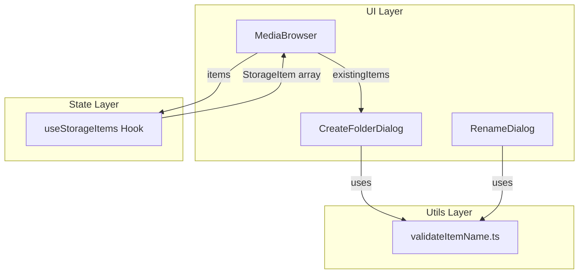

# Design Document

## Overview

**Purpose**: CreateFolderDialog において、既存のフォルダと同じ名前のフォルダを作成しようとした際に、クライアントサイドで重複を検知しエラー表示する機能を提供する。

**Users**: S3 Photo Browser を利用するユーザーが、フォルダ作成時に不要な API 呼び出しを行うことなく、即座にエラーフィードバックを受け取れるようになる。

**Impact**: バリデーションロジックをリファクタリングし、共通ロジックを `validateItemName.ts` に抽出。用途別関数は各コンポーネントに配置。

### Goals

- 同名フォルダの重複をクライアントサイドで検知
- 不要な S3 API 呼び出しの防止
- バリデーションロジックの共通化による一貫性の確保

### Non-Goals

- サーバーサイドでの重複チェック
- 大文字・小文字を無視した重複チェック（S3 はケースセンシティブ）
- ファイル名との重複チェック（S3 ではフォルダとファイルは別のオブジェクトタイプ）

## Architecture

### Existing Architecture Analysis

現在の構成:

- `validateRename.ts` が以下のバリデーションを実装:
  1. 空文字チェック
  2. 無効文字チェック（スラッシュ）
  3. 長さ制限（100文字）
  4. 同一名チェック（リネーム専用）
  5. 重複チェック
- CreateFolderDialog は独自の `validateFolderName` 関数を持つが、重複チェックは未実装

**問題点**: `validateRename` をそのまま使えない理由

- `item` パラメータが必須だが、新規作成時には対象アイテムが存在しない
- 同一名チェック（`normalizedName === item.name`）は新規作成では不要
- 重複チェックで `existing.key !== item.key` で自分自身を除外するが、新規作成では除外対象がない

### Architecture Pattern & Boundary Map



**Architecture Integration**:

- **Selected pattern**: 共通ロジック抽出 + コンポーネント内用途別関数
- **Domain/feature boundaries**:
  - `validateItemName`: 基本バリデーション（空文字、スラッシュ、長さ）
  - `validateNewFolderName`: CreateFolderDialog 内でフォルダ作成専用ロジック
  - `validateRename`: RenameDialog 内でリネーム専用ロジック
- **Existing patterns preserved**: Mantine TextInput のエラー表示パターン
- **Steering compliance**: 共通ロジックを utils に配置し、再利用性を確保

### Technology Stack

| Layer    | Choice / Version   | Role in Feature   | Notes            |
| -------- | ------------------ | ----------------- | ---------------- |
| Frontend | React 19 + Mantine | UI コンポーネント | 既存技術スタック |

## Requirements Traceability

| Requirement | Summary                    | Components                           | Interfaces            | Flows      |
| ----------- | -------------------------- | ------------------------------------ | --------------------- | ---------- |
| 1.1         | リアルタイム重複検証       | CreateFolderDialog, validateItemName | validateNewFolderName | 入力変更時 |
| 1.2         | エラーメッセージ表示       | CreateFolderDialog                   | TextInput.error       | -          |
| 1.3         | 作成ボタン無効化           | CreateFolderDialog                   | Button.disabled       | -          |
| 1.4         | エラー解消時の有効化       | CreateFolderDialog                   | -                     | -          |
| 2.1         | サーバーリクエスト不要     | CreateFolderDialog                   | -                     | -          |
| 2.2         | キャッシュ済みデータ使用   | MediaBrowser                         | useStorageItems       | -          |
| 2.3         | 大文字・小文字区別         | validateItemName                     | -                     | -          |
| 3.1         | 既存パターンとの一貫性     | CreateFolderDialog, validateItemName | TextInput.error       | -          |
| 3.2         | 統合フォームバリデーション | CreateFolderDialog                   | validateNewFolderName | -          |

## Components and Interfaces

| Component          | Domain/Layer | Intent                     | Req Coverage          | Key Dependencies                         | Contracts |
| ------------------ | ------------ | -------------------------- | --------------------- | ---------------------------------------- | --------- |
| validateItemName   | Utils        | 共通バリデーションロジック | 1.1, 2.3, 3.1         | -                                        | Service   |
| CreateFolderDialog | UI           | フォルダ作成ダイアログ     | 1.1-1.4, 2.1, 3.1-3.2 | validateItemName (P0), MediaBrowser (P0) | State     |
| RenameDialog       | UI           | リネームダイアログ         | -                     | validateItemName (P0)                    | State     |
| MediaBrowser       | UI           | メディア一覧表示           | 2.2                   | useStorageItems (P0)                     | -         |

### Utils Layer

#### validateItemName

| Field        | Detail                                                           |
| ------------ | ---------------------------------------------------------------- |
| Intent       | アイテム名の基本バリデーション（空文字、スラッシュ、長さ）を提供 |
| Requirements | 1.1, 2.3, 3.1                                                    |

**Responsibilities & Constraints**

- 空文字チェック
- 無効文字チェック（スラッシュ）
- 長さ制限（100文字）
- 正規化された名前（トリム済み）の返却

**Dependencies**

- External: なし

**Contracts**: Service [x]

##### Service Interface

```typescript
export interface ValidationResult {
  /** バリデーション成功フラグ */
  valid: boolean;
  /** エラーメッセージ（失敗時） */
  error?: string;
  /** 正規化された名前（成功時、トリム済み） */
  normalizedName?: string;
}

/**
 * アイテム名の基本バリデーションを行う
 *
 * バリデーションルール（優先度順）:
 * 1. 空文字チェック
 * 2. 無効文字チェック（スラッシュ）
 * 3. 長さ制限（100文字）
 */
export function validateItemName(name: string): ValidationResult;
```

- Preconditions: name は文字列
- Postconditions: ValidationResult を返す
- Invariants: バリデーションルールの順序は固定

**Implementation Notes**

- Integration: validateRename.ts から抽出してリネーム
- Validation: 既存のルール 1-3 をそのまま移植
- Risks: 既存テストの移動が必要

### UI Layer

#### CreateFolderDialog

| Field        | Detail                                                   |
| ------------ | -------------------------------------------------------- |
| Intent       | フォルダ作成ダイアログで同名フォルダの重複チェックを行う |
| Requirements | 1.1, 1.2, 1.3, 1.4, 2.1, 3.1, 3.2                        |

**Responsibilities & Constraints**

- フォルダ名のバリデーション（基本 + 重複チェック）
- エラーメッセージの表示
- 作成ボタンの有効/無効制御

**Dependencies**

- Inbound: MediaBrowser — existingItems の提供 (P0)
- External: validateItemName — 基本バリデーション (P0)
- External: Mantine — UI コンポーネント (P0)

**Contracts**: State [x]

##### State Management

```typescript
import type { StorageItem } from "../../types/storage";

interface CreateFolderDialogProps {
  isOpen: boolean;
  onClose: () => void;
  onCreate: (name: string) => Promise<void>;
  /** 現在のディレクトリに存在するアイテムの配列 */
  existingItems: StorageItem[];
}

/**
 * フォルダ作成時のバリデーション（コンポーネント内関数）
 *
 * バリデーションルール:
 * 1. 基本バリデーション（validateItemName）
 * 2. 重複チェック（フォルダのみ）
 */
function validateNewFolderName(name: string, existingItems: StorageItem[]): string | null;
```

- State model: `folderName`, `isCreating`, `error` の既存状態を維持
- Persistence & consistency: ダイアログ内ローカル状態のみ
- Concurrency strategy: 該当なし

**Implementation Notes**

- Integration: MediaBrowser から `existingItems` を props 経由で受け取る
- Validation:
  1. `validateItemName` で基本チェック
  2. `existingItems.filter(i => i.type === 'folder').some(f => f.name === normalizedName)` で重複チェック
- Risks: 既存テストの更新が必要

#### RenameDialog

| Field        | Detail                                               |
| ------------ | ---------------------------------------------------- |
| Intent       | リネームダイアログでアイテム名のバリデーションを行う |
| Requirements | -                                                    |

**Responsibilities & Constraints**

- アイテム名のバリデーション（基本 + 同一名 + 重複チェック）

**Dependencies**

- External: validateItemName — 基本バリデーション (P0)

**Contracts**: State [x]

##### State Management

```typescript
import type { StorageItem } from "../../types/storage";
import { validateItemName } from "../../utils/validateItemName";

/**
 * リネーム時のバリデーション（コンポーネント内関数）
 *
 * バリデーションルール:
 * 1. 基本バリデーション（validateItemName）
 * 2. 同一名チェック
 * 3. 重複チェック（同タイプのみ）
 */
function validateRename(
  newName: string,
  item: StorageItem,
  existingItems: StorageItem[],
): string | null;
```

**Implementation Notes**

- Integration: 既存の validateRename ロジックをコンポーネント内に移動
- Validation: validateItemName を呼び出し、追加で同一名・重複チェック
- Risks: validateRename.ts の削除に伴うインポートパスの変更

## File Changes

### 新規作成

なし

### 変更

| ファイル                                                  | 変更内容                                                 |
| --------------------------------------------------------- | -------------------------------------------------------- |
| `src/utils/validateRename.ts`                             | `validateItemName.ts` にリネーム、共通ロジックのみ残す   |
| `src/utils/validateRename.test.ts`                        | `validateItemName.test.ts` にリネーム                    |
| `src/components/MediaBrowser/CreateFolderDialog.tsx`      | `existingItems` props 追加、`validateNewFolderName` 実装 |
| `src/components/MediaBrowser/CreateFolderDialog.test.tsx` | 重複チェックのテスト追加                                 |
| `src/components/MediaBrowser/RenameDialog.tsx`            | `validateRename` 関数をコンポーネント内に移動            |

### 削除

なし（リネームのみ）

## Error Handling

### Error Strategy

バリデーションエラーは即座にユーザーに表示し、フォーム送信を阻止する。

### Error Categories and Responses

**User Errors (Validation)**:

- 空文字 → 「名前を入力してください」（共通）
- スラッシュ含有 → 「名前にスラッシュは使用できません」（共通）
- 長さ超過 → 「名前は100文字以内にしてください」（共通）
- 重複 → 「同じ名前のフォルダが既に存在します」（CreateFolderDialog）
- 同一名 → 「名前が変更されていません」（RenameDialog）

## Testing Strategy

### Unit Tests

- `validateItemName` が空文字でエラーを返す
- `validateItemName` がスラッシュ含有でエラーを返す
- `validateItemName` が100文字超過でエラーを返す
- `validateItemName` が有効な名前で成功を返す
- `validateNewFolderName` が重複フォルダ名を検出してエラーを返す
- `validateNewFolderName` がファイル名との重複を許可する
- `validateNewFolderName` が大文字・小文字を区別する

### Integration Tests

- CreateFolderDialog が重複時にエラーメッセージを表示する
- CreateFolderDialog が重複時に作成ボタンを無効化する
- CreateFolderDialog が重複解消時にエラーを非表示にする
- RenameDialog が既存のバリデーションロジックを維持する
