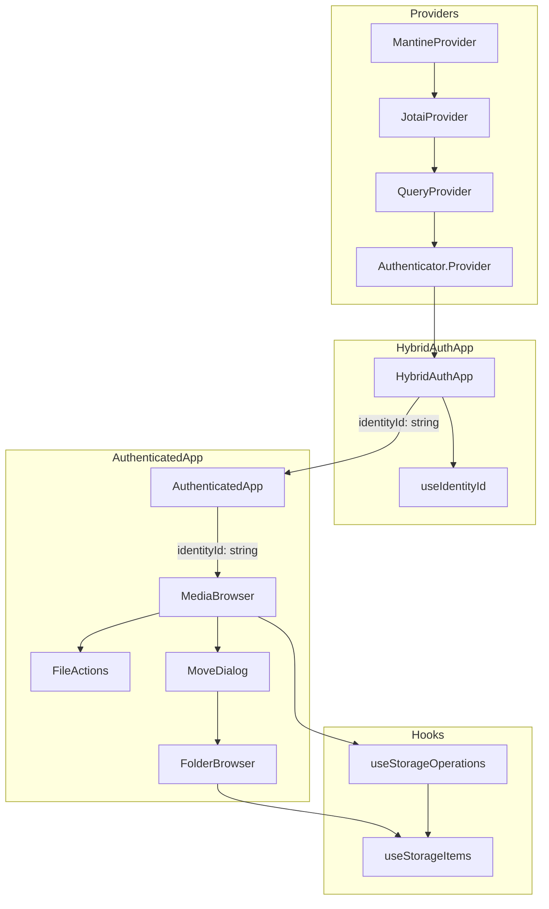
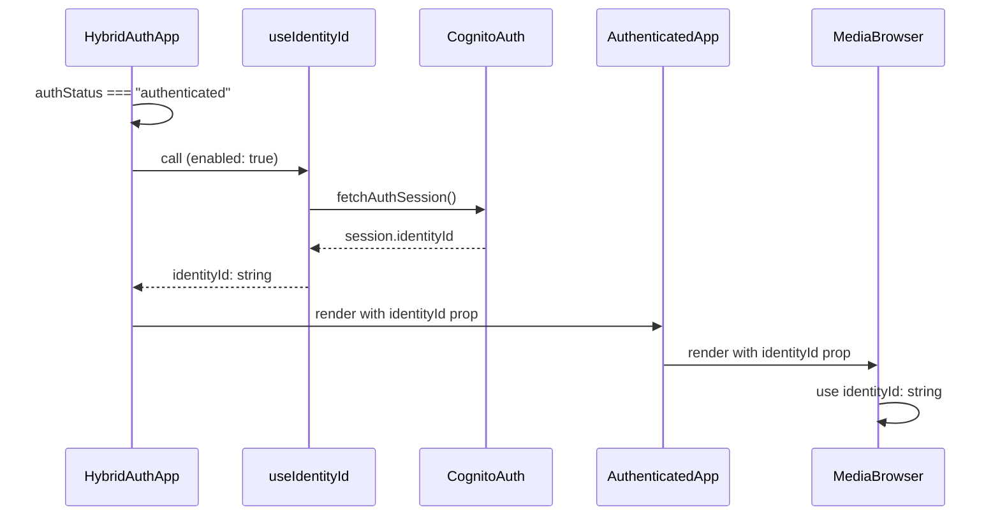

# Design Document

## Overview

**Purpose**: 本機能は、認証済みコンポーネント内で `identityId` が常に `string` 型として存在することを型レベルで保証し、開発者が null チェックのボイラープレートを排除できるようにする。

**Users**: 開発者は、認証済みコンポーネント内で Props 経由で `identityId: string` を受け取り、常に有効な値として使用できる。

**Impact**: `HybridAuthApp` で identityId を取得し、Props drilling で下位コンポーネントに伝播。関連するフック・コンポーネント・ユーティリティの型定義から `null` を除去する。

### Goals

- 認証済みコンポーネント内で `identityId: string`（非 null）を型安全に提供
- 既存の TanStack Query キャッシュ戦略を維持
- 約 10 ファイルの型変更と null チェック除去
- シンプルな Props drilling による実装（追加の抽象化なし）

### Non-Goals

- 認証フロー自体の変更（Authenticator, PasskeySignIn の変更は対象外）
- 認証状態管理の変更（authStatus の管理は既存のまま）
- React Context の新規導入（オーバーエンジニアリング回避）
- テストカバレッジの拡大（既存テストの型修正のみ）

## Architecture

> 詳細な調査結果は `research.md` を参照

### Existing Architecture Analysis

現在のアーキテクチャ:

- `App.tsx`: `MantineProvider` → `JotaiProvider` → `QueryProvider` → `Authenticator.Provider` → `HybridAuthApp`
- `HybridAuthApp`: 認証状態を判定し、認証済みなら `AuthenticatedApp` をレンダリング
- `MediaBrowser`: `useIdentityId()` で `identityId: string | null` を取得し、各コンポーネントに Props で伝播
- 各コンポーネント/フック: `identityId: string | null` を受け取り、`if (!identityId)` ガードを実装

### Architecture Pattern & Boundary Map



**Architecture Integration**:

- **Selected pattern**: Props Drilling — シンプルで追加の抽象化不要
- **Domain/feature boundaries**: 認証（identity）ドメインで `useIdentityId` を `HybridAuthApp` 専用に
- **Existing patterns preserved**: TanStack Query によるサーバー状態管理、既存の Provider 階層
- **New components rationale**: 新規コンポーネントなし、既存コンポーネントの型変更のみ
- **Steering compliance**: Two-Tier State Management（サーバー状態は TanStack Query）を維持

### Technology Stack

| Layer    | Choice / Version          | Role in Feature                | Notes                      |
| -------- | ------------------------- | ------------------------------ | -------------------------- |
| Frontend | React 19 + TypeScript 5.x | Props drilling, 型安全な Props | strict mode                |
| State    | TanStack Query            | identityId クエリキャッシュ    | 既存のキャッシュ戦略を維持 |

## System Flows

### 認証済みコンテキストの初期化フロー



**Key Decisions**:

- `HybridAuthApp` が認証状態を判定し、認証済みの場合のみ `useIdentityId` を有効化
- `enabled: isAuthenticated` オプションにより、認証前は Query が実行されない
- identityId 取得完了後に `AuthenticatedApp` をレンダリング

## Requirements Traceability

| Requirement | Summary                                          | Components                                           | Interfaces                | Flows        |
| ----------- | ------------------------------------------------ | ---------------------------------------------------- | ------------------------- | ------------ |
| 1.1         | 認証成功後に identityId 取得してからレンダリング | HybridAuthApp                                        | -                         | 初期化フロー |
| 1.2         | 取得中はローディング表示                         | HybridAuthApp                                        | -                         | 初期化フロー |
| 1.3         | 取得失敗時はエラー表示 + 再試行/サインアウト     | HybridAuthApp                                        | -                         | 初期化フロー |
| 1.4         | identityId を string 型として提供                | HybridAuthApp, AuthenticatedApp                      | Props                     | -            |
| 2.1         | 認証済みコンポーネント内で string 型を提供       | Props drilling                                       | -                         | -            |
| 2.2         | ~~コンテキスト外でエラーをスロー~~               | N/A（Props 方式のため不要）                          | -                         | -            |
| 2.3         | 既存キャッシュ戦略維持                           | useIdentityId                                        | QueryReturn               | -            |
| 3.1         | ストレージフックの型変更                         | useStorageOperations, useStorageItems                | UseStorageOperationsProps | -            |
| 3.2         | コンポーネントの型変更                           | MediaBrowser, FileActions, MoveDialog, FolderBrowser | Props interfaces          | -            |
| 3.3         | ユーティリティ/型定義の確認                      | -                                                    | -                         | -            |
| 3.4         | テストファイルの修正                             | TestProvider                                         | -                         | -            |

## Components and Interfaces

| Component            | Domain/Layer | Intent                                               | Req Coverage       | Key Dependencies          | Contracts |
| -------------------- | ------------ | ---------------------------------------------------- | ------------------ | ------------------------- | --------- |
| useIdentityId        | Identity     | TanStack Query で identityId を取得                  | 2.3                | fetchAuthSession (P0)     | Hook      |
| HybridAuthApp        | App          | 認証判定 + identityId 取得 + ローディング/エラー処理 | 1.1, 1.2, 1.3, 1.4 | useIdentityId (P0)        | Component |
| AuthenticatedApp     | App          | 認証済みアプリケーションコンテナ                     | 1.4                | -                         | Component |
| useStorageOperations | Storage      | ストレージ操作ファサード                             | 3.1                | useStorageItems (P0)      | Hook      |
| useStorageItems      | Storage      | ストレージアイテム取得                               | 3.1                | queryKeys (P1)            | Hook      |
| MediaBrowser         | UI           | メインブラウザコンポーネント                         | 3.2                | useStorageOperations (P0) | Component |
| FileActions          | UI           | ファイル操作 UI                                      | 3.2                | -                         | Component |
| MoveDialog           | UI           | 移動ダイアログ                                       | 3.2                | FolderBrowser (P1)        | Component |
| FolderBrowser        | UI           | フォルダ一覧表示                                     | 3.2                | useStorageItems (P0)      | Component |

### Identity Domain

#### useIdentityId

| Field        | Detail                                                             |
| ------------ | ------------------------------------------------------------------ |
| Intent       | TanStack Query を使用して Cognito から identityId を取得するフック |
| Requirements | 2.3                                                                |

**Responsibilities & Constraints**

- キャッシュ戦略: `staleTime: Infinity`, `gcTime: Infinity`, `retry: false`
- `enabled` オプションをサポート（認証状態に応じた制御）

**Dependencies**

- Inbound: HybridAuthApp — identityId 取得 (P0)
- External: fetchAuthSession (aws-amplify/auth) — Cognito セッション取得 (P0)

**変更内容**: `enabled` オプションを追加

**Contracts**: Hook [x]

##### Service Interface

```typescript
interface UseIdentityIdOptions {
  enabled?: boolean;
}

interface UseIdentityIdReturn {
  identityId: string | null;
  isLoading: boolean;
  isError: boolean;
  error: Error | null;
  refetch: () => void;
}

function useIdentityId(options?: UseIdentityIdOptions): UseIdentityIdReturn;
```

- **Preconditions**: QueryProvider の内側で呼び出される
- **Postconditions**: Cognito セッションの identityId を返す（取得前は null）
- **Invariants**: キャッシュ戦略を維持、`enabled: false` の間は Query 実行されない

### App Domain

#### HybridAuthApp

| Field        | Detail                                                       |
| ------------ | ------------------------------------------------------------ |
| Intent       | 認証状態の判定 + identityId の取得 + ローディング/エラー処理 |
| Requirements | 1.1, 1.2, 1.3, 1.4                                           |

**変更内容**:

- `useIdentityId({ enabled: isAuthenticated })` を呼び出し
- identityId 取得中はローディング UI を表示
- エラー時はエラー UI + 再試行/サインアウトボタンを表示
- 取得完了後に `AuthenticatedApp` に `identityId: string` を Props で渡す

```typescript
// Before
function HybridAuthApp() {
  if (isPasskeyAuthenticated || authStatus === "authenticated") {
    return <AuthenticatedApp onSignOut={handleSignOut} />;
  }
  // ...
}

// After
function HybridAuthApp() {
  const isAuthenticated = isPasskeyAuthenticated || authStatus === "authenticated";
  const { identityId, isLoading, isError, error, refetch } = useIdentityId({
    enabled: isAuthenticated,
  });

  if (isAuthenticated) {
    if (isLoading) {
      return <LoadingUI />;
    }
    if (isError || !identityId) {
      return <ErrorUI error={error} onRetry={refetch} onSignOut={handleSignOut} />;
    }
    return <AuthenticatedApp identityId={identityId} onSignOut={handleSignOut} />;
  }
  // ...
}
```

#### AuthenticatedApp

| Field        | Detail                           |
| ------------ | -------------------------------- |
| Intent       | 認証済みアプリケーションコンテナ |
| Requirements | 1.4                              |

**変更内容**:

- Props に `identityId: string` を追加
- `MediaBrowser` に `identityId` を Props で渡す

```typescript
// Before
interface AuthenticatedAppProps {
  onSignOut: () => void;
}

// After
interface AuthenticatedAppProps {
  identityId: string;
  onSignOut: () => void;
}

function AuthenticatedApp({ identityId, onSignOut }: AuthenticatedAppProps) {
  return (
    <>
      <MediaBrowser identityId={identityId} />
      <PasskeySettingsModal />
    </>
  );
}
```

### Storage Domain

#### useStorageOperations

| Field        | Detail                     |
| ------------ | -------------------------- |
| Intent       | ストレージ操作のファサード |
| Requirements | 3.1                        |

**変更内容**: Props の型を `identityId: string | null` → `identityId: string` に変更

```typescript
// Before
export interface UseStorageOperationsProps {
  identityId: string | null;
  currentPath: string;
}

// After
export interface UseStorageOperationsProps {
  identityId: string;
  currentPath: string;
}
```

**Implementation Notes**

- 内部の `identityId ?? ""` ガードは削除
- `!identityId` チェックは削除

#### useStorageItems

| Field        | Detail                       |
| ------------ | ---------------------------- |
| Intent       | ストレージアイテム一覧の取得 |
| Requirements | 3.1                          |

**変更内容**: パラメータ型を `identityId: string | null` → `identityId: string` に変更

```typescript
// Before
export function useStorageItems(
  identityId: string | null,
  currentPath: string,
): UseStorageItemsReturn;

// After
export function useStorageItems(identityId: string, currentPath: string): UseStorageItemsReturn;
```

**Implementation Notes**

- `enabled: !!identityId` は削除可能（identityId 取得完了待ちのガードだったが、Props drilling により常に string が渡されるため不要に）
- `queryKey: queryKeys.storageItems(identityId ?? "", currentPath)` のフォールバックは削除
- `queryFn` 内の `if (!identityId) return []` ガードも削除

### UI Domain

#### MediaBrowser

| Field        | Detail                       |
| ------------ | ---------------------------- |
| Intent       | メインブラウザコンポーネント |
| Requirements | 3.2                          |

**変更内容**:

- Props に `identityId: string` を追加（`useIdentityId()` 呼び出しを削除）
- `identityLoading`, `identityError` の aggregation を削除
- `identityId` を使用する箇所の型が自動的に `string` に

```typescript
// Before
export function MediaBrowser() {
  const { identityId, loading: identityLoading, isError: identityError } = useIdentityId();
  // ...
}

// After
interface MediaBrowserProps {
  identityId: string;
}

export function MediaBrowser({ identityId }: MediaBrowserProps) {
  // identityId は常に string 型
  // ...
}
```

**Implementation Notes**

- `if (!identityId) return null` ガードは不要に

#### FileActions (Summary only)

**変更内容**: Props の `identityId: string | null` → `identityId: string`

- `if (!identityId) return null` ガードを削除

#### MoveDialog (Summary only)

**変更内容**: Props の `identityId: string | null` → `identityId: string`

#### FolderBrowser (Summary only)

**変更内容**: Props の `identityId: string | null` → `identityId: string`

- `enabled ? identityId : null` ハックを削除し、`identityId` を直接渡す
- `enabled` プロパティを削除（MoveDialog が閉じている時は `if (!isOpen) return null` によりコンポーネント自体がレンダリングされないため、クエリ無効化の制御は不要）
- TanStack Query のキャッシュ共有により、MediaBrowser で取得済みのデータは即座に表示される

## Data Models

### Domain Model

本機能ではデータモデルの変更なし。既存の `StorageItem` 型を維持。

### Data Contracts & Integration

Props による型保証:

```typescript
// HybridAuthApp → AuthenticatedApp
interface AuthenticatedAppProps {
  identityId: string;
  onSignOut: () => void;
}

// AuthenticatedApp → MediaBrowser
interface MediaBrowserProps {
  identityId: string;
}
```

## Error Handling

### Error Strategy

- **identityId 取得エラー**: `HybridAuthApp` でキャッチし、エラー UI を表示
- **Props 未設定**: TypeScript コンパイルエラーで検出（開発時エラー）

### Error Categories and Responses

**User Errors**: なし（認証は Authenticator が担当）

**System Errors**:

- `fetchAuthSession` 失敗 → `HybridAuthApp` でエラー UI 表示、再試行/サインアウト提供

**Business Logic Errors**: なし

### Monitoring

- 既存のエラーログ機構を継続使用

## Testing Strategy

### Unit Tests

- `useIdentityId`: モック fetchAuthSession での成功/エラーケース、enabled オプションの動作
- `HybridAuthApp`: ローディング状態、エラー状態、成功状態のレンダリング

### Integration Tests

- `MediaBrowser` + Props: identityId が正しく伝播されることを確認
- 既存の `MediaBrowser.display.test.tsx` の型修正

### テストプロバイダー修正

Props 方式により、テスト時は直接 `identityId` を渡すだけで良い:

```typescript
// Before: Context モックが必要
<TestProvider identityId="test-id">
  <MediaBrowser />
</TestProvider>

// After: 直接 Props で渡す
<TestProvider>
  <MediaBrowser identityId="test-id" />
</TestProvider>
```
