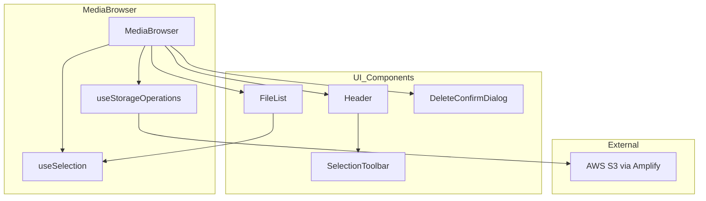
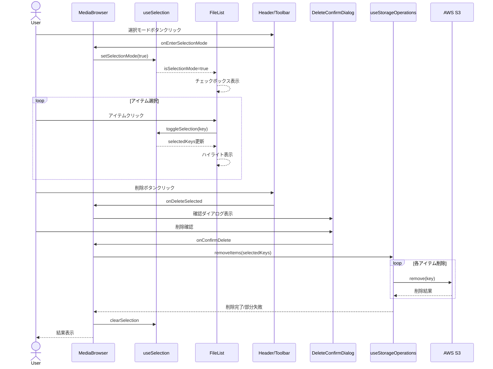
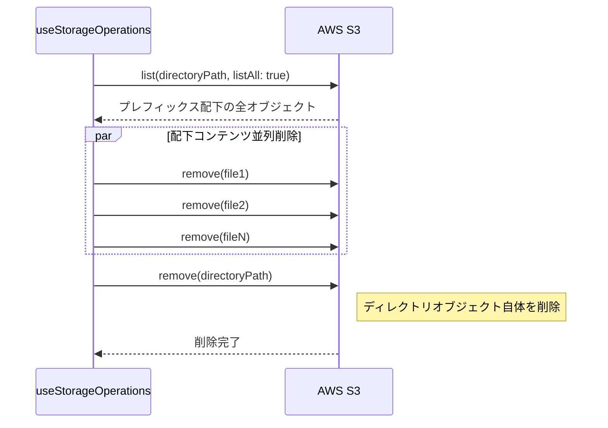

# Design Document: 複数選択・一括削除機能

## Overview

**Purpose**: メディアブラウザにおいて複数のファイル・フォルダを選択し、一括で削除操作を実行する機能を提供する。

**Users**: アプリケーションの全ユーザーがメディア整理のワークフローで使用する。

**Impact**: 既存の FileList、Header、useStorageOperations を拡張し、選択モード機能と一括削除 API を追加する。

### Goals
- ユーザーが複数のファイル・フォルダを効率的に選択できる UI の提供
- 選択したアイテムの一括削除機能の実装
- フォルダ削除時の配下コンテンツ一括削除
- アクセシブルな操作体験の確保

### Non-Goals
- 複数選択によるコピー・移動機能（将来の拡張）
- ドラッグ選択（矩形選択）UI
- 選択状態のセッション永続化

## Architecture

### Existing Architecture Analysis

現在の MediaBrowser アーキテクチャ:
- **MediaBrowser**: メインコンポーネント、状態管理の中心
- **FileList**: アイテム一覧表示、クリックイベント発火
- **Header**: ナビゲーション、サインアウト
- **useStorageOperations**: S3 操作（list, remove, upload, createFolder）

拡張ポイント:
- MediaBrowser: 選択モード状態管理の追加
- FileList: チェックボックス UI、選択状態表示
- Header: 選択モードツールバー
- useStorageOperations: 複数削除、フォルダ一括削除 API

### Architecture Pattern & Boundary Map



**Architecture Integration**:
- **Selected pattern**: 既存のフック分離パターンを踏襲（Hook Abstraction）
- **Domain boundaries**: 選択状態管理は useSelection フック、削除操作は useStorageOperations に集約
- **Existing patterns preserved**: カスタムフック分離、コンポーネント単位 CSS、Co-location テスト
- **New components rationale**: useSelection（選択ロジック分離）、SelectionToolbar（選択モード UI）
- **Steering compliance**: TypeScript strict mode、`any` 禁止、テスト併設

### Technology Stack

| Layer | Choice / Version | Role in Feature | Notes |
|-------|------------------|-----------------|-------|
| Frontend | React 19 | 選択状態管理、UI レンダリング | 既存 |
| State | React useState + useCallback | 選択状態、選択モード管理 | 新規フック追加 |
| Storage API | aws-amplify/storage (remove, list) | S3 削除・リスト操作 | 既存利用 |
| Testing | Vitest + Testing Library | フック・コンポーネントテスト | 既存 |

## System Flows

### 選択モード有効化〜一括削除フロー



### ディレクトリ削除フロー



**Note**: S3 では `/` で終わるオブジェクトがディレクトリマーカーとして機能する。ディレクトリ削除時は、配下コンテンツの削除後にディレクトリオブジェクト自体（`path/to/dir/`）も削除が必要。

## Requirements Traceability

| Requirement | Summary | Components | Interfaces | Flows |
|-------------|---------|------------|------------|-------|
| 1.1, 1.2, 1.3, 1.4 | 選択モード有効化・無効化 | MediaBrowser, Header, FileList, useSelection | SelectionState, HeaderProps | 選択モード有効化フロー |
| 2.1, 2.2, 2.3, 2.4 | アイテムの個別選択 | FileList, useSelection | SelectionActions, FileListProps | 選択トグル処理 |
| 3.1, 3.2, 3.3, 3.4 | 一括選択操作 | Header, useSelection | SelectionActions | 全選択/解除処理 |
| 4.1, 4.2, 4.3, 4.4, 4.5, 4.6 | 複数アイテム一括削除 | MediaBrowser, DeleteConfirmDialog, useStorageOperations | removeItems, DeleteProgress | 一括削除フロー |
| 5.1, 5.2, 5.3 | フォルダ一括削除 | useStorageOperations, DeleteConfirmDialog | removeItems | フォルダ削除フロー |
| 6.1, 6.2, 6.3, 6.4 | 視覚的フィードバック | Header, FileList | SelectionToolbarProps, FileListProps | UI 状態変更 |
| 7.1, 7.2, 7.3, 7.4 | アクセシビリティ | FileList, DeleteConfirmDialog | aria 属性 | — |

## Components and Interfaces

### Summary

| Component | Domain/Layer | Intent | Req Coverage | Key Dependencies | Contracts |
|-----------|--------------|--------|--------------|------------------|-----------|
| useSelection | Hooks | 選択状態とモード管理 | 1.1-1.4, 2.1-2.4, 3.1-3.4 | — | State |
| useStorageOperations (拡張) | Hooks | 複数削除・フォルダ一括削除 API | 4.3, 5.2, 5.3 | aws-amplify/storage (P0) | Service |
| MediaBrowser (拡張) | Components | 選択モード統合 | 1.1, 1.3, 4.1-4.6 | useSelection (P0), useStorageOperations (P0) | — |
| Header (拡張) | Components | 選択モードツールバー | 1.1, 1.3, 3.1, 6.1, 6.2 | — | — |
| FileList (拡張) | Components | チェックボックス・ハイライト | 1.2, 1.4, 2.1-2.4, 6.3, 7.1, 7.2 | — | — |
| DeleteConfirmDialog (拡張) | Components | 複数削除確認 UI | 4.2, 5.1, 7.4 | — | — |

### Hooks Layer

#### useSelection

| Field | Detail |
|-------|--------|
| Intent | 選択モードと選択アイテムの状態管理 |
| Requirements | 1.1, 1.2, 1.3, 1.4, 2.1, 2.2, 2.3, 2.4, 3.1, 3.2, 3.3, 3.4 |

**Responsibilities & Constraints**
- 選択モード（有効/無効）の状態管理
- 選択アイテムキーの Set 管理
- 選択操作（トグル、全選択、クリア）の提供
- 選択モード終了時に自動クリア

**Dependencies**
- Inbound: MediaBrowser — 状態参照・操作呼び出し (P0)
- Outbound: なし

**Contracts**: State [x]

##### State Management

```typescript
interface UseSelectionProps {
  /** 選択可能なアイテムのキー一覧 */
  itemKeys: string[];
}

interface UseSelectionReturn {
  /** 選択モードが有効か */
  isSelectionMode: boolean;
  /** 選択中のアイテムキー */
  selectedKeys: ReadonlySet<string>;
  /** 選択件数 */
  selectedCount: number;
  /** 全アイテムが選択されているか */
  isAllSelected: boolean;
  /** 選択モード開始 */
  enterSelectionMode: () => void;
  /** 選択モード終了（選択クリア） */
  exitSelectionMode: () => void;
  /** アイテム選択トグル */
  toggleSelection: (key: string) => void;
  /** 全選択/全解除トグル */
  toggleSelectAll: () => void;
  /** 選択クリア */
  clearSelection: () => void;
}
```

- State model: `isSelectionMode: boolean`, `selectedKeys: Set<string>`
- Persistence: なし（メモリ内のみ）
- Concurrency: React の状態更新で自動制御

**Implementation Notes**
- `Set<string>` による O(1) 選択チェック
- `itemKeys` 変更時に存在しないキーを自動削除
- 選択モード終了時は `clearSelection` を自動呼び出し

---

#### useStorageOperations (拡張)

| Field | Detail |
|-------|--------|
| Intent | 複数アイテム削除とフォルダ一括削除の追加 |
| Requirements | 4.3, 5.2, 5.3 |

**Responsibilities & Constraints**
- 既存の単一削除機能は維持
- 複数アイテムの並列削除処理
- フォルダの配下コンテンツ一括削除（list + 並列 remove）
- 部分失敗時のエラー情報提供

**Dependencies**
- Inbound: MediaBrowser — 削除操作呼び出し (P0)
- External: aws-amplify/storage — remove, list (P0)

**Contracts**: Service [x]

##### Service Interface

```typescript
interface DeleteResult {
  /** 削除に成功したキー */
  succeeded: string[];
  /** 削除に失敗したキーとエラー */
  failed: Array<{ key: string; error: Error }>;
}

interface UseStorageOperationsReturn {
  // ... 既存の戻り値 ...

  /**
   * 複数アイテムを削除する
   * フォルダが含まれる場合は list で配下コンテンツを取得し一括削除
   */
  removeItems: (items: StorageItem[]) => Promise<DeleteResult>;

  /** 削除処理中フラグ */
  isDeleting: boolean;
}
```

- Preconditions: `items` は空でない、各アイテムの `key` が有効
- Postconditions: 成功分は S3 から削除済み、`DeleteResult` に結果格納
- Invariants: 削除中は `isDeleting = true`

**Implementation Notes**
- `Promise.allSettled` で部分失敗許容
- フォルダ削除時: `list({ listAll: true })` で全キー取得 → `Promise.all` で並列 `remove`
- 削除後は自動 `refresh` で一覧更新

---

### Components Layer

#### MediaBrowser (拡張)

| Field | Detail |
|-------|--------|
| Intent | 選択モード状態の統合と削除フロー制御 |
| Requirements | 1.1, 1.3, 4.1, 4.2, 4.4, 4.5, 4.6 |

**Responsibilities & Constraints**
- useSelection フック統合
- 選択モード切り替えハンドラ
- 削除確認ダイアログ表示制御
- 削除処理の実行と結果ハンドリング

**Dependencies**
- Inbound: App — ルートコンポーネント
- Outbound: useSelection, useStorageOperations, Header, FileList, DeleteConfirmDialog

**Contracts**: なし（UI 統合のみ）

**Implementation Notes**
- 選択モード中は `onFileClick`/`onFolderClick` の動作を選択トグルに変更
- 削除処理中は UI をブロック（ローディング表示）
- 部分失敗時はエラーメッセージ表示

---

#### Header (拡張)

| Field | Detail |
|-------|--------|
| Intent | 選択モードツールバー表示 |
| Requirements | 1.1, 1.3, 3.1, 6.1, 6.2 |

**Props 拡張**:

```typescript
interface HeaderProps {
  // ... 既存 props ...

  /** 選択モードが有効か */
  isSelectionMode?: boolean;
  /** 選択件数 */
  selectedCount?: number;
  /** 全選択状態か */
  isAllSelected?: boolean;
  /** 選択モード開始 */
  onEnterSelectionMode?: () => void;
  /** 選択モード終了 */
  onExitSelectionMode?: () => void;
  /** 全選択/解除トグル */
  onToggleSelectAll?: () => void;
  /** 削除ボタン押下 */
  onDeleteSelected?: () => void;
}
```

**Implementation Notes**
- 通常モード: 既存 UI + 選択モードボタン追加
- 選択モード: 「キャンセル」「N件選択中」「全選択」「削除」ボタン表示
- 削除ボタンは `selectedCount > 0` のときのみ有効

---

#### FileList (拡張)

| Field | Detail |
|-------|--------|
| Intent | チェックボックス UI と選択状態ハイライト |
| Requirements | 1.2, 1.4, 2.1, 2.2, 2.3, 2.4, 6.3, 7.1, 7.2 |

**Props 拡張**:

```typescript
interface FileListProps {
  // ... 既存 props ...

  /** 選択モードが有効か */
  isSelectionMode?: boolean;
  /** 選択中のキー */
  selectedKeys?: ReadonlySet<string>;
  /** 選択トグル */
  onToggleSelection?: (key: string) => void;
}
```

**Implementation Notes**
- 選択モード時: 各アイテム左側にチェックボックス表示
- 選択アイテムに `.file-list-item--selected` クラス適用（背景色変更）
- チェックボックスに `aria-label="{item.name} を選択"` 設定
- キーボード操作: Space/Enter でトグル

---

#### DeleteConfirmDialog (拡張)

| Field | Detail |
|-------|--------|
| Intent | 複数削除確認 UI |
| Requirements | 4.2, 5.1, 7.4 |

**Props 拡張**:

```typescript
interface DeleteConfirmDialogProps {
  /** 削除対象アイテム（複数対応） */
  items: StorageItem[];
  /** ダイアログを閉じる */
  onClose: () => void;
  /** 削除実行 */
  onConfirm: () => Promise<void>;
  /** 削除処理中 */
  isDeleting?: boolean;
}
```

**Implementation Notes**
- 単一/複数で表示文言を切り替え
- フォルダ含む場合は「フォルダ内のすべてのファイルも削除されます」警告
- 削除中はボタン無効化 + 「削除中...」表示
- フォーカストラップ: ダイアログ内でフォーカスループ

## Data Models

### Domain Model

選択状態はメモリ内のみで管理し、永続化しない。

```typescript
/** 選択状態 */
interface SelectionState {
  isSelectionMode: boolean;
  selectedKeys: Set<string>;
}

/** 削除結果 */
interface DeleteResult {
  succeeded: string[];
  failed: Array<{ key: string; error: Error }>;
}
```

### Data Contracts

**削除 API レスポンス（内部用）**:
- `DeleteResult` オブジェクトで成功/失敗を分離
- UI は `failed.length > 0` でエラーメッセージ表示判定

## Error Handling

### Error Strategy

- **部分失敗許容**: 複数削除で一部失敗しても成功分は反映
- **ユーザー通知**: 失敗アイテム数とリトライ推奨メッセージ表示
- **自動リフレッシュ**: 削除後は常にリスト更新で最新状態表示

### Error Categories and Responses

| カテゴリ | 対応 |
|---------|------|
| ネットワークエラー | 「接続エラー。再試行してください」表示 |
| 権限エラー | 「削除権限がありません」表示 |
| 部分失敗 | 「N件中M件の削除に失敗しました」表示 |
| フォルダ内コンテンツ取得失敗 | 該当フォルダを失敗扱いとし継続 |

## Testing Strategy

### Unit Tests
- `useSelection`: 選択トグル、全選択、モード切替、自動クリア
- `useStorageOperations.removeItems`: 単一/複数削除、フォルダ一括削除、部分失敗
- `parseStorageItems`: フォルダ判定ロジック（既存）

### Integration Tests
- 選択モード開始 → アイテム選択 → 削除確認 → 削除実行フロー
- フォルダ含む選択削除フロー
- 部分失敗時のエラー表示フロー

### E2E/UI Tests
- 選択モードボタンクリック → チェックボックス表示確認
- 複数選択 → 削除 → リスト更新確認
- キーボード操作での選択トグル

### Accessibility Tests
- チェックボックスの aria-label 検証
- 選択件数の aria-live 通知検証
- 削除ダイアログのフォーカストラップ検証
