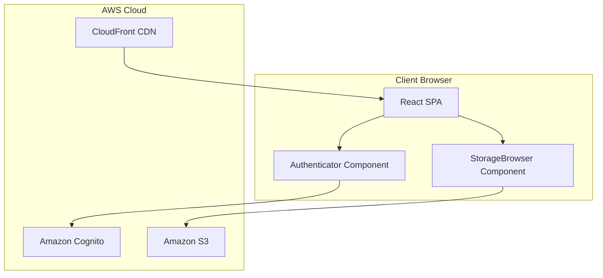
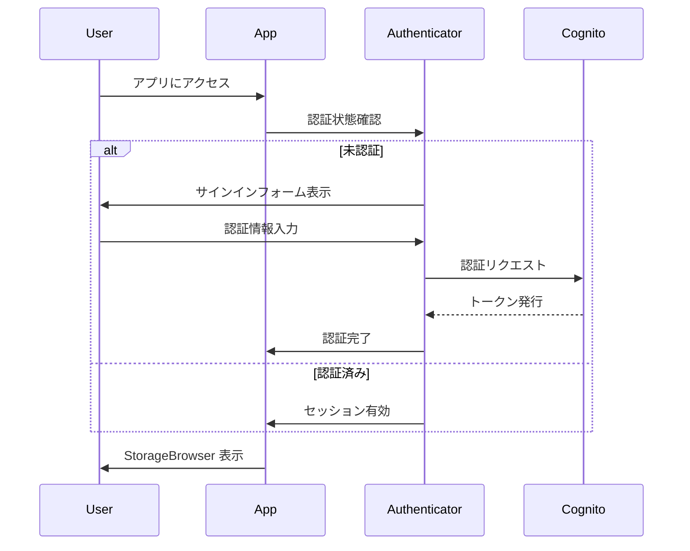
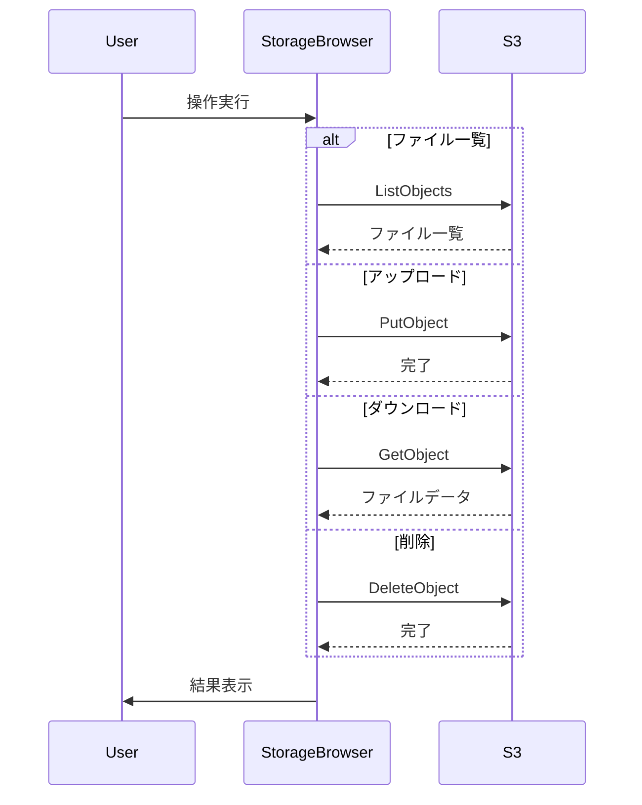

# Design Document: S3 Media Browser

## Overview

**Purpose**: 本機能は、個人ユーザー向けに S3 バケット内のメディアファイルを安全にブラウジング・アップロード・管理する Web アプリケーションを提供する。

**Users**: 個人ユーザーが自身のメディアファイル（画像・動画）をクラウドに保存し、任意のデバイスからアクセスするワークフローで利用する。

**Impact**: Amplify Gen2 と Cognito 認証を組み合わせた SPA として新規構築。**Amplify が提供するコンポーネントを最大限活用し、自前実装を最小化する。**

### Design Principles

> **重要**: Amplify で用意されているコンポーネント・機能は最大限それを利用する。自前実装は行わない。

- `Authenticator` コンポーネントで認証 UI を提供
- `StorageBrowser` コンポーネントでファイルブラウザ UI を提供
- バックエンドは Amplify Gen2 のマネージドサービス（Cognito, S3）のみ使用
- カスタムコードは設定とコンポーネント統合のみに限定

### Goals
- Cognito 認証による安全なアクセス制御
- **セルフサインアップ無効化**（管理者のみがユーザーを作成）
- **ユーザー分離ストレージ**（各ユーザーは自分のファイルのみアクセス可能）
- **StorageBrowser コンポーネント**による S3 ファイル操作（一覧、アップロード、ダウンロード、削除）
- レスポンシブで直感的な UI（Amplify UI テーマ適用）

### Non-Goals（Phase 1）
- ファイルプレビュー機能（Phase 2 で対応予定）
- ファイル共有機能
- ファイル検索機能
- オフラインサポート
- ファイル編集機能
- カスタム UI コンポーネント開発
- StorageBrowser の UI カスタマイズ（パンくずリスト、タイトル等）

## Architecture

### Architecture Pattern & Boundary Map



**Architecture Integration**:
- **Selected pattern**: Amplify UI Component-First Architecture
- **Core principle**: **Amplify 提供コンポーネントの最大活用、自前実装の最小化**
- **Domain boundaries**: 認証（Authenticator）、ファイル操作（StorageBrowser）の 2 コンポーネントに集約
- **New components rationale**: 自前コンポーネントは作成しない。設定ファイルと統合コードのみ
- **Steering compliance**: マネージドサービス優先、コード量最小化

### Technology Stack

| Layer | Choice / Version | Role in Feature | Notes |
|-------|------------------|-----------------|-------|
| Frontend | React 18 + TypeScript | SPA フレームワーク | Vite でビルド |
| Auth UI | @aws-amplify/ui-react (Authenticator) | 認証 UI | **Amplify 提供** |
| Storage UI | @aws-amplify/ui-react-storage (StorageBrowser) | ファイルブラウザ UI | **Amplify 提供** |
| Backend | Amplify Gen2 | バックエンド基盤 | defineAuth, defineStorage |
| Auth | Amazon Cognito | ユーザー認証 | Email ベースサインイン |
| Storage | Amazon S3 | ファイルストレージ | StorageBrowser 経由 |
| Hosting | Amplify Hosting | 静的ホスティング | CloudFront CDN 配信 |

## System Flows

### 認証フロー



### ファイル操作フロー（StorageBrowser 内部）



## Requirements Traceability

| Requirement | Summary | Components | Notes |
|-------------|---------|------------|-------|
| 1.1 | サインイン実行 | Authenticator | Amplify 提供 |
| 1.2 | サインアウト | Authenticator + カスタムボタン | ヘッダーにサインアウトボタン配置 |
| 1.3 | 未認証時ブロック | Authenticator | Amplify 提供 |
| 1.4 | セッション維持 | Authenticator | Amplify 提供 |
| 1.5 | 認証エラー表示 | Authenticator | Amplify 提供 |
| 1.6 | 認証 UI 提供 | Authenticator | Amplify 提供 |
| 1.7 | セルフサインアップ無効化 | cfnUserPool 設定 | バックエンドで制御 |
| 1.8 | サインアップフォーム非表示 | Authenticator (hideSignUp) | フロントエンドで制御 |
| 2.1 | ルート一覧表示 | StorageBrowser | Amplify 提供 |
| 2.2 | フォルダ内表示 | StorageBrowser | Amplify 提供 |
| 2.3 | 親フォルダ戻る | StorageBrowser | Amplify 提供（Breadcrumb 内蔵） |
| 2.4 | 画像プレビュー | - | **Phase 2 で対応** |
| 2.5 | 動画プレビュー | - | **Phase 2 で対応** |
| 2.6 | ローディング表示 | StorageBrowser | Amplify 提供 |
| 2.7 | エラー表示 | StorageBrowser | Amplify 提供 |
| 2.8 | サムネイル表示 | - | **Phase 2 で対応** |
| 3.1 | ファイル選択アップロード | StorageBrowser | Amplify 提供 |
| 3.2 | ドラッグ＆ドロップ | StorageBrowser | Amplify 提供 |
| 3.3 | 複数ファイル並列 | StorageBrowser | Amplify 提供 |
| 3.4 | 進捗表示 | StorageBrowser | Amplify 提供 |
| 3.5 | 一覧自動更新 | StorageBrowser | Amplify 提供 |
| 3.6 | アップロードエラー | StorageBrowser | Amplify 提供 |
| 3.7 | サイズ制限 | Storage 設定 | バックエンド設定 |
| 4.1 | ファイル削除 | StorageBrowser | Amplify 提供 |
| 4.2 | フォルダ作成 | StorageBrowser | Amplify 提供 |
| 4.3 | 削除後更新 | StorageBrowser | Amplify 提供 |
| 4.4 | 削除エラー | StorageBrowser | Amplify 提供 |
| 4.5 | 作成エラー | StorageBrowser | Amplify 提供 |
| 5.1 | Amplify UI 使用 | 全体 | Amplify 提供 |
| 5.2 | レスポンシブ | StorageBrowser | Amplify 提供 |
| 5.3 | パンくずリスト | StorageBrowser | Amplify 提供（内蔵） |
| 5.4 | ローディング状態 | StorageBrowser | Amplify 提供 |
| 5.5 | エラーメッセージ | StorageBrowser | Amplify 提供 |
| 5.6 | 表示切替 | - | StorageBrowser 標準表示のみ |
| 6.1 | ユーザー専用パス保存 | Storage 設定 | `media/{entity_id}/*` |
| 6.2 | 自分のファイルのみ表示 | Storage 設定 | `allow.entity('identity')` |
| 6.3 | Cognito Identity ID 使用 | Storage 設定 | 自動分離 |

## Components and Interfaces

### Component Summary

| Component | Domain/Layer | Intent | Req Coverage | Source | Notes |
|-----------|--------------|--------|--------------|--------|-------|
| App | UI/Root | アプリケーションルート | - | 自前（最小） | 統合のみ |
| Authenticator | UI/Auth | 認証 UI 全体 | 1.1-1.6 | **Amplify 提供** | 設定のみ |
| StorageBrowser | UI/Storage | ファイルブラウザ全体 | 2.1-2.3, 2.6-2.7, 3.1-3.6, 4.1-4.5, 5.1-5.5 | **Amplify 提供** | 設定のみ |

### Frontend Layer（自前実装は最小限）

#### App.tsx

```typescript
// src/App.tsx
import { Authenticator } from '@aws-amplify/ui-react';
import { StorageBrowser } from './StorageBrowser';
import '@aws-amplify/ui-react/styles.css';

function App() {
  return (
    <Authenticator hideSignUp>
      {({ signOut }) => (
        <div>
          <header style={{ padding: '1rem', borderBottom: '1px solid #ccc', display: 'flex', justifyContent: 'space-between', alignItems: 'center' }}>
            <h1 style={{ margin: 0, fontSize: '1.5rem' }}>S3 Media Browser</h1>
            <button onClick={signOut} style={{ padding: '0.5rem 1rem', cursor: 'pointer' }}>
              Sign out
            </button>
          </header>
          <StorageBrowser />
        </div>
      )}
    </Authenticator>
  );
}

export default App;
```

#### StorageBrowser.tsx

```typescript
// src/StorageBrowser.tsx
import { useMemo } from 'react';
import {
  createAmplifyAuthAdapter,
  createStorageBrowser,
} from '@aws-amplify/ui-react-storage/browser';
import '@aws-amplify/ui-react-storage/styles.css';

export function StorageBrowser() {
  const { StorageBrowser: Browser } = useMemo(
    () =>
      createStorageBrowser({
        config: createAmplifyAuthAdapter(),
      }),
    []
  );

  return <Browser />;
}
```

#### main.tsx

```typescript
// src/main.tsx
import React from 'react';
import ReactDOM from 'react-dom/client';
import { Amplify } from 'aws-amplify';
import App from './App';
import outputs from '../amplify_outputs.json';

Amplify.configure(outputs);

ReactDOM.createRoot(document.getElementById('root')!).render(
  <React.StrictMode>
    <App />
  </React.StrictMode>
);
```

### Backend Layer（Amplify Gen2）

#### Auth Resource

```typescript
// amplify/auth/resource.ts
import { defineAuth } from '@aws-amplify/backend';

export const auth = defineAuth({
  loginWith: {
    email: true
  }
});
```

#### Storage Resource

```typescript
// amplify/storage/resource.ts
import { defineStorage } from '@aws-amplify/backend';

export const storage = defineStorage({
  name: 'mediaBucket',
  access: (allow) => ({
    'media/{entity_id}/*': [
      allow.entity('identity').to(['read', 'write', 'delete'])
    ]
  })
});
```

**ユーザー分離の仕組み**:
- `{entity_id}` は Cognito Identity ID に自動的に置換される
- `allow.entity('identity')` により、各ユーザーは自分の `entity_id` ディレクトリのみアクセス可能
- 例: `media/ap-northeast-1:abc123-def456/photos/image.jpg`

#### Backend Definition

```typescript
// amplify/backend.ts
import { defineBackend } from '@aws-amplify/backend';
import { auth } from './auth/resource';
import { storage } from './storage/resource';

const backend = defineBackend({
  auth,
  storage,
});

// セルフサインアップを無効化（管理者のみがユーザーを作成可能）
const { cfnUserPool } = backend.auth.resources.cfnResources;
cfnUserPool.adminCreateUserConfig = {
  allowAdminCreateUserOnly: true,
};
```

**セルフサインアップ無効化の仕組み**:
- `allowAdminCreateUserOnly: true` により、ユーザーは自己登録不可
- AWS CLI または AWS Console から管理者がユーザーを作成
- フロントエンドでは `hideSignUp` prop によりサインアップフォームを非表示

## Data Models

### Domain Model

StorageBrowser が内部的に管理するため、自前でのデータモデル定義は不要。

**S3 パス構造**（ユーザー分離）:
```
media/
  ├── {user_a_identity_id}/
  │   ├── photos/
  │   │   └── image001.jpg
  │   └── videos/
  │       └── clip001.mp4
  └── {user_b_identity_id}/
      ├── photos/
      │   └── image002.png
      └── documents/
          └── file.pdf
```

- 各ユーザーは自分の `{entity_id}` ディレクトリ配下のみアクセス可能
- `entity_id` は Cognito Identity ID（例: `ap-northeast-1:d1d8c878-8d70-c9e6-dbe8-aa1d55862fa6`）

## Error Handling

### Error Strategy

StorageBrowser が内部的にエラーハンドリングを実装しているため、自前でのエラーハンドリング実装は不要。

| Error Type | Handling | Provider |
|------------|----------|----------|
| 認証エラー | サインインフォーム再表示 | Authenticator |
| S3 アクセスエラー | エラーメッセージ表示 | StorageBrowser |
| アップロードエラー | リトライオプション表示 | StorageBrowser |
| ネットワークエラー | エラーメッセージ表示 | StorageBrowser |

## Testing Strategy

### Unit Tests
- Amplify 設定の検証（amplify_outputs.json の読み込み）
- コンポーネントレンダリング確認

### Integration Tests
- 認証フロー: サインイン → StorageBrowser 表示 → サインアウト
- ファイル操作: アップロード → 一覧確認 → 削除（実際の S3 バケット）

### E2E Tests
- 完全な認証フロー（Cognito 連携）
- 実際の S3 バケットへのファイル操作

## Security Considerations

**認証・認可**:
- Cognito User Pool でユーザー認証（Authenticator が処理）
- Identity Pool で AWS 認証情報取得（StorageBrowser が処理）
- S3 バケットポリシーで認証済みユーザーのみアクセス許可（defineStorage で設定）
- **ユーザー分離**: 各ユーザーは自分の `entity_id` ディレクトリのみアクセス可能
- **セルフサインアップ無効化**: 管理者のみがユーザーを作成可能

**データ保護**:
- HTTPS 通信必須（Amplify Hosting で自動）
- S3 署名付きリクエスト（StorageBrowser が自動処理）
- トークンは localStorage に保存（Amplify Auth 標準動作）

## Phase 2 Roadmap

Phase 1 完了後、以下の機能追加を検討:

1. **ファイルプレビュー機能**: カスタムモーダルで画像・動画をインライン表示
2. **サムネイル表示**: ファイル一覧でのサムネイル表示
3. **UI カスタマイズ**: Amplify UI テーマによるブランディング

Sources:
- [Storage Browser for Amazon S3 | Amplify UI](https://ui.docs.amplify.aws/react/connected-components/storage/storage-browser)
- [AWS News Blog - Storage Browser](https://aws.amazon.com/blogs/aws/connect-users-to-data-through-your-apps-with-storage-browser-for-amazon-s3/)
- [GitHub - sample-amplify-storage-browser](https://github.com/aws-samples/sample-amplify-storage-browser)
