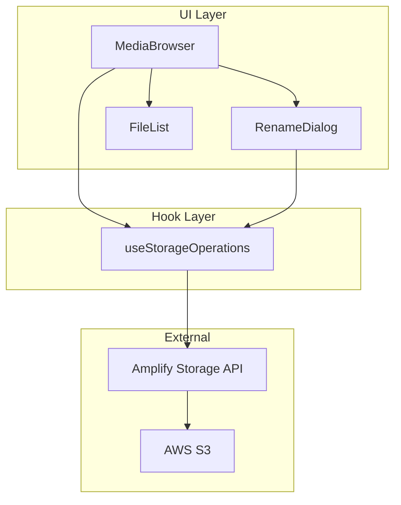
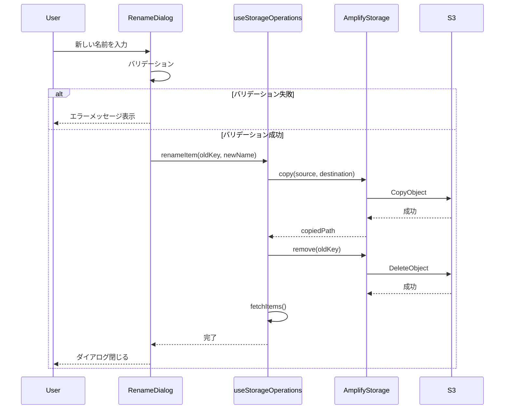
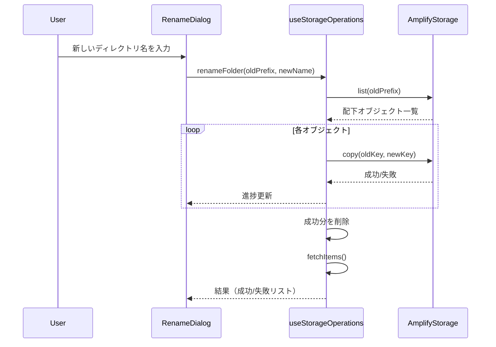
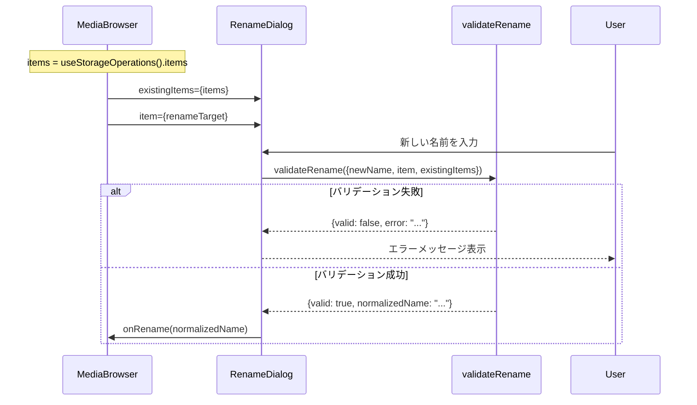

# Design Document

## Overview

**Purpose**: 本機能は、AWS S3 Photo Browser においてファイルおよびディレクトリのリネーム機能を提供する。S3 にはネイティブなリネーム操作がないため、copy + remove パターンで実現する。

**Users**: アプリケーションを利用するエンドユーザーが、アップロード済みのファイルやフォルダを整理するために使用する。

**Impact**: 既存の `useStorageOperations` フックを拡張し、新規 UI コンポーネント `RenameDialog` を追加する。

### Goals
- 単一ファイルのリネーム機能を提供する
- ディレクトリ（プレフィックス）配下の全オブジェクトを一括リネームする
- 適切なバリデーションとエラーハンドリングを実装する
- 既存 UI パターンと一貫性のあるユーザー体験を提供する

### Non-Goals
- ファイルの移動（別ディレクトリへの移動）
- 複数ファイルの一括リネーム（バッチリネーム）
- リネーム履歴・Undo 機能
- サムネイルの直接操作（Lambda に委任）

## Architecture

### Existing Architecture Analysis

既存システムは以下の構成を持つ：
- **useStorageOperations**: S3 操作（list, remove, upload, getUrl）を提供するカスタムフック
- **MediaBrowser コンポーネント群**: FileList, FileActions, CreateFolderDialog 等の UI コンポーネント
- **StorageItem 型**: ファイル/フォルダを表現する共通型

リネーム機能は既存パターンに沿って、フック拡張 + 新規ダイアログコンポーネントとして実装する。

### Architecture Pattern & Boundary Map



**Architecture Integration**:
- **Selected pattern**: Hook 拡張パターン — 既存の useStorageOperations に renameItem, renameFolder メソッドを追加
- **Domain/feature boundaries**: UI 層（表示・入力）と Hook 層（ビジネスロジック・API 呼び出し）を分離
- **Existing patterns preserved**: CreateFolderDialog のバリデーション・状態管理パターンを踏襲
- **New components rationale**: RenameDialog はリネーム固有のバリデーションと初期値設定が必要なため新規作成
- **Steering compliance**: Feature-first + Layer 分離、Hook Abstraction 原則を維持

### Technology Stack

| Layer | Choice / Version | Role in Feature | Notes |
|-------|------------------|-----------------|-------|
| Frontend | React 19 + TypeScript 5.x | UI コンポーネント、状態管理 | 既存スタック維持 |
| Storage API | aws-amplify/storage (copy, remove, list) | S3 操作 | copy API を新規使用 |
| Testing | Vitest + Testing Library | ユニット・コンポーネントテスト | 既存スタック維持 |

## System Flows

### ファイルリネームフロー



### ディレクトリリネームフロー



**Key Decisions**:
- copy 成功後に remove を実行することで、失敗時も元ファイルを維持
- ディレクトリリネームは順次処理し進捗を表示
- サムネイルは UI から操作せず Lambda に委任（UI にはサムネイルパスへの Write 権限がない）
  - 新しいキーへのコピー完了後、S3 イベントトリガーで Lambda がサムネイル生成
  - 古いサムネイルは既存のクリーンアップ処理で削除

## Requirements Traceability

| Requirement | Summary | Components | Interfaces | Flows |
|-------------|---------|------------|------------|-------|
| 1.1, 1.2, 1.3 | ファイルリネーム | RenameDialog, useStorageOperations | renameItem | ファイルリネームフロー |
| 1.4 | ローディング状態 | RenameDialog | isRenaming | - |
| 1.5 | キャンセル | RenameDialog | onClose | - |
| 2.1, 2.2, 2.3 | ディレクトリリネーム | RenameDialog, useStorageOperations | renameFolder | ディレクトリリネームフロー |
| 2.4 | 進捗表示 | RenameDialog | progress | - |
| 2.5 | 一覧更新 | useStorageOperations | fetchItems | - |
| 3.1, 3.2, 3.3, 3.4 | バリデーション | RenameDialog | validateName | - |
| 4.1, 4.2, 4.3, 4.4 | エラーハンドリング | useStorageOperations, RenameDialog | RenameResult | - |
| 5.1 | アクションボタン | FileList, MediaBrowser | onRename | - |
| 5.2, 5.3, 5.4 | ダイアログ UI/UX | RenameDialog | - | - |

## Components and Interfaces

| Component | Domain/Layer | Intent | Req Coverage | Key Dependencies | Contracts |
|-----------|--------------|--------|--------------|------------------|-----------|
| useStorageOperations | Hook Layer | S3 ストレージ操作 | 1.2, 1.3, 2.2, 2.3, 2.5, 4.1-4.4 | Amplify Storage (P0) | Service |
| RenameDialog | UI Layer | リネームダイアログ UI | 1.1, 1.4, 1.5, 2.1, 2.4, 3.1-3.4, 5.2-5.4 | useStorageOperations (P0) | State |
| FileList | UI Layer | リネームボタン追加 | 5.1 | - | - |

### Hook Layer

#### useStorageOperations（拡張）

| Field | Detail |
|-------|--------|
| Intent | S3 ストレージ操作（既存 + リネーム機能追加） |
| Requirements | 1.2, 1.3, 2.2, 2.3, 2.5, 4.1, 4.2, 4.3, 4.4 |

**Responsibilities & Constraints**
- ファイル・ディレクトリのリネーム処理（copy + remove）
- 既存の list, remove, upload 操作との一貫性を維持
- エラー発生時は元ファイルを維持

**Dependencies**
- Outbound: Amplify Storage API (copy, remove, list) — S3 操作 (P0)

**Contracts**: Service [x]

##### Service Interface

```typescript
interface RenameResult {
  /** リネーム成功フラグ */
  success: boolean;
  /** 新しいキー（成功時） */
  newKey?: string;
  /** エラー（失敗時） */
  error?: Error;
}

interface FolderRenameResult {
  /** 成功したオブジェクトのキー */
  succeeded: string[];
  /** 失敗したオブジェクトとエラー */
  failed: Array<{ key: string; error: Error }>;
}

interface FolderRenameProgress {
  /** 処理済みファイル数 */
  completed: number;
  /** 総ファイル数 */
  total: number;
}

interface UseStorageOperationsReturn {
  // ... 既存メソッド ...

  /**
   * ファイルをリネームする
   * @param item リネーム対象のファイル
   * @param newName 新しいファイル名（パスは含まない）
   */
  renameItem: (item: StorageItem, newName: string) => Promise<RenameResult>;

  /**
   * フォルダをリネームする
   * @param item リネーム対象のフォルダ
   * @param newName 新しいフォルダ名
   * @param onProgress 進捗コールバック
   */
  renameFolder: (
    item: StorageItem,
    newName: string,
    onProgress?: (progress: FolderRenameProgress) => void
  ) => Promise<FolderRenameResult>;

  /** リネーム処理中フラグ */
  isRenaming: boolean;
}
```

- **Preconditions**: identityId が設定済み、item.key が有効なパス
- **Postconditions**: 成功時は新しいキーでオブジェクトが存在、元のキーは削除済み
- **Invariants**: コピー失敗時は元オブジェクトを維持

**Implementation Notes**
- Integration: 既存の `listFolderContents` を再利用してディレクトリ配下を取得
- Validation: フック内ではパスの整合性のみ検証、名前バリデーションは UI 側
- Risks: 削除失敗時はユーザーに明示的に通知が必要

### UI Layer

#### RenameDialog

| Field | Detail |
|-------|--------|
| Intent | リネーム用モーダルダイアログ |
| Requirements | 1.1, 1.4, 1.5, 2.1, 2.4, 3.1, 3.2, 3.3, 3.4, 5.2, 5.3, 5.4 |

**Responsibilities & Constraints**
- 新しい名前の入力 UI を提供
- 入力値のバリデーション（空、重複、無効文字）
- ローディング状態と進捗表示
- キーボード操作（Enter 確定、Escape キャンセル）

**Dependencies**
- Inbound: MediaBrowser — ダイアログ表示制御 (P0)
- Outbound: useStorageOperations.renameItem/renameFolder — リネーム実行 (P0)

**Contracts**: State [x]

##### State Management

```typescript
interface RenameDialogProps {
  /** ダイアログ表示フラグ */
  isOpen: boolean;
  /** リネーム対象アイテム */
  item: StorageItem | null;
  /** 現在のディレクトリ内の既存名リスト（重複チェック用） */
  existingNames: string[];
  /** 閉じるハンドラ */
  onClose: () => void;
  /** リネーム実行ハンドラ */
  onRename: (newName: string) => Promise<void>;
  /** リネーム処理中フラグ */
  isRenaming?: boolean;
  /** フォルダリネーム時の進捗 */
  progress?: FolderRenameProgress;
}
```

- **State model**: ローカル state で入力値とエラーメッセージを管理
- **Persistence & consistency**: 非永続、ダイアログ閉じ時にリセット
- **Concurrency strategy**: isRenaming フラグで二重送信防止

**Implementation Notes**
- Integration: CreateFolderDialog.css を再利用してスタイル統一
- Risks: なし

### Validation Layer

#### validateRename 関数

| Field | Detail |
|-------|--------|
| Intent | リネーム名の入力バリデーション |
| Requirements | 3.1, 3.2, 3.3, 3.4 |

##### 関数シグネチャ

```typescript
interface ValidateRenameOptions {
  /** 入力された新しい名前 */
  newName: string;
  /** リネーム対象アイテム */
  item: StorageItem;
  /** 現在のディレクトリ内の既存アイテム */
  existingItems: StorageItem[];
}

interface ValidationResult {
  /** バリデーション成功フラグ */
  valid: boolean;
  /** エラーメッセージ（失敗時） */
  error?: string;
  /** 正規化された名前（成功時、トリム済み） */
  normalizedName?: string;
}

function validateRename(options: ValidateRenameOptions): ValidationResult;
```

##### バリデーションルール

**バリデーションの2層構成**:

| 層 | 目的 | 実行タイミング | チェック内容 |
|---|------|---------------|-------------|
| UI 層 | 即時フィードバック（UX） | 入力中 | 形式チェック + 重複チェック（early return） |
| フック層 | 整合性保証（データ安全性） | リネーム実行直前 | S3 上での重複チェック |

**⚠️ 2層チェックの目的の違い**:
- **UI 層**: UX 向上のための即時フィードバック（items 状態を使用、古い可能性あり）
- **フック層**: データ整合性保証（S3 API で実際の状態を確認、上書き防止）

両方のチェックは**相互に補完的**であり、どちらか一方では不十分。

**UI 層バリデーション（validateRename 関数）**:

| # | ルール | 条件 | エラーメッセージ | 優先度 |
|---|--------|------|------------------|--------|
| 1 | 空文字チェック | `newName.trim() === ''` | 「名前を入力してください」 | 最優先 |
| 2 | 無効文字チェック | `/` or `\\` を含む | 「名前にスラッシュは使用できません」 | 高 |
| 3 | 長さ制限 | `newName.trim().length > 100` | 「名前は100文字以内にしてください」 | 中 |
| 4 | 同一名チェック | `newName.trim() === item.name` | 「名前が変更されていません」 | 中 |
| 5 | 重複チェック（UI） | `existingItems` に同タイプ同名が存在 | 「同じ名前の{ファイル/フォルダ}が既に存在します」 | 低 |

**UI 層重複チェックの詳細**:
- 比較対象: `existingItems.filter(i => i.type === item.type && i.key !== item.key)`
- 比較方法: `normalizedName === existingItem.name`（case-sensitive）
- 注意: この段階では UI の items 状態を使用（古い可能性あり、フック層で再チェック）

**フック層バリデーション（S3 API で実行）**:

| # | ルール | 条件 | エラーメッセージ |
|---|--------|------|------------------|
| 5 | ファイル重複チェック | S3 上に新キーが存在 | 「同じ名前のファイルが既に存在します」 |
| 6 | フォルダ重複チェック | 新プレフィックス配下に重複オブジェクト | 「以下のファイルが既に存在します: {list}」 |

##### 重複チェックの詳細仕様

**⚠️ 重要: 重複チェックは S3 API で実行する（UI の items 状態ではない）**

UI の items 状態は古くなっている可能性があるため（他ユーザーによるアップロード、別タブでの操作等）、
リネーム実行直前に S3 API で実際の存在確認を行う。

```typescript
/**
 * S3 上での重複チェック（フック層で実装）
 *
 * @param newKey リネーム後の S3 キー
 * @returns true = 重複あり（リネーム不可）
 */
async function checkS3Exists(newKey: string): Promise<boolean> {
  try {
    // list API で新キーの存在を確認
    const result = await list({
      path: newKey,
      options: { listAll: false },
    });
    // 完全一致するキーが存在するか確認
    return result.items.some(item => item.path === newKey);
  } catch {
    // エラー時は安全側に倒して重複ありとする
    return true;
  }
}
```

**ファイルリネーム時の重複チェック**:
```typescript
// 新しいキーを生成
const newKey = `${parentPath}${newName}`;

// S3 上で存在確認
if (await checkS3Exists(newKey)) {
  return { success: false, error: new Error('同じ名前のファイルが既に存在します') };
}

// 存在しなければ copy 実行
await copy({ source: { path: item.key }, destination: { path: newKey } });
```

**フォルダリネーム時の重複チェック**:

⚠️ **ファイル数制限**: 配下オブジェクト数が **1000件を超える場合はエラー**（処理時間・安定性の観点）

```typescript
/** フォルダリネームの制限 */
const MAX_FOLDER_RENAME_ITEMS = 1000;

/**
 * フォルダリネーム時は、配下すべてのオブジェクトについて
 * 新プレフィックス配下での重複を事前チェック
 *
 * 最適化: 先にリネーム先のパス一覧を取得し、Set で比較（O(n+m) vs O(n*m)）
 */
async function checkFolderRenameConflicts(
  oldPrefix: string,
  newPrefix: string
): Promise<{
  hasConflicts: boolean;
  conflicts: string[];
  tooManyFiles: boolean;
  sourceCount: number;
}> {
  // 1. 先にリネーム先プレフィックス配下の既存オブジェクト一覧を取得
  //    （リネーム先が空の場合は即座に重複なしと判定可能）
  const destResult = await list({
    path: newPrefix,
    options: { listAll: true },
  });
  const destKeys = new Set(destResult.items.map(item => item.path));

  // 2. 元フォルダ配下のオブジェクト一覧を取得
  const sourceItems = await listFolderContents(oldPrefix);

  // 3. ファイル数制限チェック
  if (sourceItems.length > MAX_FOLDER_RENAME_ITEMS) {
    return {
      hasConflicts: false,
      conflicts: [],
      tooManyFiles: true,
      sourceCount: sourceItems.length,
    };
  }

  // 4. リネーム先が空なら重複チェック不要（高速パス）
  if (destKeys.size === 0) {
    return {
      hasConflicts: false,
      conflicts: [],
      tooManyFiles: false,
      sourceCount: sourceItems.length,
    };
  }

  // 5. 各ソースオブジェクトの新キーが既存と重複するかチェック
  const conflicts: string[] = [];
  for (const sourceKey of sourceItems) {
    const relativePath = sourceKey.replace(oldPrefix, '');
    const newKey = `${newPrefix}${relativePath}`;
    if (destKeys.has(newKey)) {
      conflicts.push(relativePath);
    }
  }

  return {
    hasConflicts: conflicts.length > 0,
    conflicts,
    tooManyFiles: false,
    sourceCount: sourceItems.length,
  };
}
```

**重複検出時の動作**:
| シナリオ | 動作 |
|---------|------|
| ファイルリネーム: 重複あり | エラー返却、リネーム中止 |
| フォルダリネーム: ファイル数 > 1000 | エラー返却（「フォルダ内のファイル数が多すぎます（{count}件）。1000件以下のフォルダのみリネーム可能です」） |
| フォルダリネーム: 1件でも重複あり | エラー返却、リネーム中止（部分実行しない） |
| フォルダリネーム: 重複なし | すべてのオブジェクトを順次 copy → remove |

##### 拡張子の扱い（ファイルリネーム時）

| 決定事項 | 詳細 |
|---------|------|
| 拡張子変更 | **許可する** — ユーザーの意図を尊重 |
| 警告表示 | **なし** — S3 はファイル拡張子に依存しない |
| 理由 | S3 オブジェクトは Content-Type で MIME タイプを保持しており、拡張子は表示名のみの意味を持つ |

##### データフロー



##### テストケース

**UI 層バリデーション（validateRename 関数）**:

| ケース | 入力 | 期待結果 |
|--------|------|----------|
| 空文字 | `""` | `{valid: false, error: "名前を入力してください"}` |
| 空白のみ | `"   "` | `{valid: false, error: "名前を入力してください"}` |
| スラッシュ含む | `"foo/bar"` | `{valid: false, error: "名前にスラッシュは使用できません"}` |
| バックスラッシュ含む | `"foo\\bar"` | `{valid: false, error: "名前にスラッシュは使用できません"}` |
| 101文字 | `"a" * 101` | `{valid: false, error: "名前は100文字以内にしてください"}` |
| 同一名（変更なし） | 元の名前と同じ | `{valid: false, error: "名前が変更されていません"}` |
| ファイル重複（UI） | 既存ファイル名 | `{valid: false, error: "同じ名前のファイルが既に存在します"}` |
| フォルダ重複（UI） | 既存フォルダ名 | `{valid: false, error: "同じ名前のフォルダが既に存在します"}` |
| 異タイプ同名 | ファイル→既存フォルダ名 | `{valid: true}` |
| 大文字小文字違い | `"Photo.jpg"` vs `"photo.jpg"` | `{valid: true}` |
| 前後空白 | `"  name  "` | `{valid: true, normalizedName: "name"}` |
| 拡張子変更 | `"photo.png"` → `"photo.jpg"` | `{valid: true}` |
| 正常（ファイル） | `"newname.jpg"` | `{valid: true, normalizedName: "newname.jpg"}` |
| 正常（フォルダ） | `"newfolder"` | `{valid: true, normalizedName: "newfolder"}` |

**フック層バリデーション（S3 API チェック）**:

| ケース | 条件 | 期待結果 |
|--------|------|----------|
| S3 重複なし | 新キーが存在しない | リネーム続行 |
| S3 重複あり | 新キーが存在する | エラー返却（コピー実行されない） |
| list API エラー | API 呼び出し失敗 | エラー返却（安全側に倒す） |
| フォルダ: ファイル数超過 | 1001件以上 | エラー返却（「ファイル数が多すぎます」） |
| フォルダ: リネーム先が空 | destKeys.size === 0 | 重複チェックスキップ（高速パス） |
| フォルダ: 1件でも重複 | conflicts.length > 0 | エラー返却（部分実行しない） |

#### FileList（軽微な拡張）

| Field | Detail |
|-------|--------|
| Intent | ファイル一覧表示（リネームボタン追加） |
| Requirements | 5.1 |

**Implementation Notes**
- 各アイテムにリネームアイコンボタンを追加
- クリック時に `onRename(item)` コールバックを呼び出し
- 選択モード中はリネームボタンを非表示

## Data Models

### Domain Model

既存の `StorageItem` 型をそのまま使用。新規エンティティは追加しない。

```typescript
interface StorageItem {
  key: string;        // S3 オブジェクトキー（フルパス）
  name: string;       // 表示名（ファイル名/フォルダ名）
  type: 'file' | 'folder';
  size?: number;
  lastModified?: Date;
}
```

### Data Contracts & Integration

リネーム操作の結果型は Service Interface セクションで定義済み（`RenameResult`, `FolderRenameResult`）。

## Error Handling

### Error Strategy

| エラー種別 | 発生箇所 | 対応 |
|-----------|---------|------|
| バリデーションエラー | RenameDialog | フィールド下にエラーメッセージ表示、送信ブロック |
| コピー失敗 | useStorageOperations | エラーメッセージ表示、元ファイル維持 |
| 削除失敗 | useStorageOperations | エラーメッセージ表示（新旧両方存在を通知） |
| ネットワークエラー | useStorageOperations | エラーメッセージ表示、リトライ可能 |
| 部分失敗（フォルダ） | useStorageOperations | 失敗ファイル一覧を表示 |

### Error Categories and Responses

**User Errors (4xx)**:
- 空のファイル名 → 「ファイル名を入力してください」
- 既存名と重複 → 「同じ名前のファイルが既に存在します」
- 無効な文字 → 「ファイル名にスラッシュは使用できません」

**System Errors (5xx)**:
- S3 コピー失敗 → 「リネームに失敗しました。再度お試しください」
- S3 削除失敗 → 「元のファイルの削除に失敗しました。手動で削除してください」
- ネットワークエラー → 「ネットワークエラーが発生しました」

## Testing Strategy

### Unit Tests
- `validateName`: 空文字、重複、無効文字、トリムのテスト
- `renameItem`: copy → remove の正常フロー
- `renameFolder`: 配下オブジェクトの一括処理

### Integration Tests
- `useStorageOperations.renameItem`: Amplify Storage mock でのエンドツーエンド
- `useStorageOperations.renameFolder`: 複数ファイル処理と進捗コールバック

### E2E/UI Tests
- RenameDialog: 入力、バリデーション、確定、キャンセル
- FileList: リネームボタンクリック → ダイアログ表示

### Error Scenario Tests
- コピー失敗時の元ファイル維持確認
- 削除失敗時のエラーメッセージ表示
- フォルダリネーム部分失敗時の結果表示
