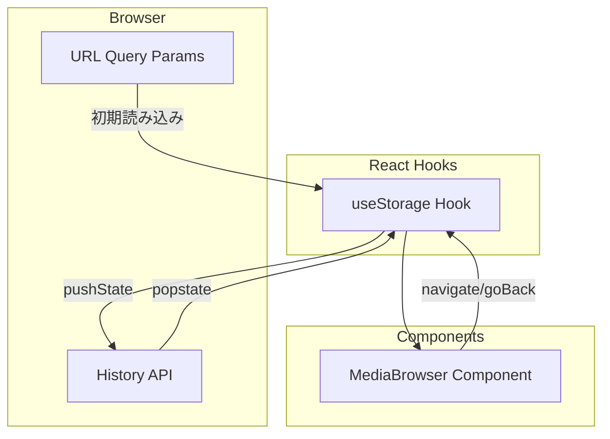
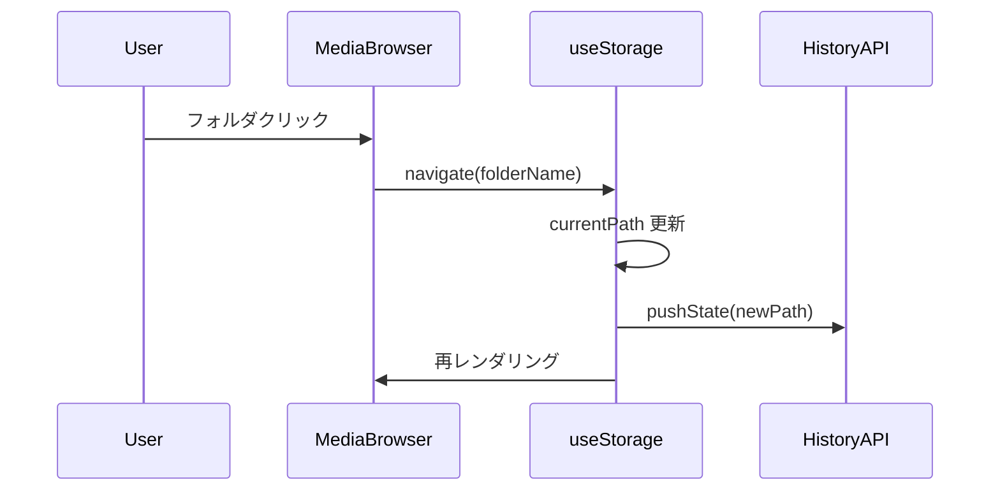
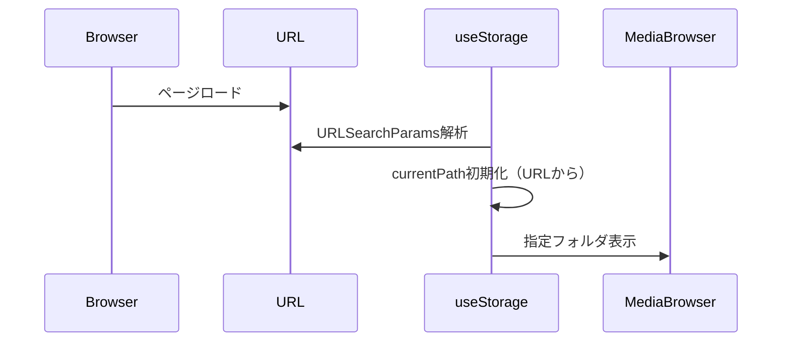
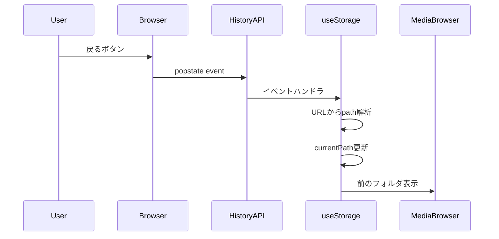

# Design Document: SPA Router

## Overview

**Purpose**: ページリロードやブラウザナビゲーション時に現在のフォルダ位置を保持する URL 同期機能を提供する。

**Users**: 写真・動画を閲覧するユーザーが、ブラウザの戻る/進む操作やページリロード後も同じフォルダに留まれる。

**Impact**: useStorage フックに URL 同期ロジックを追加。将来のリファクタリングで責務分離を検討。

### Goals

- ページリロード時にフォルダ位置を保持
- ブラウザの戻る/進むボタンでフォルダ間移動
- 日本語フォルダ名を含む URL の正確なエンコード/デコード

### Non-Goals

- ディープリンク共有機能（スコープ外）
- 複数ページルーティング（単一画面アプリ）
- サーバーサイドレンダリング対応

## Architecture

### Existing Architecture Analysis

現在のアーキテクチャ:

- `useStorage` フック: `currentPath` を React state (`useState`) で管理
- `navigate(path)`: パスを追加して currentPath を更新
- `goBack()`: パスの最後のセグメントを削除
- URL は静的（パス情報を含まない）

変更方針:

- useStorage フックに URL 同期ロジックを直接追加
- useState の初期値を URL から取得
- setCurrentPath 時に History API で URL を更新
- popstate イベントで ブラウザナビゲーションを検知
- 将来のリファクタリングで責務分離を検討

### Architecture Pattern & Boundary Map



**Architecture Integration**:

- Selected pattern: 既存フック拡張パターン（最小変更）
- Domain boundaries: useStorage が URL 同期とストレージ操作を担当
- Existing patterns preserved: カスタムフック、コンポーネント分離
- Steering compliance: フックへのロジック集約（tech.md 準拠）
- Future refactoring: 責務分離は将来のリファクタリングで検討

### Technology Stack

| Layer       | Choice / Version | Role in Feature | Notes                   |
| ----------- | ---------------- | --------------- | ----------------------- |
| Frontend    | React 19.2       | 状態管理        | 既存                    |
| Browser API | History API      | URL 同期        | 標準 API、依存追加なし  |
| URL Format  | Query Parameter  | パスエンコード  | `?path=folder1/folder2` |

## System Flows

### フォルダナビゲーションフロー



### ページリロードフロー



### ブラウザ戻る/進むフロー



## Requirements Traceability

| Requirement | Summary                     | Components         | Interfaces         | Flows                |
| ----------- | --------------------------- | ------------------ | ------------------ | -------------------- |
| 1.1         | フォルダナビゲート時URL更新 | useStorage         | syncToUrl          | ナビゲーションフロー |
| 1.2         | リロード時URL解析           | useStorage         | parseUrlPath       | リロードフロー       |
| 1.3         | URL-パス同期維持            | useStorage         | useEffect          | 全フロー             |
| 1.4         | ルート戻り時URLリセット     | useStorage         | syncToUrl          | ナビゲーションフロー |
| 2.1         | 戻るボタン対応              | useStorage         | popstate handler   | 戻る/進むフロー      |
| 2.2         | 進むボタン対応              | useStorage         | popstate handler   | 戻る/進むフロー      |
| 2.3         | UI同期                      | Header, useStorage | currentPath prop   | 全フロー             |
| 3.1         | URLエンコード形式           | useStorage         | encodeURIComponent | -                    |
| 3.2         | 日本語パス処理              | useStorage         | encodeURIComponent | -                    |
| 3.3         | S3キー互換                  | useStorage         | path format        | -                    |
| 3.4         | デコードエラー処理          | useStorage         | parseUrlPath       | リロードフロー       |

## Components and Interfaces

| Component  | Domain/Layer | Intent                    | Req Coverage              | Key Dependencies | Contracts |
| ---------- | ------------ | ------------------------- | ------------------------- | ---------------- | --------- |
| useStorage | Hooks        | ストレージ操作 + URL 同期 | 1.1-1.4, 2.1-2.3, 3.1-3.4 | History API (P0) | State     |

### Hooks Layer

#### useStorage (変更)

| Field        | Detail                                                         |
| ------------ | -------------------------------------------------------------- |
| Intent       | S3 ストレージ操作 + URL クエリパラメータとパス状態の双方向同期 |
| Requirements | 1.1, 1.2, 1.3, 1.4, 2.1, 2.2, 2.3, 3.1, 3.2, 3.3, 3.4          |

**Responsibilities & Constraints**

- 既存の S3 操作機能を維持
- URL クエリパラメータ (`?path=...`) とパス状態の同期
- 初期化時に URL からパスを読み取り
- パス変更時に History API で URL を更新
- popstate イベントでブラウザナビゲーションを検知
- 日本語パスのエンコード/デコード

**Dependencies**

- Inbound: MediaBrowser — ストレージ操作 API 使用 (P0)
- External: History API — pushState, popstate (P0)
- External: URLSearchParams — クエリパラメータ操作 (P0)

**Contracts**: State [x]

##### URL 同期用ヘルパー関数（新規追加）

```typescript
const PATH_PARAM = "path";

function parseUrlPath(): string {
  const params = new URLSearchParams(window.location.search);
  const path = params.get(PATH_PARAM);
  if (!path) return "";
  try {
    return decodeURIComponent(path);
  } catch {
    return ""; // デコードエラー時はルートにフォールバック
  }
}

function syncToUrl(path: string): void {
  const url = new URL(window.location.href);
  if (path) {
    url.searchParams.set(PATH_PARAM, encodeURIComponent(path));
  } else {
    url.searchParams.delete(PATH_PARAM);
  }
  window.history.pushState({ path }, "", url.toString());
}
```

##### State Management (変更箇所)

```typescript
// Before (useState で直接管理)
const [currentPath, setCurrentPath] = useState("");

// After (URL から初期値を取得)
const [currentPath, setCurrentPathState] = useState(() => parseUrlPath());

// URL 同期用の setCurrentPath ラッパー
const setCurrentPath = useCallback((path: string) => {
  setCurrentPathState(path);
  syncToUrl(path);
}, []);

// popstate イベントでブラウザナビゲーションを検知
useEffect(() => {
  const handlePopState = () => {
    setCurrentPathState(parseUrlPath());
  };
  window.addEventListener("popstate", handlePopState);
  return () => window.removeEventListener("popstate", handlePopState);
}, []);

// navigate/goBack は既存ロジックを維持（内部で setCurrentPath を呼び出し）
const navigate = useCallback(
  (path: string) => {
    setCurrentPath(currentPath ? `${currentPath}/${path}` : path);
  },
  [currentPath, setCurrentPath],
);

const goBack = useCallback(() => {
  const parts = currentPath.split("/").filter(Boolean);
  parts.pop();
  setCurrentPath(parts.join("/"));
}, [currentPath, setCurrentPath]);
```

- State model: `currentPath: string` — URL と同期
- Persistence: URL クエリパラメータ (`?path=...`)
- Concurrency: popstate イベントで外部からの状態変更を検知

**Implementation Notes**

- Integration: useState の初期値と更新ロジックを拡張
- Validation: decodeURIComponent の try-catch でエラーハンドリング
- Risks: SSR 環境では window 未定義 → ブラウザ専用として設計
- Future: 責務が増えるため、将来のリファクタリングで分離を検討

## Data Models

### Domain Model

- **currentPath**: フォルダパス文字列（例: `"folder1/folder2"`）
- **URL state**: `?path=folder1%2Ffolder2` 形式でエンコード

### Data Contracts & Integration

**URL Query Parameter Schema**:

- Key: `path`
- Value: encodeURIComponent でエンコードされたフォルダパス
- Example: `?path=photos%2F2024%2F%E6%97%85%E8%A1%8C` (photos/2024/旅行)

**History State Object**:

```typescript
interface HistoryState {
  path: string; // デコード済みパス
}
```

## Error Handling

### Error Strategy

- デコードエラー: ルートディレクトリにフォールバック
- 不正な URL: パラメータを無視してルートから開始

### Error Categories and Responses

**User Errors (4xx equivalent)**:

- 不正なエンコーディング → ルートにフォールバック、コンソールに警告
- 存在しないパス → S3 list API のエラーハンドリングに委譲（既存動作）

## Testing Strategy

### Unit Tests (useStorage URL 同期機能)

- `parseUrlPath`: 正常パス、空パス、日本語パス、不正エンコードのパース
- `syncToUrl`: パスの URL 反映、空パス時のパラメータ削除
- `useStorage` hook: URL からの初期値取得、setCurrentPath による URL 更新
- `popstate` handler: 履歴イベントでの state 更新
- `navigate`: 正しいパスで URL が更新される
- `goBack`: 正しいパスで URL が更新される

### Integration Tests

- navigate → URL 更新 → リロード → 同じパス表示
- goBack → URL 更新 → ブラウザ戻るボタン → 正しいパス表示

### E2E/UI Tests

- フォルダナビゲーション → URL 変更確認
- ページリロード → 同じフォルダ表示確認
- ブラウザ戻る/進む → フォルダ切り替え確認
