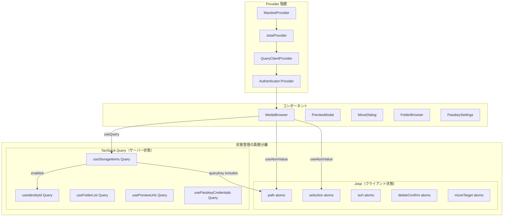
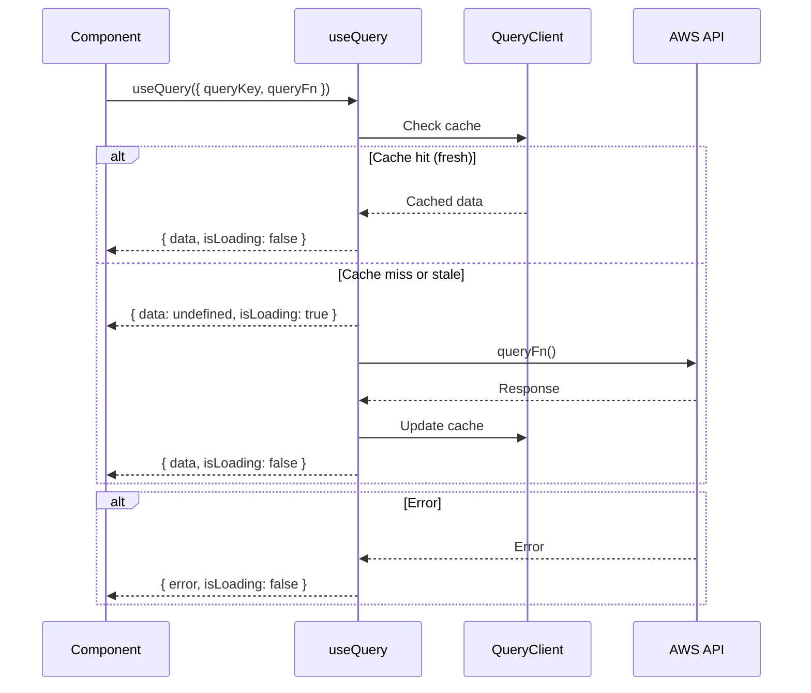
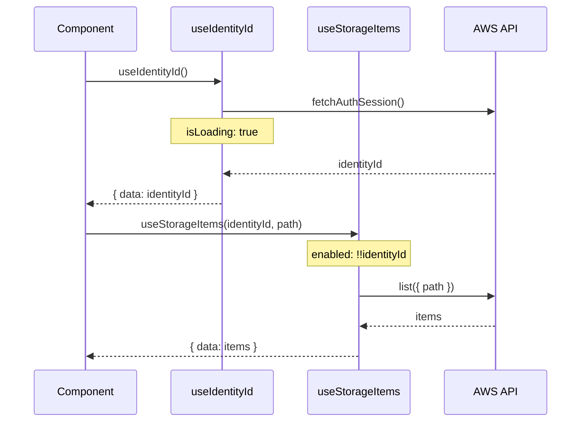
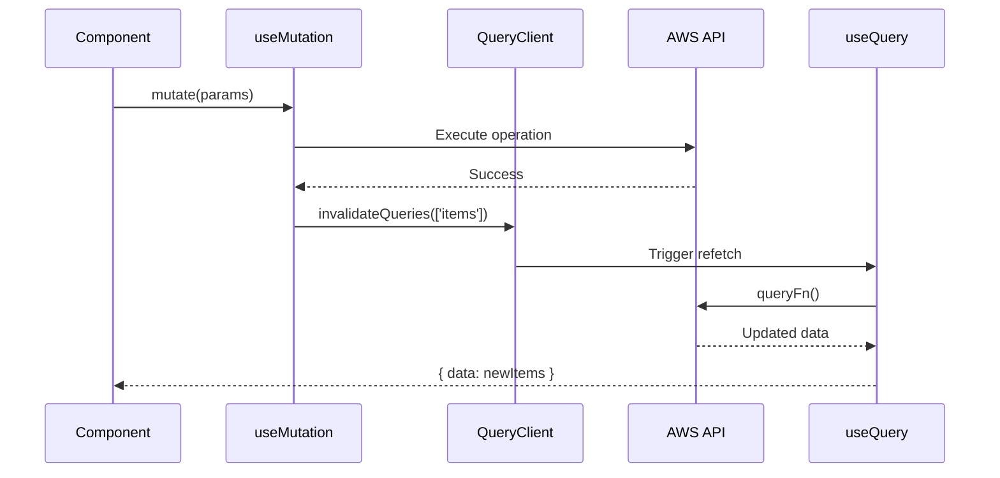

# Design Document

## Overview

**Purpose**: この機能は、AWS S3 Photo Browser の非同期データ取得を TanStack Query に移行し、Phase 3 でのサムネイル遅延表示バグ解決の基盤を整備します。

**Users**: 開発者が恩恵を受けます。useState + useEffect による手動状態管理から、TanStack Query の useQuery/useMutation による宣言的なデータ取得に移行することで、useEffect の撲滅とボイラープレートの削減を実現します。

**Impact**: 現在の5箇所のデータ取得 useEffect を useQuery に置換し、コードベース全体の useEffect 密度を下げることで、Phase 3 でのサムネイル遅延管理ロジック整理を容易にします。

### Goals

- データ取得 useEffect を 5 箇所から 0 箇所に削減
- ローディング/エラー状態の手動管理を TanStack Query の組み込み機能で自動化
- サーバー状態（TanStack Query）とクライアント状態（Jotai）の明確な責務分離
- 自動キャッシュ、バックグラウンド再取得、リトライ機構の活用
- Phase 3 でのサムネイル遅延管理改善の基盤を構築

### Non-Goals

- ThumbnailImage.tsx のサムネイル URL 取得（Phase 3 スコープ）
- useUploadTracker.ts のアップロード状態管理（Phase 3 スコープ）
- Storage Write 操作の移行（Upload/Delete/Move/Rename/CreateFolder）（Phase 3 スコープ）
- Suspense モードの使用（本 Phase では useEffect 撲滅が目的のため不要）
- SSR/プリフェッチ機能（本プロジェクトは SPA）

## Architecture

### Existing Architecture Analysis

**現在のパターン**:

- クライアント状態: Jotai atom（selection, path, sort, deleteConfirm ドメイン）— Phase 1 で導入済み
- 非同期データ取得: useState + useEffect パターン（5箇所に分散）— **本 Phase の対象**
- Provider 構造: MantineProvider > JotaiProvider > Authenticator.Provider

**現在の問題（useEffect + useState パターン）**:

- 手動でのローディング/エラー状態管理（各ファイルで重複）
- useEffect のクリーンアップとレースコンディションへの対処が必要
- 状態遷移の追跡が困難（DevTools で可視化できない）
- Phase 3 でサムネイル遅延ロジックを整理する前に、データ取得パターンの標準化が必要

**TanStack Query 導入による改善**:

- useQuery でデータ取得を宣言的に定義（useEffect 不要）
- isLoading, isError, data でボイラープレートを削減
- React Query DevTools で全クエリ状態を可視化
- Jotai はクライアント状態（UI 状態）に特化して継続使用

### Architecture Pattern & Boundary Map

**Architecture Integration**:

- **Selected pattern**: TanStack Query（サーバー状態）+ Jotai（クライアント状態）の責務分離
- **Domain/feature boundaries**: identity, storage, preview, passkey の4つのクエリドメイン
- **Existing patterns preserved**: Jotai の atom 構造、命名規則、ドメイン分離を維持
- **New components rationale**: QueryClientProvider を追加、カスタムフック群を新規作成
- **Steering compliance**: useEffect 使用基準を維持（TanStack Query 内部に移譲）

### Technology Stack

| Layer    | Choice / Version                     | Role in Feature        | Notes                           |
| -------- | ------------------------------------ | ---------------------- | ------------------------------- |
| Frontend | React 19                             | -                      | -                               |
| State    | Jotai 2.x                            | クライアント状態管理   | 既存（selection, path, sort等） |
| Server   | TanStack Query v5                    | サーバー状態管理       | 新規追加                        |
| UI       | Mantine 8                            | ローディング/エラー UI | Loader, Alert 等既存活用        |
| DevTools | React Query DevTools                 | クエリ状態可視化       | 新規追加（開発環境のみ）        |
| DevTools | Redux DevTools (jotai-devtools 経由) | 状態可視化             | 既存（Phase 1 で導入済み）      |

## System Flows

### データ取得フロー（useQuery パターン）

### 依存クエリフロー（enabled オプション）

### データ更新フロー（invalidateQueries パターン）

## Requirements Traceability

| Requirement | Summary                  | Custom Hook           | queryKey              | Flows |
| ----------- | ------------------------ | --------------------- | --------------------- | ----- |
| 1           | QueryClient 基盤の構築   | QueryClientProvider   | -                     | Setup |
| 2           | 認証状態の useQuery 化   | useIdentityId         | ["identityId"]        | Read  |
| 3           | ストレージ一覧取得の移行 | useStorageItems       | ["items", id, path]   | Read  |
| 4           | フォルダ選択の移行       | useFolderList         | ["folders", id, path] | Read  |
| 5           | プレビュー URL の移行    | usePreviewUrls        | ["previewUrls", keys] | Read  |
| 6.1         | パスキー一覧取得         | usePasskeyCredentials | ["passkeys"]          | Read  |
| 6.2         | パスキー登録             | useRegisterPasskey    | -                     | Write |
| 6.3         | パスキー削除             | useDeletePasskey      | -                     | Write |
| 7           | 既存機能の互換性維持     | 全コンポーネント      | -                     | -     |

> **Note:** Storage Write 操作（useMutation）は Phase 3 で対応します。パスキー管理は Phase 2 で完結します。

## Components and Interfaces

### コンポーネント概要

| Component             | Domain/Layer | Intent                    | Req Coverage | Key Dependencies            | Contracts |
| --------------------- | ------------ | ------------------------- | ------------ | --------------------------- | --------- |
| QueryClientProvider   | Setup        | TanStack Query の基盤設定 | 1            | -                           | -         |
| useIdentityId         | Identity     | 認証 ID の取得            | 2            | fetchAuthSession            | Hook      |
| usePasskeyCredentials | Passkey      | クレデンシャル一覧の取得  | 6.1          | listWebAuthnCredentials     | Hook      |
| useRegisterPasskey    | Passkey      | パスキーの登録            | 6.2          | associateWebAuthnCredential | Hook      |
| useDeletePasskey      | Passkey      | パスキーの削除            | 6.3          | deleteWebAuthnCredential    | Hook      |
| useStorageItems       | Storage      | ファイル一覧の取得        | 3            | useIdentityId, currentPath  | Hook      |
| useFolderList         | Storage      | フォルダ一覧の取得        | 4            | useIdentityId               | Hook      |
| usePreviewUrls        | Preview      | プレビュー URL の取得     | 5            | selectedItems               | Hook      |

> **Note:** useStorageMutations（Storage CRUD 操作）は Phase 3 で対応します。パスキー管理は Auth 関連として Identity の直後に実装します（requirements.md Constraint 0 参照）。

---

### Setup Layer

#### QueryClientProvider 設定

| Field        | Detail                                     |
| ------------ | ------------------------------------------ |
| Intent       | TanStack Query の QueryClient を設定・提供 |
| Requirements | 1.1, 1.2, 1.3, 1.4, 1.5                    |

**Responsibilities & Constraints**

- QueryClient インスタンスを作成し、アプリ全体で共有
- defaultOptions でグローバルなデフォルト値を設定
- 開発環境では ReactQueryDevtools を表示

**Dependencies**

- External: @tanstack/react-query — QueryClient, QueryClientProvider (P0)
- External: @tanstack/react-query-devtools — ReactQueryDevtools (P1)

**Default Options**

| Option               | Value | Rationale                            |
| -------------------- | ----- | ------------------------------------ |
| staleTime            | 5分   | 頻繁な再取得を抑制                   |
| gcTime               | 30分  | メモリ効率のためガベージコレクション |
| retry                | 3     | ネットワークエラーの自動リトライ     |
| refetchOnWindowFocus | false | S3 データは頻繁に変わらない          |

**Implementation Notes**

- JotaiProvider の内側に QueryProvider を配置
- 開発環境では ReactQueryDevtools を表示

---

### queryKey ファクトリ

| Field        | Detail                                    |
| ------------ | ----------------------------------------- |
| Intent       | queryKey の一貫性を保証するファクトリ関数 |
| Requirements | 全要件                                    |

**Key Patterns**

| Domain   | Key Pattern                     | 用途                         |
| -------- | ------------------------------- | ---------------------------- |
| Identity | `["identityId"]`                | 認証 ID                      |
| Storage  | `["items", identityId, path]`   | ファイル一覧（パス依存）     |
| Storage  | `["folders", identityId, path]` | フォルダ一覧（移動先選択用） |
| Preview  | `["previewUrls", ...itemKeys]`  | プレビュー URL               |
| Passkey  | `["passkeys"]`                  | パスキー一覧                 |

**Implementation Notes**

- as const で型安全性を確保
- invalidateQueries でプレフィックスマッチが可能

---

### Identity Domain

#### useIdentityId

| Field        | Detail                                        |
| ------------ | --------------------------------------------- |
| Intent       | Cognito 認証セッションから Identity ID を取得 |
| Requirements | 2.1, 2.2, 2.3, 2.4                            |

**Responsibilities & Constraints**

- fetchAuthSession() を実行し、identityId を返す
- 認証済みユーザーのみが使用可能
- エラー時は error プロパティで返却

**Dependencies**

- External: aws-amplify/auth — fetchAuthSession (P0)
- External: @tanstack/react-query — useQuery (P0)

**Contracts**: Hook [x]

| Property  | Type                  | Description        |
| --------- | --------------------- | ------------------ |
| data      | `string \| undefined` | Identity ID        |
| isLoading | `boolean`             | 初回ローディング中 |
| isError   | `boolean`             | エラー発生         |
| error     | `Error \| null`       | エラー内容         |

**Query Options**

- queryKey: `queryKeys.identityId()`
- staleTime: Infinity（セッション中は変わらない）
- gcTime: Infinity（ログアウトまでキャッシュ保持）

**Implementation Notes**

- 既存の useIdentityId フックを置換
- 便利なヘルパー `useIdentityIdValue()` を提供（既存コードとの互換性）

---

### Passkey Domain

#### usePasskeyCredentials

| Field        | Detail                            |
| ------------ | --------------------------------- |
| Intent       | WebAuthn クレデンシャル一覧を取得 |
| Requirements | 6.1, 6.2, 6.3                     |

**Responsibilities & Constraints**

- listWebAuthnCredentials を実行
- ページネーションを処理して全件取得

**Dependencies**

- External: aws-amplify/auth — listWebAuthnCredentials (P0)

**Contracts**: Hook [x]

| Property  | Type                                | Description        |
| --------- | ----------------------------------- | ------------------ |
| data      | `WebAuthnCredential[] \| undefined` | クレデンシャル一覧 |
| isLoading | `boolean`                           | 初回ローディング中 |
| isError   | `boolean`                           | エラー発生         |
| error     | `Error \| null`                     | エラー内容         |

**Query Options**

- queryKey: `queryKeys.passkeys()`
- ページネーション: nextToken を使用して全件取得

**Implementation Notes**

- 既存の usePasskey フックから取得ロジックを抽出
- toWebAuthnCredential 変換関数は既存を再利用

---

#### useRegisterPasskey

| Field        | Detail         |
| ------------ | -------------- |
| Intent       | パスキーの登録 |
| Requirements | 6.2            |

**Responsibilities & Constraints**

- associateWebAuthnCredential を実行
- 成功時に invalidateQueries でクレデンシャル一覧を再取得
- WebAuthn がサポートされていない環境ではエラー

**Dependencies**

- External: aws-amplify/auth — associateWebAuthnCredential (P0)
- External: @tanstack/react-query — useMutation, useQueryClient (P0)

**Contracts**: Hook [x]

| Property    | Type                  | Description         |
| ----------- | --------------------- | ------------------- |
| mutate      | `() => void`          | 登録実行            |
| mutateAsync | `() => Promise<void>` | 登録実行（Promise） |
| isPending   | `boolean`             | 実行中              |
| isError     | `boolean`             | エラー発生          |
| error       | `Error \| null`       | エラー内容          |

**Mutation Options**

- onSuccess: `invalidateQueries({ queryKey: queryKeys.passkeys() })`
- 一覧を自動的に再取得

**Implementation Notes**

- 登録成功後に invalidateQueries で一覧を再取得
- 既存の usePasskey.register() を置換

---

#### useDeletePasskey

| Field        | Detail         |
| ------------ | -------------- |
| Intent       | パスキーの削除 |
| Requirements | 6.3            |

**Responsibilities & Constraints**

- deleteWebAuthnCredential を実行
- 成功時に invalidateQueries でクレデンシャル一覧を再取得
- 削除確認は呼び出し元で実施済みの前提

**Dependencies**

- External: aws-amplify/auth — deleteWebAuthnCredential (P0)
- External: @tanstack/react-query — useMutation, useQueryClient (P0)

**Contracts**: Hook [x]

| Property    | Type                                                  | Description         |
| ----------- | ----------------------------------------------------- | ------------------- |
| mutate      | `(params: { credentialId: string }) => void`          | 削除実行            |
| mutateAsync | `(params: { credentialId: string }) => Promise<void>` | 削除実行（Promise） |
| isPending   | `boolean`                                             | 実行中              |
| isError     | `boolean`                                             | エラー発生          |
| error       | `Error \| null`                                       | エラー内容          |

**Mutation Options**

- onSuccess: `invalidateQueries({ queryKey: queryKeys.passkeys() })`
- 一覧を自動的に再取得

**Implementation Notes**

- 削除成功後に invalidateQueries で一覧を再取得
- 既存の usePasskey.deleteCredential() を置換

---

### Storage Domain

#### useStorageItems

| Field        | Detail                                      |
| ------------ | ------------------------------------------- |
| Intent       | 現在のパスにあるファイル/フォルダ一覧を取得 |
| Requirements | 3.1, 3.2, 3.3, 3.4                          |

**Responsibilities & Constraints**

- identityId と currentPath に依存
- identityId が取得されるまで enabled: false
- パスまたは identityId の変更で自動的に再取得

**Dependencies**

- Inbound: useIdentityId — 認証 ID (P0)
- Inbound: currentPathAtom — 現在のパス (P0)
- External: aws-amplify/storage — list (P0)

**Contracts**: Hook [x]

| Property  | Type                         | Description           |
| --------- | ---------------------------- | --------------------- |
| data      | `StorageItem[] \| undefined` | ファイル/フォルダ一覧 |
| isLoading | `boolean`                    | 初回ローディング中    |
| isError   | `boolean`                    | エラー発生            |
| error     | `Error \| null`              | エラー内容            |

**Query Options**

- queryKey: `queryKeys.items(identityId, currentPath)`
- enabled: `!!identityId`（identityId 取得まで待機）
- パス変更時に自動再取得（queryKey 依存）

**Implementation Notes**

- enabled: !!identityId で依存クエリを実現
- queryKey にパスを含めることで、パス変更時に自動再取得
- toStorageItems は既存の変換ロジックを抽出

---

#### useFolderList

| Field        | Detail                                       |
| ------------ | -------------------------------------------- |
| Intent       | 指定パスのフォルダ一覧を取得（移動先選択用） |
| Requirements | 4.1, 4.2, 4.3                                |

**Responsibilities & Constraints**

- パラメータとしてパスを受け取る
- フォルダのみをフィルタリングして返す
- MoveDialog が開いている間のみ有効

**Dependencies**

- Inbound: useIdentityId — 認証 ID (P0)
- External: aws-amplify/storage — list (P0)

**Contracts**: Hook [x]

**Hook Parameters**

| Parameter | Type      | Required | Description                   |
| --------- | --------- | -------- | ----------------------------- |
| path      | `string`  | Yes      | 取得対象のパス                |
| enabled   | `boolean` | No       | 有効化フラグ（default: true） |

**Return Type**

| Property  | Type                         | Description                         |
| --------- | ---------------------------- | ----------------------------------- |
| data      | `StorageItem[] \| undefined` | フォルダ一覧（isFolder: true のみ） |
| isLoading | `boolean`                    | 初回ローディング中                  |
| isError   | `boolean`                    | エラー発生                          |
| error     | `Error \| null`              | エラー内容                          |

**Query Options**

- queryKey: `queryKeys.folders(identityId, path)`
- enabled: `enabled && !!identityId`
- フォルダのみをフィルタリング

**Implementation Notes**

- FolderBrowser.tsx 内の useEffect + useState を置換
- MoveDialog が閉じているときは enabled: false で無効化

---

### Preview Domain

#### usePreviewUrls

| Field        | Detail                                      |
| ------------ | ------------------------------------------- |
| Intent       | プレビュー対象アイテムのメディア URL を取得 |
| Requirements | 5.1, 5.2, 5.3                               |

**Responsibilities & Constraints**

- プレビュー対象アイテム配列を受け取る
- 各アイテムの署名付き URL を並列取得
- Lightbox 用の Slide 配列を返す

**Dependencies**

- External: aws-amplify/storage — getUrl (P0)

**Contracts**: Hook [x]

**Hook Parameters**

| Parameter | Type            | Required | Description                   |
| --------- | --------------- | -------- | ----------------------------- |
| items     | `StorageItem[]` | Yes      | プレビュー対象アイテム        |
| enabled   | `boolean`       | No       | 有効化フラグ（default: true） |

**Return Type**

| Property  | Type                   | Description             |
| --------- | ---------------------- | ----------------------- |
| data      | `Slide[] \| undefined` | Lightbox 用スライド配列 |
| isLoading | `boolean`              | 初回ローディング中      |
| isError   | `boolean`              | エラー発生              |
| error     | `Error \| null`        | エラー内容              |

**Query Options**

- queryKey: `queryKeys.previewUrls(itemKeys)`
- enabled: `enabled && items.length > 0`
- staleTime: 10分（署名付き URL の有効期限を考慮）

**Slide 変換ルール**

- 画像: `{ src, alt }`
- 動画: `{ src, alt, type: "video", sources: [...] }`

**Implementation Notes**

- PreviewModal.tsx 内の useEffect + useState を置換
- Promise.all で並列取得（パフォーマンス向上）
- staleTime: 10分（署名付き URL の有効期限を考慮）

---

## Error Handling

### Error Strategy

| Error Type         | 処理方法                      | 回復アクション             |
| ------------------ | ----------------------------- | -------------------------- |
| 認証エラー         | isError + error で判定        | 再ログインへ誘導           |
| ネットワークエラー | 自動リトライ（3回）           | リトライ後もエラーなら表示 |
| 操作エラー         | useMutation の onError で処理 | エラー通知 + 状態リセット  |
| 不正データ         | queryFn 内でバリデーション    | エラースロー               |

### Error Categories and Responses

**System Errors (5xx)**:

- AWS API タイムアウト → 自動リトライ（指数バックオフ）
- S3 アクセスエラー → リトライ後にエラー表示

**Business Logic Errors**:

- 重複ファイル → 確認ダイアログで上書き確認（既存ロジック維持）
- 無効なフォルダ名 → バリデーションエラー表示

### Monitoring

- 開発環境: ReactQueryDevtools でクエリ状態を可視化
- 開発環境: Jotai DevTools でクライアント状態を可視化
- エラー発生時: console.error でスタックトレースを出力

---

## Testing Strategy

### Unit Tests

- useIdentityId: 認証セッション取得のモック、エラー時の動作
- useStorageItems: 依存クエリの動作、リスト変換ロジック
- useFolderList: フォルダフィルタリング、enabled オプション
- usePreviewUrls: 並列 URL 取得、Slide 変換
- usePasskeyCredentials: ページネーション処理、データ変換

### Integration Tests

- QueryClientProvider: 正しい設定での初期化
- 依存クエリ: identityId → items の連携
- キャッシュ: staleTime/gcTime の動作確認
- エラー状態: リトライ後のエラー表示

### E2E Tests（既存テストの動作確認）

- ファイル一覧表示: パス遷移時のデータ取得
- ファイルアップロード: アップロード後の一覧更新（invalidateQueries）
- ファイル削除: 削除後の一覧更新
- プレビュー表示: モーダル表示時の URL 取得

---

## Performance & Scalability

### パフォーマンス目標

| 指標                 | 目標値  | 備考                       |
| -------------------- | ------- | -------------------------- |
| 初回ファイル一覧表示 | < 2秒   | ローディング UI 表示含む   |
| キャッシュヒット時   | < 100ms | staleTime 内の再表示       |
| 操作後の一覧更新     | < 1秒   | invalidateQueries + 再取得 |
| プレビュー URL 取得  | < 500ms | 並列取得による最適化       |

### 最適化戦略

- **自動キャッシュ**: TanStack Query のキャッシュ機構で重複リクエストを削減
- **staleTime 設定**: 5分間は fresh とみなし、バックグラウンド再取得を抑制
- **並列取得**: Promise.all で複数 URL を並列取得（previewUrls）
- **依存クエリ**: enabled オプションで不要なリクエストを防止

---

## Migration Strategy

### 移行フェーズ

Auth 関連（Identity + Passkey）を先に完了させ、その後 Storage 関連を実装します（requirements.md Constraint 0 参照）。

```mermaid
flowchart LR
    subgraph "Phase 2-1: 基盤 + Auth"
        A[QueryClient 設定] --> B[QueryProvider 作成]
        B --> C[Provider 階層に統合]
        C --> D[queryKeys ファクトリ作成]
        D --> E[useIdentityId 実装]
        E --> F[useIdentityId 置換]
        F --> G[usePasskeyCredentials 実装]
        G --> H[useRegisterPasskey 実装]
        H --> I[useDeletePasskey 実装]
        I --> J[usePasskey 完全置換]
    end

    subgraph "Phase 2-2: Storage Read"
        K[useStorageItems 実装] --> L[useStorageOperations Read 部分置換]
    end

    subgraph "Phase 2-3: Storage UI"
        M[useFolderList 実装] --> N[FolderBrowser 置換]
        O[usePreviewUrls 実装] --> P[PreviewModal 置換]
    end

    J --> K
    L --> M
    L --> O
```

### 移行ステップ

1. **基盤構築 + Auth（Phase 2-1）**
   - @tanstack/react-query, @tanstack/react-query-devtools インストール
   - QueryClient 設定（src/lib/queryClient.ts）
   - QueryProvider 作成（src/providers/QueryProvider.tsx）
   - Provider 階層に統合（JotaiProvider > QueryProvider）
   - queryKeys ファクトリ作成（src/lib/queryKeys.ts）
   - useIdentityId 実装、既存フック置換
   - usePasskeyCredentials 実装（useQuery）
   - useRegisterPasskey 実装（useMutation）
   - useDeletePasskey 実装（useMutation）
   - 既存の usePasskey を完全に置換

2. **Storage Read 移行（Phase 2-2）**
   - useStorageItems 実装
   - useStorageOperations の Read 部分（fetchItems）を置換
   - **Note:** Write 操作は既存のまま維持（Phase 3 で対応）

3. **Storage UI 移行（Phase 2-3）**
   - useFolderList 実装、FolderBrowser 更新
   - usePreviewUrls 実装、PreviewModal 更新

### ロールバック戦略

- 各フェーズは独立してロールバック可能
- Git ブランチで各フェーズを管理
- 問題発生時は前フェーズの状態に戻す

---

## Supporting References

詳細な調査結果と決定の背景は [research.md](./research.md) を参照してください。

- TanStack Query v5 パターンの調査
- Jotai + Suspense アプローチ失敗の振り返り
- 既存コードベースの分析
- アーキテクチャパターンの評価

### 関連ドキュメント

- [jotai-suspense-migration/design.md](../jotai-suspense-migration/design.md) — 失敗した Jotai + Suspense アプローチの設計（参考用）
- [jotai-suspense-migration/research.md](../jotai-suspense-migration/research.md) — Jotai + Suspense の調査結果と失敗の教訓
- [jotai-suspense-migration/requirements.md](../jotai-suspense-migration/requirements.md) — 本 spec の requirements.md の原型
