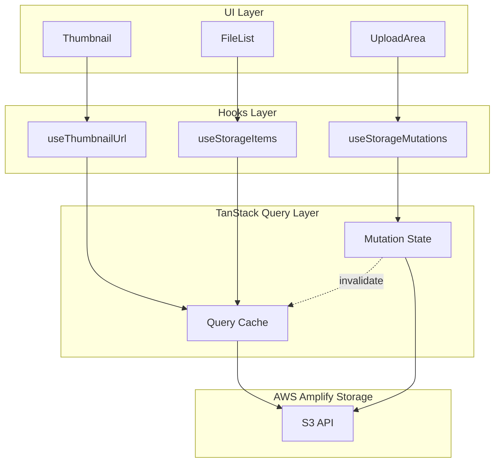
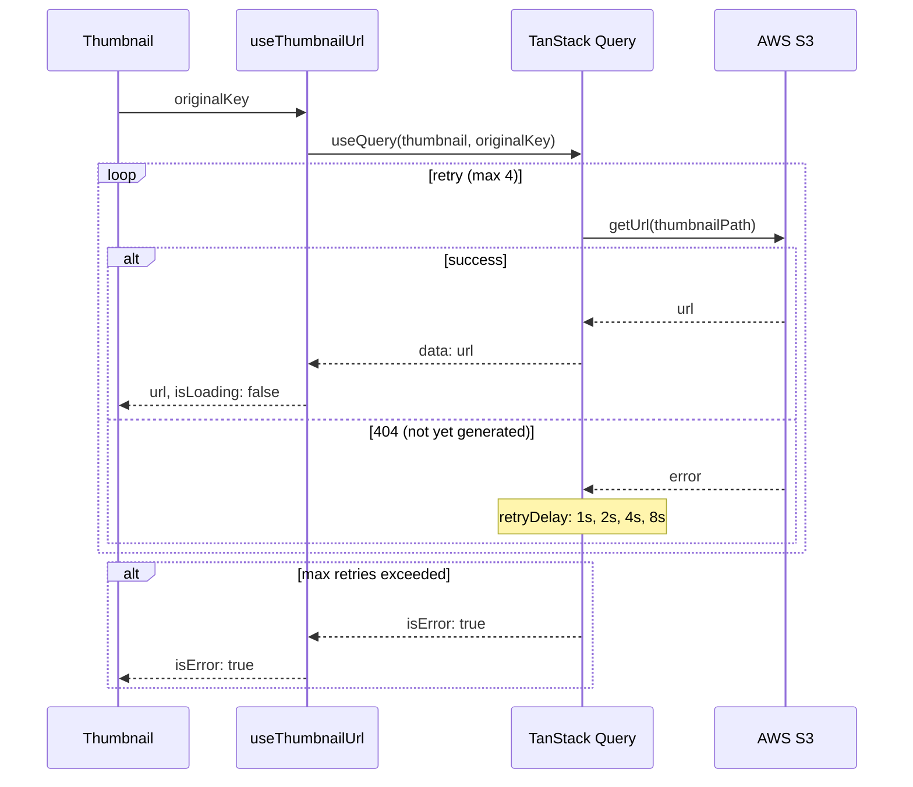
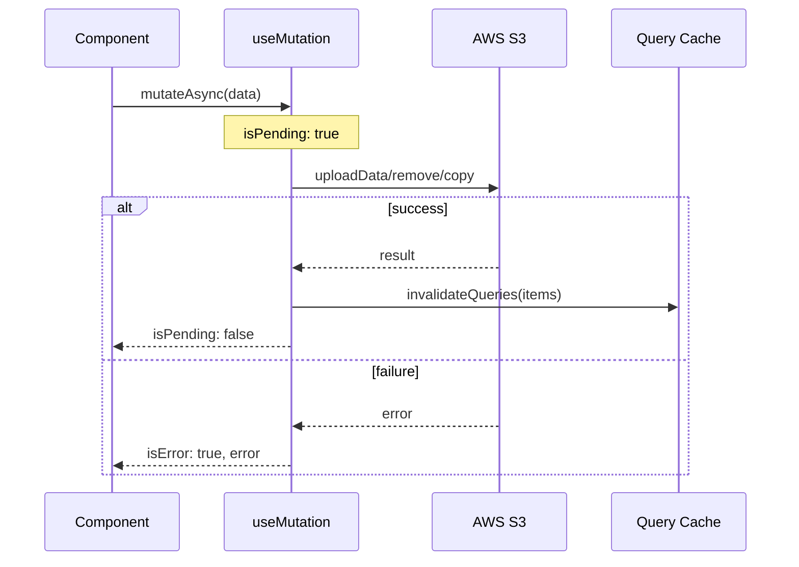

# Technical Design: thumbnail-delay-fix

## Overview

**Purpose**: ストレージ書き込み操作とサムネイル URL 取得を TanStack Query で実装し、サムネイル遅延表示バグを解決する。

**Users**: Photo Browser ユーザーがアップロード直後のファイルでもサムネイルを正しく表示できるようになる。

**Impact**: 既存の `useState`/`useEffect` ベースの状態管理を TanStack Query の宣言的パターンに置き換える。

### Goals

- Storage Write 操作を `useMutation` で実装し、`isPending` による処理中状態を提供
- サムネイル URL 取得を `useQuery` で実装し、リトライによる Lambda 生成完了待機
- 既存機能の互換性維持

### Non-Goals

- アップロード進捗表示の変更（既存の Amplify UI コンポーネントを維持）
- サムネイル生成 Lambda の変更
- 楽観的更新の実装（S3 操作は確実性を優先）

---

## Architecture

### Existing Architecture Analysis

Phase 2 で確立した TanStack Query 基盤を拡張:

- `queryKeys` による型安全なクエリキー管理
- `queryClient` のデフォルト設定（staleTime, gcTime, retry）
- `invalidateQueries` によるキャッシュ無効化パターン

現在の問題点:

- `useStorageOperations` が `useState` で処理中フラグを手動管理
- `ThumbnailImage` が複数の `useState` と `useEffect` で状態管理
- サムネイル取得にリトライ機能がなく、Lambda 生成完了を待機できない

### Architecture Pattern & Boundary Map



**Architecture Integration**:

- 選択パターン: Query/Mutation 分離パターン（Read は useQuery、Write は useMutation）
- ドメイン境界: Storage 操作は hooks/storage に集約
- 既存パターン維持: queryKeys, invalidateQueries の既存パターンを踏襲
- 新コンポーネント理由: useMutation による宣言的状態管理、useQuery によるリトライ機構

### Technology Stack

| Layer    | Choice / Version    | Role in Feature                                 |
| -------- | ------------------- | ----------------------------------------------- |
| Frontend | TanStack Query v5   | サーバー状態管理・キャッシュ・リトライ          |
| Storage  | AWS Amplify Storage | S3 操作 API（uploadData, remove, copy, getUrl） |

---

## System Flows

### サムネイル取得フロー



### Storage Write フロー



---

## Requirements Traceability

| Requirement | Summary                       | Components              | Interfaces         | Flows          |
| ----------- | ----------------------------- | ----------------------- | ------------------ | -------------- |
| 1.1         | アップロード useMutation      | useUploadMutation       | MutationResult     | Storage Write  |
| 1.2         | アップロード成功時 invalidate | useUploadMutation       | onSuccess callback | Storage Write  |
| 1.3         | 削除 useMutation              | useDeleteMutation       | MutationResult     | Storage Write  |
| 1.4         | 移動 useMutation              | useMoveMutation         | MutationResult     | Storage Write  |
| 1.5         | リネーム useMutation          | useRenameMutation       | MutationResult     | Storage Write  |
| 1.6         | フォルダ作成 useMutation      | useCreateFolderMutation | MutationResult     | Storage Write  |
| 1.7         | 操作失敗時 isError            | All mutations           | error object       | -              |
| 2.1         | サムネイル useQuery           | useThumbnailUrl         | QueryResult        | サムネイル取得 |
| 2.2         | queryKey 識別                 | queryKeys.thumbnail     | -                  | -              |
| 2.3         | isLoading 状態                | useThumbnailUrl         | isLoading          | サムネイル取得 |
| 2.4         | isError フォールバック        | Thumbnail               | isError            | サムネイル取得 |
| 2.5         | retry: 4                      | useThumbnailUrl         | retry option       | サムネイル取得 |
| 2.6         | exponential backoff           | useThumbnailUrl         | retryDelay option  | サムネイル取得 |

---

## Components and Interfaces

| Component               | Domain  | Intent                                          | Req Coverage  | Dependencies                             | Contracts |
| ----------------------- | ------- | ----------------------------------------------- | ------------- | ---------------------------------------- | --------- |
| useThumbnailUrl         | storage | サムネイル URL を取得しリトライで生成完了を待機 | 2.1-2.6       | queryKeys (P0), getUrl (P0)              | Service   |
| useUploadMutation       | storage | ファイルアップロードを実行                      | 1.1, 1.2, 1.7 | uploadData (P0), invalidateQueries (P0)  | Service   |
| useDeleteMutation       | storage | ファイル/フォルダ削除を実行                     | 1.3, 1.7      | remove (P0), invalidateQueries (P0)      | Service   |
| useMoveMutation         | storage | ファイル/フォルダ移動を実行                     | 1.4, 1.7      | copy/remove (P0), invalidateQueries (P0) | Service   |
| useRenameMutation       | storage | ファイル/フォルダリネームを実行                 | 1.5, 1.7      | copy/remove (P0), invalidateQueries (P0) | Service   |
| useCreateFolderMutation | storage | フォルダ作成を実行                              | 1.6, 1.7      | uploadData (P0), invalidateQueries (P0)  | Service   |
| Thumbnail               | UI      | サムネイル画像を表示（新規作成）                | 2.3, 2.4      | useThumbnailUrl (P0)                     | -         |

### Storage Hooks

#### useThumbnailUrl

| Field        | Detail                                                                    |
| ------------ | ------------------------------------------------------------------------- |
| Intent       | originalKey からサムネイル URL を取得し、リトライで Lambda 生成完了を待機 |
| Requirements | 2.1, 2.2, 2.3, 2.4, 2.5, 2.6                                              |

**Responsibilities & Constraints**

- サムネイル URL の取得とキャッシュ管理
- リトライによる Lambda 生成完了待機（最大 15 秒）
- 5 分間のキャッシュ保持

**Dependencies**

- Outbound: AWS Amplify Storage (getUrl) — サムネイル署名付き URL 取得 (P0)
- Outbound: queryKeys — クエリキー生成 (P0)

**Contracts**: Service [x]

##### Service Interface

```typescript
interface UseThumbnailUrlReturn {
  url: string | null;
  isLoading: boolean;
  isError: boolean;
}

function useThumbnailUrl(originalKey: string): UseThumbnailUrlReturn;
```

- Preconditions: originalKey は有効なメディアファイルパス
- Postconditions: 成功時は署名付き URL を返却、失敗時は isError: true
- Invariants: retry は最大 4 回、retryDelay は指数バックオフ (1s, 2s, 4s, 8s)

##### State Management

- State model: TanStack Query が管理（loading → success | error）
- Persistence: 5 分間のキャッシュ（staleTime）
- Concurrency: 同一 originalKey への重複リクエストは自動的にデデュープ

#### useMutation フック群

| Field        | Detail                                                              |
| ------------ | ------------------------------------------------------------------- |
| Intent       | Storage Write 操作を useMutation で実装し、isPending/isError を提供 |
| Requirements | 1.1-1.7                                                             |

**Responsibilities & Constraints**

- 各操作（upload, delete, move, rename, createFolder）の実行
- 成功時の invalidateQueries によるキャッシュ無効化
- 処理中状態（isPending）とエラー状態（isError）の提供

**Dependencies**

- Outbound: AWS Amplify Storage (uploadData, remove, copy) — S3 操作 (P0)
- Outbound: queryClient.invalidateQueries — キャッシュ無効化 (P0)

**Contracts**: Service [x]

##### Service Interface

```typescript
interface MutationContext {
  identityId: string;
  currentPath: string;
}

// 各 mutation フックの返り値型
interface MutationResult<TVariables, TData> {
  mutateAsync: (variables: TVariables) => Promise<TData>;
  isPending: boolean;
  isError: boolean;
  error: Error | null;
}

// Upload
interface UploadVariables {
  files: File[];
  basePath: string;
}
function useUploadMutation(context: MutationContext): MutationResult<UploadVariables, string[]>;

// Delete
interface DeleteVariables {
  items: StorageItem[];
}
interface DeleteResult {
  succeeded: string[];
  failed: Array<{ key: string; error: Error }>;
}
function useDeleteMutation(context: MutationContext): MutationResult<DeleteVariables, DeleteResult>;

// Move
interface MoveVariables {
  items: StorageItem[];
  destinationPath: string;
  onProgress?: (progress: { current: number; total: number }) => void;
}
interface MoveResult {
  success: boolean;
  succeeded: number;
  failed: number;
}
function useMoveMutation(context: MutationContext): MutationResult<MoveVariables, MoveResult>;

// Rename
interface RenameVariables {
  currentKey: string;
  newName: string;
  isFolder: boolean;
  onProgress?: (progress: { current: number; total: number }) => void;
}
interface RenameResult {
  success: boolean;
  error?: string;
}
function useRenameMutation(context: MutationContext): MutationResult<RenameVariables, RenameResult>;

// CreateFolder
interface CreateFolderVariables {
  name: string;
  basePath: string;
}
function useCreateFolderMutation(
  context: MutationContext,
): MutationResult<CreateFolderVariables, string>;
```

- Preconditions: context.identityId が有効であること
- Postconditions: 成功時は invalidateQueries が呼び出される
- Invariants: 楽観的更新は使用しない（S3 操作の確実性優先）

**Implementation Notes**

- Integration: 既存の useStorageOperations を内部で mutation フックを使用するよう段階的に移行
- Validation: basePath, destinationPath の形式検証は呼び出し側の責務
- Risks: 大量ファイル操作時のタイムアウト（既存と同様の制約）

### UI Components

#### Thumbnail（新規作成）

| Field        | Detail                                                  |
| ------------ | ------------------------------------------------------- |
| Intent       | サムネイル画像を表示し、ローディング/エラー状態を視覚化 |
| Requirements | 2.3, 2.4                                                |

**Responsibilities & Constraints**

- useThumbnailUrl を使用してサムネイル URL を取得
- isLoading 時はスケルトン UI を表示
- isError 時はフォールバックアイコンを表示

**Dependencies**

- Inbound: FileList — サムネイル表示要求 (P0)
- Outbound: useThumbnailUrl — URL 取得 (P0)

**Implementation Notes**

- Integration: 既存の ThumbnailImage を使用している箇所を Thumbnail に置き換え
- Risks: なし（リトライ機構により既存より安定）

---

## Data Models

### queryKeys 拡張

```typescript
export const queryKeys = {
  // 既存
  identityId: () => ["identityId"] as const,
  items: (identityId: string, path: string) => ["items", identityId, path] as const,
  folders: (identityId: string, path: string) => ["folders", identityId, path] as const,
  previewUrls: (itemKeys: string[]) => ["previewUrls", ...itemKeys] as const,
  passkeys: () => ["passkeys"] as const,

  // 追加
  thumbnail: (originalKey: string) => ["thumbnail", originalKey] as const,
} as const;
```

---

## Error Handling

### Error Categories and Responses

**System Errors (サムネイル取得)**

- 404 Not Found → リトライ（Lambda 生成中）
- 最大リトライ超過 → フォールバックアイコン表示

**System Errors (Storage Write)**

- ネットワークエラー → isError: true, error オブジェクトで詳細提供
- S3 エラー → isError: true, error オブジェクトで詳細提供

**Business Logic Errors**

- 重複ファイル → 呼び出し側で事前チェック（既存と同様）
- リネーム先重複 → error オブジェクトでメッセージ提供

---

## Testing Strategy

### Unit Tests

- useThumbnailUrl: 成功時の URL 返却、リトライ動作、最大リトライ後のエラー状態
- useUploadMutation: isPending 状態提供、成功時の invalidate、エラー時の状態
- useDeleteMutation: 複数アイテム削除、部分失敗時の結果

### Integration Tests

- アップロード → サムネイル表示フロー
- 削除 → リスト更新フロー

### E2E Tests

- アップロード直後のサムネイル表示（リトライ待機）
- 既存ファイルのサムネイル表示（キャッシュ利用）

---

## 削除対象

Phase 3 完了後に削除:

- `useUploadTracker` フック（初期遅延排除により不要）
- `ThumbnailImage` コンポーネント全体（deprecated、新規 `Thumbnail` に置き換え）
- `useStorageOperations` の手動フラグ管理（useState の isDeleting 等）
