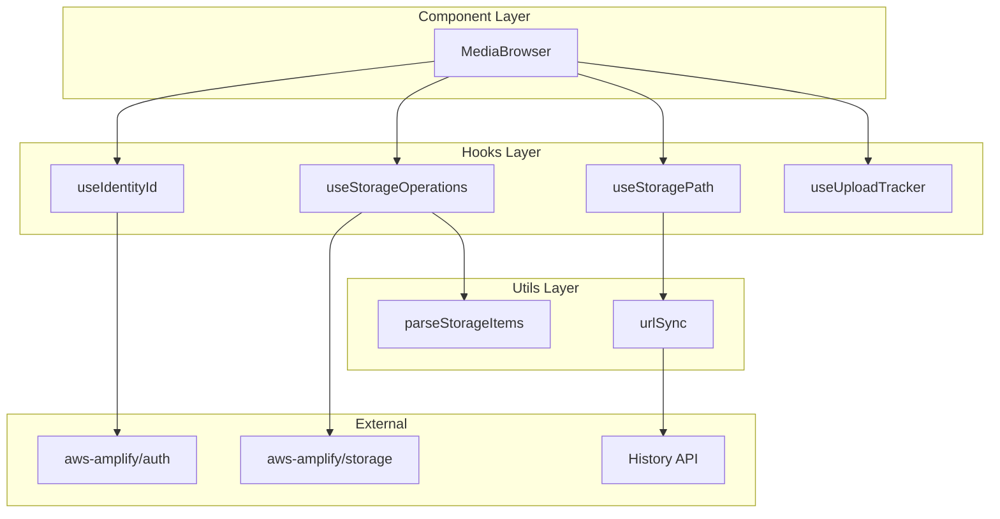
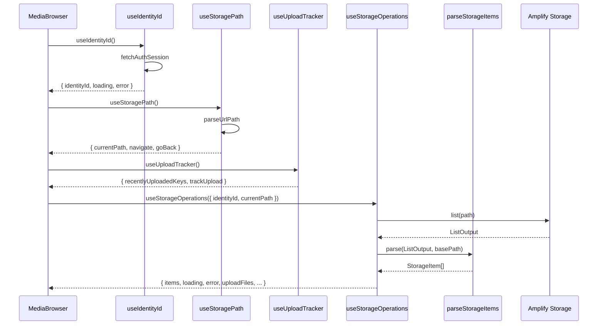
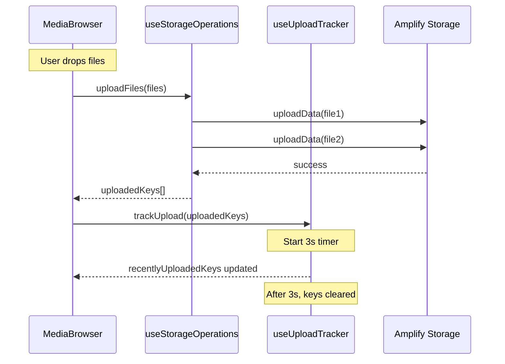
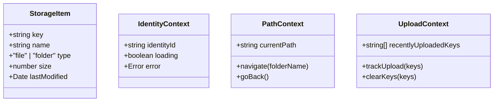

# Design Document: useStorage リファクタリング

## Overview

**Purpose**: `useStorage` フックの責務分離リファクタリングにより、単一責任の原則（SRP）に準拠した保守性・テスト容易性の高いコードベースを実現する。

**Users**: 開発者が対象。各責務が独立したフック/ユーティリティとして分離されることで、個別のテスト・再利用・変更が容易になる。

**Impact**: 現在の単一フック `useStorage`（約230行、5責務）を、4つの独立フック + 1ユーティリティに分離。統合フックは作成せず、MediaBrowser コンポーネントが各フックを直接使用する疎結合設計を採用。

### Goals

- 単一責任の原則（SRP）に準拠した責務分離
- 各フック・ユーティリティの独立したテスト容易性
- 疎結合な設計（依存関係を引数で明示）
- コードの再利用性向上（各フックを他コンポーネントでも使用可能）

### Non-Goals

- 統合フックの作成（不要な抽象化を避ける）
- パフォーマンス最適化（現状維持で十分）
- 新機能の追加

## Architecture

### Existing Architecture Analysis

現在の `useStorage` フックは以下の責務を単一ファイル内で管理:

1. **認証**: `fetchAuthSession` による Identity ID 取得
2. **パス管理**: URL クエリパラメータとの同期、ナビゲーション
3. **ストレージ操作**: S3 API 呼び出し（list, upload, remove, getUrl）
4. **データ変換**: S3 レスポンス → `StorageItem` 配列への変換・ソート・重複排除
5. **アップロード追跡**: サムネイル遅延取得用のキー追跡

既存パターン:

- `src/hooks/urlSync.ts`: URL 同期ユーティリティ（既に分離済み）
- `src/utils/`: ユーティリティ関数の配置場所

### Architecture Pattern & Boundary Map

**Selected Pattern**: 疎結合パターン（統合フック廃止）

各責務を独立したフック/ユーティリティとして分離し、コンポーネント（MediaBrowser）が直接使用する。統合フックは作成せず、依存関係を引数で明示的に渡す。



**Architecture Integration**:

- **疎結合パターン**: 各フックが完全に独立、コンポーネントが直接使用
- **依存方向**: コンポーネント → 個別フック → 外部 API
- **引数による依存注入**: `useStorageOperations` は `identityId` と `currentPath` を引数で受け取る
- **steering 準拠**: `hooks/` に個別フック配置、`utils/` にユーティリティ配置

### Technology Stack

| Layer    | Choice / Version          | Role in Feature     | Notes                                              |
| -------- | ------------------------- | ------------------- | -------------------------------------------------- |
| Frontend | React 19 + TypeScript 5.x | Custom Hooks 実装   | strict mode 有効                                   |
| Backend  | AWS Amplify Gen2          | Auth/Storage API    | fetchAuthSession, list, remove, uploadData, getUrl |
| Testing  | Vitest + Testing Library  | ユニット/統合テスト | happy-dom 使用                                     |

## System Flows

### ストレージ操作フロー



### アップロードフロー（コンポーネント統合）



## Requirements Traceability

| Requirement                       | Summary                          | Components            | Interfaces                 | Flows                    |
| --------------------------------- | -------------------------------- | --------------------- | -------------------------- | ------------------------ |
| 1.1, 1.2, 1.3, 1.4                | Identity ID 管理                 | useIdentityId         | UseIdentityIdReturn        | 認証フロー               |
| 2.1, 2.2, 2.3, 2.4, 2.5           | パス管理                         | useStoragePath        | UseStoragePathReturn       | ナビゲーションフロー     |
| 3.1, 3.2, 3.3, 3.4, 3.5, 3.6      | ストレージ操作                   | useStorageOperations  | UseStorageOperationsReturn | ストレージ操作フロー     |
| 4.1, 4.2, 4.3, 4.4, 4.5           | アイテム変換                     | parseStorageItems     | parseStorageItems()        | データ変換               |
| 5.1, 5.2, 5.3, 5.4                | アップロード追跡                 | useUploadTracker      | UseUploadTrackerReturn     | アップロードフロー       |
| 6.1, 6.2, 6.3, 6.4                | コンポーネント統合               | MediaBrowser          | —                          | コンポーネント統合フロー |
| 7.1, 7.2, 7.3, 7.4, 7.5           | テスト容易性                     | 全コンポーネント      | —                          | テスト設計               |
| 8.1, 8.2, 8.3, 8.4, 8.5, 8.6, 8.7 | リファクタリング前振る舞いテスト | MediaBrowser.test.tsx | —                          | ユーザーフロー検証       |

## Components and Interfaces

### Summary

| Component            | Domain/Layer | Intent                                    | Req Coverage | Key Dependencies              | Contracts      |
| -------------------- | ------------ | ----------------------------------------- | ------------ | ----------------------------- | -------------- |
| useIdentityId        | Hooks        | Cognito 認証から Identity ID を取得・管理 | 1.1-1.4      | AmplifyAuth (P0)              | State          |
| useStoragePath       | Hooks        | パス状態と URL 同期を管理                 | 2.1-2.5      | urlSync (P1), BrowserAPI (P1) | State          |
| useStorageOperations | Hooks        | S3 ストレージ操作を実行                   | 3.1-3.6      | AmplifyStorage (P0)           | Service, State |
| useUploadTracker     | Hooks        | アップロードファイルのキー追跡            | 5.1-5.4      | —                             | State          |
| parseStorageItems    | Utils        | S3 レスポンスを StorageItem に変換        | 4.1-4.5      | —                             | —              |

---

### Hooks Layer

#### useIdentityId

| Field        | Detail                                              |
| ------------ | --------------------------------------------------- |
| Intent       | Cognito 認証セッションから Identity ID を取得・保持 |
| Requirements | 1.1, 1.2, 1.3, 1.4                                  |

**Responsibilities & Constraints**

- `fetchAuthSession` を呼び出し、`identityId` を取得
- ローディング・エラー状態を管理
- マウント時に一度のみ取得（再取得機能は将来拡張）

**Dependencies**

- External: `aws-amplify/auth` — `fetchAuthSession` (P0)

**Contracts**: State [x]

##### State Management

```typescript
interface UseIdentityIdReturn {
  identityId: string | null;
  loading: boolean;
  error: Error | null;
}

function useIdentityId(): UseIdentityIdReturn;
```

- **State model**: `identityId` は認証セッションから取得した文字列、`loading` は取得中フラグ、`error` は取得失敗時のエラー
- **Persistence**: メモリ内（コンポーネントライフサイクル）
- **Concurrency**: 単一のマウント時取得、競合なし

**Implementation Notes**

- Integration: `fetchAuthSession` の戻り値から `session.identityId ?? null` を抽出
- Validation: 認証セッションが存在しない場合は `error` を設定
- Risks: 認証エラー時の UI フィードバックは呼び出し側で対応

---

#### useStoragePath

| Field        | Detail                                            |
| ------------ | ------------------------------------------------- |
| Intent       | 現在のパス状態を管理し URL クエリパラメータと同期 |
| Requirements | 2.1, 2.2, 2.3, 2.4, 2.5                           |

**Responsibilities & Constraints**

- URL クエリパラメータからの初期パス読み込み
- パス変更時の URL 同期（History API）
- `popstate` イベントによるブラウザナビゲーション対応

**Dependencies**

- Inbound: なし
- Outbound: `urlSync` — URL 同期ユーティリティ (P1)
- External: `window.history`, `window.location` — History API (P1)

**Contracts**: State [x]

##### State Management

```typescript
interface UseStoragePathReturn {
  currentPath: string;
  navigate: (folderName: string) => void;
  goBack: () => void;
}

function useStoragePath(): UseStoragePathReturn;
```

- **State model**: `currentPath` は現在のフォルダパス（空文字列 = ルート）
- **Persistence**: URL クエリパラメータと同期
- **Concurrency**: `popstate` イベントリスナーで状態更新

**Implementation Notes**

- Integration: 既存の `urlSync.ts`（`parseUrlPath`, `syncToUrl`）を使用
- Validation: パスは文字列、特殊文字は URL エンコード
- Risks: History API 非対応環境では動作しない（現状問題なし）

---

#### useStorageOperations

| Field        | Detail                                                                |
| ------------ | --------------------------------------------------------------------- |
| Intent       | S3 ストレージ操作（list, upload, remove, createFolder, getUrl）を実行 |
| Requirements | 3.1, 3.2, 3.3, 3.4, 3.5, 3.6                                          |

**Responsibilities & Constraints**

- Amplify Storage API の呼び出し
- 操作ごとのローディング・エラー状態管理
- `identityId` と `currentPath` から基底パスを構築

**Dependencies**

- Inbound: `MediaBrowser` — コンポーネントから直接呼び出し (P0)
- Outbound: `parseStorageItems` — S3 レスポンス変換 (P1)
- External: `aws-amplify/storage` — `list`, `remove`, `uploadData`, `getUrl` (P0)
- Arguments: `identityId` と `currentPath` を引数として受け取る（依存注入パターン）

**Contracts**: Service [x] / State [x]

##### Service Interface

```typescript
interface UseStorageOperationsOptions {
  identityId: string | null;
  currentPath: string;
}

interface UseStorageOperationsReturn {
  items: StorageItem[];
  loading: boolean;
  error: Error | null;
  fetchItems: () => Promise<void>;
  uploadFiles: (files: File[]) => Promise<string[]>;
  removeItem: (key: string) => Promise<void>;
  createFolder: (name: string) => Promise<void>;
  getFileUrl: (key: string) => Promise<string>;
  refresh: () => void;
}

function useStorageOperations(options: UseStorageOperationsOptions): UseStorageOperationsReturn;
```

- **Preconditions**: `identityId` が非 null の場合のみ操作実行
- **Postconditions**: 操作完了後に `items` を最新化
- **Invariants**: `loading` が true の間は `items` は前回の値を保持

##### State Management

- **State model**: `items` は変換済みの `StorageItem[]`、`loading` / `error` は操作状態
- **Persistence**: メモリ内
- **Concurrency**: 複数操作の同時実行は許可、最後の結果が反映

**Implementation Notes**

- Integration: `uploadFiles` は並列アップロード後にアップロードしたキーを返却（アップロード追跡用）
- Validation: フォルダ名の末尾スラッシュ付加は内部で処理
- Risks: S3 API エラーは呼び出し側で UI 表示

---

#### useUploadTracker

| Field        | Detail                                             |
| ------------ | -------------------------------------------------- |
| Intent       | アップロードファイルのキーを追跡し、遅延後にクリア |
| Requirements | 5.1, 5.2, 5.3, 5.4                                 |

**Responsibilities & Constraints**

- アップロードキーの追跡リスト管理
- 指定遅延時間（3秒）後の自動クリア
- サムネイル生成完了待機のためのフラグ提供

**Dependencies**

- External: なし（タイマーのみ）

**Contracts**: State [x]

##### State Management

```typescript
interface UseUploadTrackerReturn {
  recentlyUploadedKeys: string[];
  trackUpload: (keys: string[]) => void;
  clearKeys: (keys: string[]) => void;
}

function useUploadTracker(delay?: number): UseUploadTrackerReturn;
```

- **State model**: `recentlyUploadedKeys` は追跡中のキー配列
- **Persistence**: メモリ内
- **Concurrency**: `setTimeout` によるクリア、アンマウント時にクリーンアップ

**Implementation Notes**

- Integration: `trackUpload` をアップロード完了時に呼び出し
- Validation: 同一キーの重複追加を許可（クリア時にフィルタ）
- Risks: タイマーのメモリリーク防止にアンマウント時クリーンアップ必須

---

### Utils Layer

#### parseStorageItems

| Field        | Detail                                                    |
| ------------ | --------------------------------------------------------- |
| Intent       | S3 ListOutput を StorageItem 配列に変換・ソート・重複排除 |
| Requirements | 4.1, 4.2, 4.3, 4.4, 4.5                                   |

**Responsibilities & Constraints**

- S3 レスポンスから相対パスを抽出
- 直接の子要素のみをフィルタ
- フォルダ/ファイルを識別
- フォルダの重複排除
- ソート（フォルダ優先、名前順）

**Dependencies**: なし（純粋関数）

**Contracts**: なし（純粋関数）

```typescript
interface ListOutputItem {
  path: string;
  size?: number;
  lastModified?: Date;
}

function parseStorageItems(items: ListOutputItem[], basePath: string): StorageItem[];
```

- **Preconditions**: `items` は S3 list 結果、`basePath` は現在のフォルダパス
- **Postconditions**: ソート済み、重複排除済みの `StorageItem[]` を返却
- **Invariants**: 入力を変更しない（イミュータブル）

**Implementation Notes**

- Integration: `useStorageOperations` から呼び出し
- Validation: 空配列入力は空配列を返却
- Risks: なし（純粋関数）

---

### Component Integration Pattern

#### MediaBrowser コンポーネントでのフック使用

| Field        | Detail                                                       |
| ------------ | ------------------------------------------------------------ |
| Intent       | 分離された個別フックを MediaBrowser コンポーネントで直接使用 |
| Requirements | 6.1, 6.2, 6.3, 6.4                                           |

**Integration Pattern**

MediaBrowser コンポーネントは統合フックを使用せず、各独立フックを直接呼び出します。これにより依存関係が明示的になり、テスト容易性が向上します。

```typescript
// src/components/MediaBrowser/index.tsx
function MediaBrowser() {
  // 1. 各フックを独立して呼び出し
  const { identityId, loading: authLoading, error: authError } = useIdentityId();
  const { currentPath, navigate, goBack } = useStoragePath();
  const { recentlyUploadedKeys, trackUpload } = useUploadTracker();

  // 2. useStorageOperations に依存値を引数として渡す
  const {
    items,
    loading: storageLoading,
    error: storageError,
    uploadFiles,
    removeItem,
    createFolder,
    getFileUrl,
    refresh,
  } = useStorageOperations({ identityId, currentPath });

  // 3. アップロード処理はコンポーネントで uploadFiles + trackUpload を組み合わせ
  const handleUpload = async (files: File[]) => {
    const uploadedKeys = await uploadFiles(files);
    trackUpload(uploadedKeys);
  };

  // 4. ローディング・エラー状態の集約
  const loading = authLoading || storageLoading;
  const error = authError || storageError;

  // ... render logic
}
```

**Responsibilities**

- 各フックの呼び出しと状態の取得
- `uploadFiles` と `trackUpload` の連携処理
- 複数フックの loading/error 状態の集約
- 子コンポーネントへの props 伝播

**Benefits**

- 依存関係が明示的（引数として渡す）
- 各フックが完全に独立、テスト容易
- 不要な抽象化レイヤーを排除
- コンポーネントで柔軟に組み合わせ可能

---

### Shared Types

#### StorageItem

```typescript
// src/types/storage.ts
export interface StorageItem {
  key: string;
  name: string;
  type: "file" | "folder";
  size?: number;
  lastModified?: Date;
}
```

**配置理由**: 複数フック・コンポーネントで共有されるため、専用の型定義ファイルに配置。

## Data Models

### Domain Model



**Aggregates**: 各 Context はフックの状態を表現。StorageItem は値オブジェクト。

## Error Handling

### Error Strategy

- **Fail Fast**: 認証エラーは即座に `error` 状態に反映
- **Graceful Degradation**: 個別操作のエラーは `error` に設定し、他の操作は継続可能
- **User Context**: エラーメッセージは `error.message` として UI に伝播

### Error Categories and Responses

- **認証エラー**: `useIdentityId` で捕捉、UI で「再認証」案内
- **ストレージ操作エラー**: `useStorageOperations` で捕捉、リトライ可能
- **ネットワークエラー**: タイムアウト後に `error` 設定、リフレッシュで回復

## Testing Strategy

### Unit Tests

- `parseStorageItems`: 変換ロジック、ソート、重複排除、境界値
- `useIdentityId`: 成功/失敗/ローディング状態
- `useStoragePath`: パス変更、URL 同期、popstate
- `useUploadTracker`: 追跡/クリア、タイマー動作
- `useStorageOperations`: 各操作のモック検証

### Behavior Tests（リファクタリング前に整備必須）

**Why: 振る舞いテストを採用する理由**

本リファクタリングでは `useStorage` の内部構造を大幅に変更する。フックの内部実装ではなく **外部から観測可能な振る舞い** をテスト対象とすることで:

- 内部実装の変更に対する耐性（フック分離方法が変わってもテスト書き換え不要）
- リファクタリングの安全網（同じテストがパスすれば動作維持を保証）
- 今回変更するフック群（useIdentityId, useStoragePath, useStorageOperations, useUploadTracker）の連携を検証

**テスト対象フロー**

- `MediaBrowser.test.tsx`: フック連携による振る舞いを検証
  - 初期表示: ローディング → アイテム一覧表示（useIdentityId + useStorageOperations 連携）
  - ナビゲーション: フォルダクリック → パス変更 → 新アイテム表示（useStoragePath + useStorageOperations 連携）
  - 戻る操作: 戻るボタン → 親フォルダ遷移（useStoragePath 連携）
  - アップロード: ファイルドロップ → アップロード → 一覧更新（useStorageOperations + useUploadTracker 連携）
  - 削除: 削除ボタン → 確認 → 削除 → 一覧更新（useStorageOperations 連携）

**責務分離**

- 個別コンポーネント（Header, FileList, ThumbnailImage）は既存の単体テストでカバー済み
- 振る舞いテストはフック連携に起因するフローのみを検証
- リファクタリング後: 同じ振る舞いテストがパスすることで後方互換性を保証

### Mocking Strategy

- `aws-amplify/auth`: `vi.mock` で `fetchAuthSession` をモック
- `aws-amplify/storage`: `vi.mock` で Storage API をモック
- `window.history` / `window.location`: `vi.stubGlobal` でモック
- `setTimeout`: `vi.useFakeTimers` でタイマー制御
